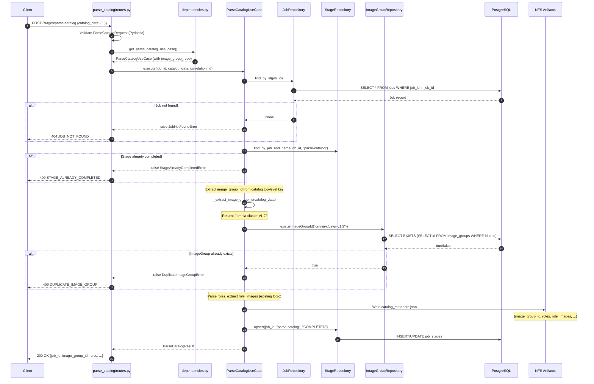
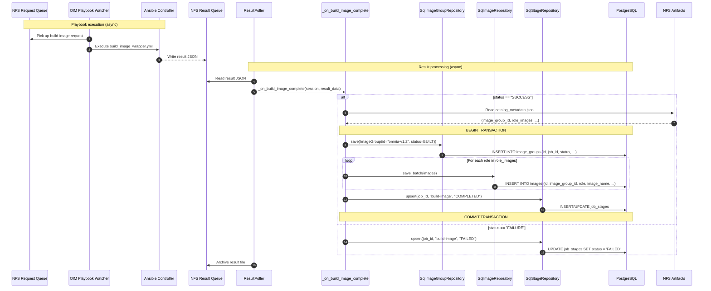
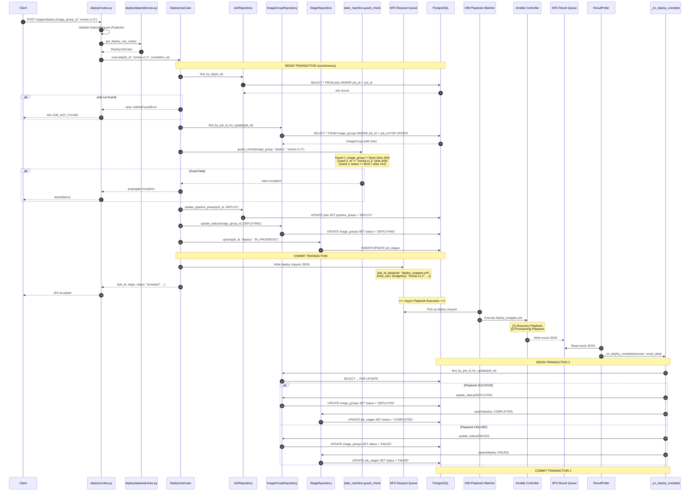

# Module Specification — API Enhancements for ImageGroup/Image Data Model Alignment

| | |
|---|---|
| **Document ID** | MSPEC-BS-APIENH-2026-001 |
| **Current Version** | 1.0 |
| **Date** | 04/07/2026 |
| **Author** | Rajeshkumar S |
| **Team** | Dell Omnia — BuildStream |
| **Document Type** | Module Specification |
| **SDD Phase** | 5b — Module Specification |
| **Parent Component Spec** | CSPEC-BS-C1 (Build Pipeline API), CSPEC-BS-C2-2026-001 (Deploy Pipeline API) |
| **Parent API Spec** | API_Spec.md v2.0 |
| **Implementation Tasks** | S1-3 (parse-catalog enhancement), S1-4 (build-image DB changes), S1-6 (deploy stage) |
| **Owner** | SD-1 (primary), SD-2 (review) |

---

**Dell Confidential - Internal Use Only**

Copyright 2026 Dell Inc. or its subsidiaries. All Rights Reserved.

---

## Revision History

| Version | Date | Description | Author(s) |
|---------|------|-------------|-----------|
| 1.0 | 04/07/2026 | Initial module spec — Consolidated API modifications for ImageGroup/Image data model alignment: parse-catalog uniqueness checks (S1-3), build-image DB writes (S1-4), deploy stage endpoint (S1-6) | Dell Omnia Team |
| 1.1 | 04/09/2026 | Updated Part C (Deploy Stage) to align with discovery/provision playbook split from pub/q2_dev merge (commit 5b30837). Added deploy_wrapper.yml sub-playbook mapping to discovery.yml and provision.yml. Added playbook watcher whitelist update requirement. Documented additive rename strategy (validate-image-on-test kept for backward compat, new deploy module created alongside). | Dell Omnia Team |

---

## Table of Contents

- [1 References](#1-references)
- [2 Purpose & Scope](#2-purpose--scope)
- [3 Module Architecture](#3-module-architecture)
  - [3.1 File Layout — All Modified and Created Files](#31-file-layout--all-modified-and-created-files)
  - [3.2 Layer Responsibilities](#32-layer-responsibilities)
- [4 Part A: Parse-Catalog Enhancement (S1-3)](#4-part-a-parse-catalog-enhancement-s1-3)
  - [4.1 Overview](#41-overview)
  - [4.2 image_group_id Extraction](#42-image_group_id-extraction)
  - [4.3 Uniqueness Check](#43-uniqueness-check)
  - [4.4 ImageGroup Placeholder Record](#44-imagegroup-placeholder-record)
  - [4.5 Modified Route Handler](#45-modified-route-handler)
  - [4.6 Modified Use Case](#46-modified-use-case)
  - [4.7 Modified Dependencies](#47-modified-dependencies)
  - [4.8 Error Handling Additions](#48-error-handling-additions)
- [5 Part B: Build-Image DB Changes (S1-4)](#5-part-b-build-image-db-changes-s1-4)
  - [5.1 Overview](#51-overview)
  - [5.2 Role Extraction Logic](#52-role-extraction-logic)
  - [5.3 Modified Result Poller Callback](#53-modified-result-poller-callback)
  - [5.4 ImageGroup Record Creation](#54-imagegroup-record-creation)
  - [5.5 Images Record Insertion](#55-images-record-insertion)
  - [5.6 Transaction Pattern](#56-transaction-pattern)
  - [5.7 Modified Build-Image Use Case](#57-modified-build-image-use-case)
  - [5.8 Modified Dependencies for Build-Image](#58-modified-dependencies-for-build-image)
- [6 Part C: Deploy Stage (S1-6)](#6-part-c-deploy-stage-s1-6)
  - [6.1 Overview](#61-overview)
  - [6.2 File Layout](#62-file-layout)
  - [6.3 Router Layer](#63-router-layer)
  - [6.4 Schemas](#64-schemas)
  - [6.5 Dependencies](#65-dependencies)
  - [6.6 Deploy Use Case](#66-deploy-use-case)
  - [6.7 Playbook Invocation — NFS Queue Pattern](#67-playbook-invocation--nfs-queue-pattern)
  - [6.8 Async Completion Handling](#68-async-completion-handling)
  - [6.9 Error Handling](#69-error-handling)
- [7 Sequence Diagrams](#7-sequence-diagrams)
  - [7.1 Parse-Catalog Enhancement Sequence](#71-parse-catalog-enhancement-sequence)
  - [7.2 Build-Image Completion Sequence](#72-build-image-completion-sequence)
  - [7.3 Deploy Stage Sequence](#73-deploy-stage-sequence)
- [8 Test Cases](#8-test-cases)
- [9 Traceability](#9-traceability)

---

## 1. References

| Source | ID | Description |
|--------|----|-------------|
| API Specification | API_Spec.md v2.0 | Full API endpoint contracts — request/response formats, authentication, error codes |
| Component Spec (C1) | CSPEC-BS-C1, Sections 3–5 | Build Pipeline API component-level design: parse-catalog, build-image flows |
| Component Spec (C2) | CSPEC-BS-C2-2026-001, Section 5.2 | Deploy Pipeline API component-level design: deploy stage, guard checks, playbook integration |
| Engineering Spec (HLD) | BuildStream_Engineering_Spec(HLD).md v0.6, Sections 3.2.1–3.2.3, 4.1.3.1, 4.1.3.3, 4.1.3.4 | System-level parse-catalog, build-image, deploy flows; DB schema; state machine |
| Functional Spec | BuildStream_Functional_Spec.md v1.2, Sections 4.2, 4.3, 4.4.2 | Functional requirements for parse-catalog, build-image, deploy stage processing |
| Implementation Plan | BuildStream_Implementation_Plan.md, S1-3, S1-4, S1-6 | Task definitions, owners, dependencies |
| Data Model Spec | MSPEC-BS-DATAMODEL-2026-001 (Module_ImageGroup_DataModel.md) | ImageGroup/Image ORM models, enums, domain entities, repository interfaces, DI registration |
| Deploy API Spec | MSPEC-BS-DEPLOY-2026-001 (Module_Deploy_API.md) | Standalone deploy endpoint spec (this document consolidates and extends) |
| Images API Module Spec | MSPEC-BS-IMAGES-2026-001 | Upstream dependency — provides Job ID + Image Group ID selection |

---

## 2. Purpose & Scope

This module specification **consolidates all API-layer modifications** required to align existing BuildStream endpoints with the new ImageGroup/Image data models defined in `Module_ImageGroup_DataModel.md` (MSPEC-BS-DATAMODEL-2026-001). Rather than scattering changes across three separate documents, this single spec provides a unified implementation guide for:

| Part | Task | Scope | Endpoint Affected |
|------|------|-------|-------------------|
| **A** | S1-3 | Parse-Catalog Enhancement | `POST /api/v1/jobs/{job_id}/stages/parse-catalog` (existing) |
| **B** | S1-4 | Build-Image DB Changes | `POST /api/v1/jobs/{job_id}/stages/build-image` (existing, result poller callback) |
| **C** | S1-6 | Deploy Stage | `POST /api/v1/jobs/{job_id}/stages/deploy` (new) |

**Key Responsibilities:**
1. Extract `image_group_id` from the catalog JSON during parse-catalog and enforce uniqueness (Part A)
2. Create `image_groups` and `images` records upon build-image completion with status `BUILT` (Part B)
3. Implement the deploy stage endpoint with guard checks, state transitions, and NFS-based playbook invocation (Part C)
4. Integrate all three parts with the existing codebase patterns (Approach A): feature-scoped routes/schemas/dependencies, centralized ORM models, `dependency_injector` DI, synchronous SQLAlchemy

**What this document covers that the Component Specs do not:**

| Aspect | Component Spec Coverage | This Document |
|--------|------------------------|---------------|
| `image_group_id` extraction from catalog JSON | "Extract from catalog" (one-line mention) | Exact JSON path, extraction function, edge cases |
| Uniqueness check SQL pattern | `EXISTS` query mention | Full repository method, error propagation, 409 mapping |
| Build-image result poller callback modification | "Update DB on completion" | Exact callback code, ImageGroup + Images creation, transaction pattern |
| Role extraction from catalog | "Per role in catalog" | Exact parsing logic, role-to-image-name mapping |
| NFS queue pattern for deploy | "Submit playbook" | File path conventions, JSON format, timestamp generation |
| Result poller integration for deploy | "Poll for completion" | Callback registration, status transition, error handling |
| Full pseudocode for all three parts | Not provided | Implementation-ready pseudocode with error handling |

**Out of scope:**
- ORM model definitions (covered in Module_ImageGroup_DataModel.md)
- Alembic migration (covered in Module_ImageGroup_DataModel.md)
- Restart and Validate stages (separate module specs)
- Authentication/authorization middleware implementation (handled by common middleware)
- Rate limiting (handled by common middleware)
- Resume & Retry for any stage (Sprint 3, S3-4)

---

## 3. Module Architecture

### 3.1 File Layout — All Modified and Created Files

```
build_stream/
├── api/
│   ├── parse_catalog/
│   │   ├── routes.py               # MODIFIED — add DuplicateImageGroupError handler (Part A)
│   │   ├── schemas.py              # UNCHANGED — existing request/response schemas
│   │   └── dependencies.py         # MODIFIED — add image_group_repo injection (Part A)
│   ├── build_image/
│   │   ├── routes.py               # UNCHANGED — async 202 endpoint
│   │   ├── schemas.py              # UNCHANGED
│   │   └── dependencies.py         # MODIFIED — add image_group_repo, image_repo injection (Part B)
│   └── deploy/                     # NEW MODULE (Part C)
│       ├── __init__.py             # NEW
│       ├── routes.py               # NEW — POST /stages/deploy endpoint
│       ├── schemas.py              # NEW — DeployRequest, DeployResponse
│       └── dependencies.py         # NEW — get_deploy_use_case DI wiring
├── orchestrator/
│   ├── catalog/
│   │   └── use_cases/
│   │       └── parse_catalog_use_case.py   # MODIFIED — add image_group_id extraction + uniqueness check (Part A)
│   ├── build_image/
│   │   └── use_cases/
│   │       └── build_image_use_case.py     # MODIFIED — add on_completion callback changes (Part B)
│   ├── deploy/                     # NEW MODULE (Part C)
│   │   ├── __init__.py             # NEW
│   │   └── use_cases/
│   │       ├── __init__.py         # NEW
│   │       └── deploy_use_case.py  # NEW — deploy orchestration: guard, transition, playbook
│   └── common/
│       └── result_poller.py        # MODIFIED — add build-image completion handler (Part B),
│                                   #            add deploy completion handler (Part C)
├── core/
│   └── image_group/
│       ├── entities.py             # DEFINED IN MSPEC-BS-DATAMODEL-2026-001 (no changes here)
│       ├── value_objects.py        # DEFINED IN MSPEC-BS-DATAMODEL-2026-001 (no changes here)
│       ├── repositories.py         # DEFINED IN MSPEC-BS-DATAMODEL-2026-001 (no changes here)
│       ├── exceptions.py           # DEFINED IN MSPEC-BS-DATAMODEL-2026-001 (no changes here)
│       └── state_machine.py        # DEFINED IN MSPEC-BS-DATAMODEL-2026-001 (no changes here)
├── infra/
│   └── db/
│       ├── models.py               # DEFINED IN MSPEC-BS-DATAMODEL-2026-001 (ImageGroupModel, ImageModel)
│       └── repositories.py         # DEFINED IN MSPEC-BS-DATAMODEL-2026-001 (SqlImageGroupRepository, SqlImageRepository)
└── container.py                    # MODIFIED — register image_group_repo, image_repo providers
```

### 3.2 Layer Responsibilities

| Layer | Module | Responsibility | Allowed Dependencies |
|-------|--------|---------------|---------------------|
| **Router** | `api/parse_catalog/routes.py` | HTTP handler for parse-catalog; add 409 handler for `DuplicateImageGroupError` | Use case (via dependency injection), Pydantic schemas |
| **Router** | `api/deploy/routes.py` | HTTP handler for deploy stage; parse path params + JSON body, return 202 | Use case (via dependency injection), Pydantic schemas |
| **Dependencies** | `api/parse_catalog/dependencies.py` | Wire `image_group_repo` into parse-catalog use case | Container, repository factories |
| **Dependencies** | `api/build_image/dependencies.py` | Wire `image_group_repo`, `image_repo` into build-image use case | Container, repository factories |
| **Dependencies** | `api/deploy/dependencies.py` | Wire all repos into deploy use case | Container, repository factories |
| **Use Case** | `orchestrator/catalog/use_cases/` | Extract `image_group_id`, check uniqueness, delegate to parse logic | `ImageGroupRepository.exists()`, domain exceptions |
| **Use Case** | `orchestrator/build_image/use_cases/` | On build completion: create ImageGroup (BUILT) + Images | `ImageGroupRepository.save()`, `ImageRepository.save_batch()` |
| **Use Case** | `orchestrator/deploy/use_cases/` | Guard check → state transitions → stage record → playbook submit | `ImageGroupRepository`, `JobRepository`, `StageRepository`, NFS queue writer |
| **Result Poller** | `orchestrator/common/result_poller.py` | Poll NFS result queue, dispatch completion callbacks | Registered callback functions, DB session factory |
| **Repository** | `infra/db/repositories.py` | SQL persistence for ImageGroup, Image entities | SQLAlchemy `Session` (synchronous), ORM models |
| **DI Container** | `container.py` | Register image_group and image repository providers | `dependency_injector`, env switch |

---

## 4. Part A: Parse-Catalog Enhancement (S1-3)

### 4.1 Overview

The existing `POST /api/v1/jobs/{job_id}/stages/parse-catalog` endpoint accepts a catalog JSON file, parses it to extract image definitions, and creates input files for downstream stages. The **enhancement** adds:

1. **Extraction** of the `image_group_id` from the catalog JSON top-level key
2. **Uniqueness check** against the `image_groups` table to prevent duplicate builds
3. **Error propagation** of `DuplicateImageGroupError` as HTTP 409 Conflict

**Design Decision — Validate-Only, No Placeholder Record:**

Parse-catalog performs a uniqueness *validation check only*. It does **not** create an ImageGroup record in the database. The ImageGroup record is created later by the build-image completion callback (Part B, Section 5.4) when the build succeeds. This approach avoids orphaned ImageGroup records from failed parse or build stages.

```
Parse-Catalog Flow (Enhanced):
  [1] Receive catalog JSON
  [2] Extract image_group_id from catalog top-level key    ← NEW
  [3] Check if image_group_id already exists in DB         ← NEW
  [4] If exists → raise DuplicateImageGroupError → 409     ← NEW
  [5] Proceed with existing parse logic (unchanged)
  [6] Store image_group_id in job context for build-image  ← NEW
```

### 4.2 image_group_id Extraction

The catalog JSON has a top-level key that serves as the ImageGroupID. This key identifies the entire set of images to be built.

**Catalog JSON Structure:**

```json
{
  "omnia-cluster-v1.2": {
    "os": "rhel",
    "version": "8.8",
    "arch": "x86_64",
    "roles": {
      "slurm_node": {
        "packages": ["slurm-23.02", "openmpi-4.1"],
        "image_name": "slurm_node.img"
      },
      "slurm_controller_node": {
        "packages": ["slurm-23.02", "munge"],
        "image_name": "slurm_controller_node.img"
      },
      "kube_control_plane": {
        "packages": ["kubeadm-1.28", "kubelet-1.28"],
        "image_name": "kube_control_plane.img"
      },
      "kube_node": {
        "packages": ["kubelet-1.28", "containerd"],
        "image_name": "kube_node.img"
      }
    }
  }
}
```

**Extraction Logic:**

```python
# build_stream/orchestrator/catalog/use_cases/parse_catalog_use_case.py

def _extract_image_group_id(self, catalog_data: dict) -> str:
    """Extract ImageGroupID from the catalog JSON top-level key.

    The catalog JSON has exactly one top-level key that serves as the
    ImageGroupID (e.g., 'omnia-cluster-v1.2'). This key identifies
    the entire image set being built.

    Args:
        catalog_data: Parsed catalog JSON as a dict.

    Returns:
        The ImageGroupID string (1-128 characters).

    Raises:
        InvalidCatalogFormatError: If catalog has zero or multiple
            top-level keys, or if the key exceeds 128 characters.
    """
    top_level_keys = list(catalog_data.keys())

    if len(top_level_keys) == 0:
        raise InvalidCatalogFormatError(
            "Catalog JSON is empty — no top-level key found"
        )

    if len(top_level_keys) > 1:
        raise InvalidCatalogFormatError(
            f"Catalog JSON has {len(top_level_keys)} top-level keys; "
            f"expected exactly 1. Keys found: {top_level_keys}"
        )

    image_group_id = top_level_keys[0]

    if not image_group_id or not image_group_id.strip():
        raise InvalidCatalogFormatError(
            "Catalog top-level key is empty or whitespace"
        )

    if len(image_group_id) > 128:
        raise InvalidCatalogFormatError(
            f"Catalog top-level key exceeds 128 characters: "
            f"'{image_group_id[:50]}...' (length: {len(image_group_id)})"
        )

    return image_group_id
```

**Edge Cases:**

| Catalog Content | Behavior |
|----------------|----------|
| `{}` (empty object) | `InvalidCatalogFormatError` — "no top-level key found" |
| `{"a": {}, "b": {}}` (multiple keys) | `InvalidCatalogFormatError` — "expected exactly 1" |
| `{"": {...}}` (empty string key) | `InvalidCatalogFormatError` — "empty or whitespace" |
| `{"x" * 200: {...}}` (key > 128 chars) | `InvalidCatalogFormatError` — "exceeds 128 characters" |
| `{"omnia-cluster-v1.2": {...}}` (valid) | Returns `"omnia-cluster-v1.2"` |

### 4.3 Uniqueness Check

After extracting the `image_group_id`, the use case queries the `image_groups` table to verify no record with that ID already exists. This prevents duplicate builds of the same catalog.

```python
# build_stream/orchestrator/catalog/use_cases/parse_catalog_use_case.py

def _check_image_group_uniqueness(self, image_group_id: str) -> None:
    """Check that no ImageGroup with this ID already exists.

    Args:
        image_group_id: The extracted ImageGroupID from the catalog.

    Raises:
        DuplicateImageGroupError: If an ImageGroup with this ID
            already exists in the database. Maps to HTTP 409 Conflict.
    """
    from build_stream.core.image_group.value_objects import ImageGroupId

    exists = self._image_group_repo.exists(
        ImageGroupId(image_group_id)
    )

    if exists:
        raise DuplicateImageGroupError(image_group_id)
```

**SQL Generated by `exists()`:**

```sql
SELECT EXISTS (
    SELECT image_groups.id
    FROM image_groups
    WHERE image_groups.id = :image_group_id
) AS anon_1;
```

**Performance:** The `image_groups.id` column is the primary key, so this is an index-only scan. Expected execution time: < 1ms.

**Race Condition Consideration:** Two concurrent parse-catalog requests with the same catalog could both pass the uniqueness check before either creates a record. Since parse-catalog does NOT create the ImageGroup record (Part B does, on build completion), the uniqueness is also enforced at the DB level by the `image_groups.id` primary key constraint. If two build-image completions race, the second INSERT will fail with an `IntegrityError`, which the build-image callback handles by logging a warning and skipping the duplicate.

### 4.4 ImageGroup Placeholder Record

**Decision: No placeholder record is created during parse-catalog.**

Rationale:
1. Parse-catalog may succeed but build-image may fail — creating a placeholder would leave orphaned `PARSING` records
2. The uniqueness check (`exists()`) provides sufficient protection against duplicate catalog processing
3. The ImageGroup record is created atomically with the Image records on build-image success (Part B), ensuring consistency
4. This approach aligns with the principle of "only persist on confirmed success"

The `image_group_id` is instead stored in the job's runtime context (in-memory and persisted as a stage artifact) so that the build-image stage can access it:

```python
# Stored in NFS job artifacts directory after successful parse
# File: /opt/omnia/playbook_queue/artifacts/{job_id}/catalog_metadata.json
{
    "image_group_id": "omnia-cluster-v1.2",
    "roles": ["slurm_node", "slurm_controller_node", "kube_control_plane", "kube_node"],
    "role_images": {
        "slurm_node": "slurm_node.img",
        "slurm_controller_node": "slurm_controller_node.img",
        "kube_control_plane": "kube_control_plane.img",
        "kube_node": "kube_node.img"
    },
    "os": "rhel",
    "version": "8.8",
    "arch": "x86_64"
}
```

### 4.5 Modified Route Handler

The existing `api/parse_catalog/routes.py` already handles `JobNotFoundError`, `StageAlreadyCompletedError`, `InvalidFileFormatError`, and other exceptions. The enhancement **adds** a handler for `DuplicateImageGroupError`.

```python
# build_stream/api/parse_catalog/routes.py — MODIFIED

from fastapi import APIRouter, Depends, Header, HTTPException
from starlette.status import (
    HTTP_200_OK,
    HTTP_400_BAD_REQUEST,
    HTTP_404_NOT_FOUND,
    HTTP_409_CONFLICT,
    HTTP_500_INTERNAL_SERVER_ERROR,
)

from build_stream.api.parse_catalog.dependencies import get_parse_catalog_use_case
from build_stream.api.parse_catalog.schemas import (
    ParseCatalogRequest,
    ParseCatalogResponse,
)
from build_stream.core.image_group.exceptions import DuplicateImageGroupError  # NEW
from build_stream.core.jobs.exceptions import (
    InvalidFileFormatError,
    JobNotFoundError,
    StageAlreadyCompletedError,
)

router = APIRouter(prefix="/api/v1/jobs", tags=["stages"])


@router.post(
    "/{job_id}/stages/parse-catalog",
    response_model=ParseCatalogResponse,
    status_code=HTTP_200_OK,
)
def parse_catalog(
    job_id: str,
    body: ParseCatalogRequest,
    use_case=Depends(get_parse_catalog_use_case),
    x_correlation_id: str | None = Header(
        default=None, alias="X-Correlation-ID"
    ),
):
    """Parse a catalog JSON file and extract image definitions.

    Enhanced (S1-3): Now extracts image_group_id from the catalog
    top-level key and validates uniqueness against existing image groups.
    Returns 409 Conflict if the image group already exists.
    """
    try:
        result = use_case.execute(
            job_id=job_id,
            catalog_data=body.catalog_data,
            correlation_id=x_correlation_id,
        )
        return ParseCatalogResponse(
            job_id=result.job_id,
            stage="parse-catalog",
            status="completed",
            image_group_id=result.image_group_id,   # NEW field in response
            roles=result.roles,
            correlation_id=x_correlation_id or job_id,
        )

    except JobNotFoundError as exc:
        raise HTTPException(
            status_code=HTTP_404_NOT_FOUND,
            detail={
                "error_code": "JOB_NOT_FOUND",
                "message": str(exc),
                "correlation_id": x_correlation_id or job_id,
            },
        )

    except StageAlreadyCompletedError as exc:
        raise HTTPException(
            status_code=HTTP_409_CONFLICT,
            detail={
                "error_code": "STAGE_ALREADY_COMPLETED",
                "message": str(exc),
                "correlation_id": x_correlation_id or job_id,
            },
        )

    except InvalidFileFormatError as exc:
        raise HTTPException(
            status_code=HTTP_400_BAD_REQUEST,
            detail={
                "error_code": "INVALID_FILE_FORMAT",
                "message": str(exc),
                "correlation_id": x_correlation_id or job_id,
            },
        )

    # ── NEW: DuplicateImageGroupError handler (S1-3) ──
    except DuplicateImageGroupError as exc:
        raise HTTPException(
            status_code=HTTP_409_CONFLICT,
            detail={
                "error_code": "DUPLICATE_IMAGE_GROUP",
                "message": str(exc),
                "correlation_id": x_correlation_id or job_id,
            },
        )

    except Exception as exc:
        raise HTTPException(
            status_code=HTTP_500_INTERNAL_SERVER_ERROR,
            detail={
                "error_code": "INTERNAL_ERROR",
                "message": "Internal server error",
                "correlation_id": x_correlation_id or job_id,
            },
        )
```

**Error Response Format (409 Conflict):**

```json
{
  "detail": {
    "error_code": "DUPLICATE_IMAGE_GROUP",
    "message": "Image Group 'omnia-cluster-v1.2' already exists. Each catalog can only be built once.",
    "correlation_id": "018f3c4b-2d9e-7d1a-8a2b-111111111111"
  }
}
```

### 4.6 Modified Use Case

The parse-catalog use case is modified to incorporate `image_group_id` extraction and uniqueness checking before proceeding with the existing parse logic.

```python
# build_stream/orchestrator/catalog/use_cases/parse_catalog_use_case.py — MODIFIED

import json
import os
from dataclasses import dataclass
from datetime import datetime, timezone
from typing import Dict, List, Optional

from build_stream.core.image_group.exceptions import DuplicateImageGroupError
from build_stream.core.image_group.repositories import ImageGroupRepository
from build_stream.core.image_group.value_objects import ImageGroupId
from build_stream.core.jobs.exceptions import (
    InvalidCatalogFormatError,
    InvalidFileFormatError,
    JobNotFoundError,
    StageAlreadyCompletedError,
)
from build_stream.core.jobs.repositories import JobRepository, StageRepository


@dataclass
class ParseCatalogResult:
    """Result of parse-catalog execution."""
    job_id: str
    image_group_id: str           # NEW field
    roles: List[str]              # NEW field — extracted role names
    role_images: Dict[str, str]   # NEW field — role -> image_name mapping
    artifacts_dir: str


class ParseCatalogUseCase:
    """Orchestrates the parse-catalog stage.

    Enhanced (S1-3):
    - Extracts image_group_id from catalog top-level key
    - Validates image_group_id uniqueness against image_groups table
    - Persists catalog_metadata.json with role/image mappings for build-image
    """

    def __init__(
        self,
        job_repo: JobRepository,
        stage_repo: StageRepository,
        image_group_repo: ImageGroupRepository,     # NEW dependency
    ):
        self._job_repo = job_repo
        self._stage_repo = stage_repo
        self._image_group_repo = image_group_repo   # NEW

    def execute(
        self,
        job_id: str,
        catalog_data: dict,
        correlation_id: Optional[str] = None,
    ) -> ParseCatalogResult:
        """Execute parse-catalog with ImageGroup uniqueness validation.

        Flow:
            [1] Fetch job, validate exists
            [2] Check stage not already completed
            [3] Extract image_group_id from catalog top-level key       ← NEW
            [4] Check uniqueness against image_groups table             ← NEW
            [5] Parse catalog roles and image definitions               ← EXISTING
            [6] Write catalog_metadata.json to NFS artifacts            ← NEW
            [7] Update stage record to COMPLETED
            [8] Return result with image_group_id and roles

        Args:
            job_id: Job identifier.
            catalog_data: Parsed catalog JSON as a dict.
            correlation_id: Optional correlation ID for tracing.

        Returns:
            ParseCatalogResult with image_group_id and role list.

        Raises:
            JobNotFoundError: Job does not exist (404).
            StageAlreadyCompletedError: Stage already completed (409).
            InvalidCatalogFormatError: Bad catalog structure (400).
            DuplicateImageGroupError: ImageGroup already exists (409).
        """
        # [1] Fetch job, validate exists
        job = self._job_repo.find_by_id(job_id)
        if job is None:
            raise JobNotFoundError(job_id)

        # [2] Check stage not already completed
        existing_stage = self._stage_repo.find_by_job_and_name(
            job_id, "parse-catalog"
        )
        if existing_stage and existing_stage.status == "COMPLETED":
            raise StageAlreadyCompletedError(job_id, "parse-catalog")

        # [3] Extract image_group_id from catalog top-level key (NEW)
        image_group_id = self._extract_image_group_id(catalog_data)

        # [4] Check uniqueness against image_groups table (NEW)
        self._check_image_group_uniqueness(image_group_id)

        # [5] Parse catalog roles and image definitions (EXISTING logic)
        catalog_content = catalog_data[image_group_id]
        roles = self._extract_roles(catalog_content)
        role_images = self._extract_role_images(catalog_content)

        # [6] Write catalog_metadata.json to NFS artifacts (NEW)
        artifacts_dir = f"/opt/omnia/playbook_queue/artifacts/{job_id}"
        os.makedirs(artifacts_dir, exist_ok=True)

        catalog_metadata = {
            "image_group_id": image_group_id,
            "roles": roles,
            "role_images": role_images,
            "os": catalog_content.get("os", ""),
            "version": catalog_content.get("version", ""),
            "arch": catalog_content.get("arch", "x86_64"),
            "parsed_at": datetime.now(timezone.utc).isoformat(),
        }
        metadata_path = os.path.join(artifacts_dir, "catalog_metadata.json")
        with open(metadata_path, "w") as f:
            json.dump(catalog_metadata, f, indent=2)

        # [7] Update stage record to COMPLETED (EXISTING logic)
        self._stage_repo.upsert(
            job_id=job_id,
            stage_name="parse-catalog",
            status="COMPLETED",
        )

        # [8] Return result
        return ParseCatalogResult(
            job_id=job_id,
            image_group_id=image_group_id,
            roles=roles,
            role_images=role_images,
            artifacts_dir=artifacts_dir,
        )

    def _extract_image_group_id(self, catalog_data: dict) -> str:
        """Extract ImageGroupID from catalog top-level key.

        See Section 4.2 for full specification.
        """
        top_level_keys = list(catalog_data.keys())

        if len(top_level_keys) == 0:
            raise InvalidCatalogFormatError(
                "Catalog JSON is empty — no top-level key found"
            )

        if len(top_level_keys) > 1:
            raise InvalidCatalogFormatError(
                f"Catalog JSON has {len(top_level_keys)} top-level keys; "
                f"expected exactly 1. Keys found: {top_level_keys}"
            )

        image_group_id = top_level_keys[0]

        if not image_group_id or not image_group_id.strip():
            raise InvalidCatalogFormatError(
                "Catalog top-level key is empty or whitespace"
            )

        if len(image_group_id) > 128:
            raise InvalidCatalogFormatError(
                f"Catalog top-level key exceeds 128 characters: "
                f"'{image_group_id[:50]}...' (length: {len(image_group_id)})"
            )

        return image_group_id

    def _check_image_group_uniqueness(self, image_group_id: str) -> None:
        """Check uniqueness. See Section 4.3 for full specification."""
        exists = self._image_group_repo.exists(
            ImageGroupId(image_group_id)
        )
        if exists:
            raise DuplicateImageGroupError(image_group_id)

    def _extract_roles(self, catalog_content: dict) -> List[str]:
        """Extract role names from catalog content.

        Args:
            catalog_content: The inner catalog dict (value of top-level key).

        Returns:
            Sorted list of role name strings.
        """
        roles_section = catalog_content.get("roles", {})
        return sorted(roles_section.keys())

    def _extract_role_images(self, catalog_content: dict) -> Dict[str, str]:
        """Extract role-to-image-name mapping from catalog content.

        Args:
            catalog_content: The inner catalog dict.

        Returns:
            Dict mapping role name -> image file name.
            Example: {"slurm_node": "slurm_node.img", ...}
        """
        roles_section = catalog_content.get("roles", {})
        role_images = {}
        for role_name, role_config in roles_section.items():
            # image_name may be explicitly specified in catalog
            image_name = role_config.get("image_name")
            if not image_name:
                # Default: role_name + .img
                image_name = f"{role_name}.img"
            role_images[role_name] = image_name
        return role_images
```

### 4.7 Modified Dependencies

The parse-catalog dependency function is modified to inject the `image_group_repo` into the use case.

```python
# build_stream/api/parse_catalog/dependencies.py — MODIFIED

import os
from functools import lru_cache

from build_stream.container import container
from build_stream.orchestrator.catalog.use_cases.parse_catalog_use_case import (
    ParseCatalogUseCase,
)

_ENV = os.getenv("BUILD_STREAM_ENV", "dev")


def get_parse_catalog_use_case() -> ParseCatalogUseCase:
    """Provide ParseCatalogUseCase with all required repositories.

    Environment-aware DI:
        - prod: SQL repositories backed by PostgreSQL
        - dev/test: In-memory repositories from DI container

    Enhanced (S1-3): Now injects image_group_repo for uniqueness checking.
    """
    if _ENV == "prod":
        from build_stream.infra.db.session import get_session
        from build_stream.infra.db.repositories import (
            SqlJobRepository,
            SqlStageRepository,
            SqlImageGroupRepository,      # NEW
        )

        session = get_session()
        return ParseCatalogUseCase(
            job_repo=SqlJobRepository(session=session),
            stage_repo=SqlStageRepository(session=session),
            image_group_repo=SqlImageGroupRepository(session=session),  # NEW
        )
    else:
        return ParseCatalogUseCase(
            job_repo=container.job_repository(),
            stage_repo=container.stage_repository(),
            image_group_repo=container.image_group_repository(),        # NEW
        )
```

### 4.8 Error Handling Additions

| Condition | HTTP Status | Error Code | Domain Exception | Error Message Pattern |
|-----------|-------------|------------|-----------------|----------------------|
| ImageGroup already exists | 409 | `DUPLICATE_IMAGE_GROUP` | `DuplicateImageGroupError` | `"Image Group '{id}' already exists. Each catalog can only be built once."` |
| Empty catalog JSON | 400 | `INVALID_FILE_FORMAT` | `InvalidCatalogFormatError` | `"Catalog JSON is empty — no top-level key found"` |
| Multiple top-level keys | 400 | `INVALID_FILE_FORMAT` | `InvalidCatalogFormatError` | `"Catalog JSON has N top-level keys; expected exactly 1"` |
| Empty/whitespace key | 400 | `INVALID_FILE_FORMAT` | `InvalidCatalogFormatError` | `"Catalog top-level key is empty or whitespace"` |
| Key exceeds 128 chars | 400 | `INVALID_FILE_FORMAT` | `InvalidCatalogFormatError` | `"Catalog top-level key exceeds 128 characters"` |

**Note:** `InvalidCatalogFormatError` is a subclass of the existing `InvalidFileFormatError` and is caught by the existing 400 handler.

---

## 5. Part B: Build-Image DB Changes (S1-4)

### 5.1 Overview

The existing `POST /api/v1/jobs/{job_id}/stages/build-image` endpoint returns `202 Accepted` immediately and delegates the actual build to an Ansible playbook via the NFS queue. The **result poller** (`orchestrator/common/result_poller.py`) monitors the NFS result queue for completion. The **enhancement** adds:

1. On build-image **success**: Create an `image_groups` record with status `BUILT` and insert `images` records for each role
2. On build-image **failure**: No ImageGroup/Image records are created (clean failure)

```
Build-Image Completion Flow (Enhanced):
  [1] Result poller detects build-image completion
  [2] Read result JSON from NFS result queue
  [3] If SUCCESS:
      [3a] Read catalog_metadata.json from artifacts dir
      [3b] Create image_groups record (status=BUILT)
      [3c] For each role: create images record
      [3d] Commit transaction
      [3e] Update stage record to COMPLETED
  [4] If FAILURE:
      [4a] Update stage record to FAILED
      [4b] No ImageGroup/Image records created
```

### 5.2 Role Extraction Logic

Functional roles and their associated image names are determined from the `catalog_metadata.json` file written during parse-catalog (Section 4.4). This file is stored in the NFS artifacts directory at `/opt/omnia/playbook_queue/artifacts/{job_id}/catalog_metadata.json`.

**Role Extraction from catalog_metadata.json:**

```python
def _load_catalog_metadata(self, job_id: str) -> dict:
    """Load catalog metadata persisted by parse-catalog.

    Args:
        job_id: Job identifier for NFS path resolution.

    Returns:
        Dict with keys: image_group_id, roles, role_images, os, version, arch.

    Raises:
        CatalogMetadataNotFoundError: If catalog_metadata.json is missing.
    """
    metadata_path = (
        f"/opt/omnia/playbook_queue/artifacts/{job_id}/catalog_metadata.json"
    )

    if not os.path.exists(metadata_path):
        raise CatalogMetadataNotFoundError(
            f"catalog_metadata.json not found at {metadata_path}. "
            f"Ensure parse-catalog completed successfully."
        )

    with open(metadata_path, "r") as f:
        return json.load(f)
```

**Standard Role Names and Image Names:**

| Role Name | Image Name | Description |
|-----------|------------|-------------|
| `slurm_node` | `slurm_node.img` | Slurm compute worker node |
| `slurm_controller_node` | `slurm_controller_node.img` | Slurm controller / head node |
| `kube_control_plane` | `kube_control_plane.img` | Kubernetes control plane node |
| `kube_node` | `kube_node.img` | Kubernetes worker node |
| `login_node` | `login_node.img` | Interactive login/jump host |
| `nfs_node` | `nfs_node.img` | NFS storage server node |

**Note:** Role names and image names are catalog-driven, not hardcoded. The table above shows common examples. The actual roles come from the `roles` section of the catalog JSON.

### 5.3 Modified Result Poller Callback

The result poller is a background process that monitors the NFS result queue for playbook completion. It reads result JSON files and dispatches to registered callbacks.

```python
# build_stream/orchestrator/common/result_poller.py — MODIFIED

import json
import logging
import os
import time
from datetime import datetime, timezone
from pathlib import Path
from typing import Callable, Dict, Optional

logger = logging.getLogger(__name__)

RESULT_QUEUE_PATH = "/opt/omnia/playbook_queue/results"
POLL_INTERVAL_SECONDS = 5


class ResultPoller:
    """Polls NFS result queue for playbook completion.

    The OIM Playbook Watcher writes result JSON files to
    /opt/omnia/playbook_queue/results/ when a playbook completes.
    This poller reads those files and dispatches to registered
    callback functions.

    Result file naming: {job_id}_{stage_name}_{timestamp}_result.json
    Result format:
    {
        "job_id": "...",
        "stage_name": "...",
        "status": "SUCCESS" | "FAILURE",
        "started_at": "...",
        "completed_at": "...",
        "error_message": null | "...",
        "output": {...}
    }
    """

    def __init__(self, session_factory):
        self._session_factory = session_factory
        self._callbacks: Dict[str, Callable] = {}
        self._processed_files: set = set()

    def register_callback(
        self, stage_name: str, callback: Callable
    ) -> None:
        """Register a completion callback for a stage.

        Args:
            stage_name: Stage identifier (e.g., 'build-image', 'deploy').
            callback: Function(session, result_data) -> None.
        """
        self._callbacks[stage_name] = callback

    def poll(self) -> None:
        """Single poll iteration — scan result queue, dispatch callbacks."""
        result_dir = Path(RESULT_QUEUE_PATH)
        if not result_dir.exists():
            return

        for result_file in sorted(result_dir.glob("*_result.json")):
            if str(result_file) in self._processed_files:
                continue

            try:
                with open(result_file, "r") as f:
                    result_data = json.load(f)

                stage_name = result_data.get("stage_name", "")
                callback = self._callbacks.get(stage_name)

                if callback:
                    session = self._session_factory()
                    try:
                        callback(session, result_data)
                        session.commit()
                    except Exception:
                        session.rollback()
                        logger.exception(
                            "Callback failed for %s (job=%s)",
                            stage_name,
                            result_data.get("job_id"),
                        )
                        raise
                    finally:
                        session.close()

                self._processed_files.add(str(result_file))

                # Archive processed result file
                archive_dir = result_dir / "archived"
                archive_dir.mkdir(exist_ok=True)
                result_file.rename(archive_dir / result_file.name)

            except json.JSONDecodeError:
                logger.error("Invalid JSON in result file: %s", result_file)
                self._processed_files.add(str(result_file))

    def run_loop(self) -> None:
        """Continuous polling loop (runs in background thread)."""
        logger.info("Result poller started. Watching %s", RESULT_QUEUE_PATH)
        while True:
            try:
                self.poll()
            except Exception:
                logger.exception("Poll iteration failed")
            time.sleep(POLL_INTERVAL_SECONDS)
```

**Build-Image Completion Callback Registration:**

```python
# build_stream/orchestrator/build_image/use_cases/build_image_use_case.py
# (initialization code — called during application startup)

def register_build_image_callback(result_poller: ResultPoller) -> None:
    """Register the build-image completion callback with the result poller."""
    result_poller.register_callback(
        stage_name="build-image",
        callback=_on_build_image_complete,
    )
```

### 5.4 ImageGroup Record Creation

On build-image success, an `image_groups` record is created with status `BUILT`. This is the first time the ImageGroup record exists in the database.

```python
# build_stream/orchestrator/build_image/use_cases/build_image_use_case.py

import json
import logging
import os
import uuid
from datetime import datetime, timezone

from sqlalchemy.exc import IntegrityError
from sqlalchemy.orm import Session

from build_stream.core.image_group.entities import Image, ImageGroup
from build_stream.core.image_group.value_objects import (
    ImageGroupId,
    ImageGroupStatus,
)
from build_stream.core.jobs.value_objects import JobId
from build_stream.infra.db.repositories import (
    SqlImageGroupRepository,
    SqlImageRepository,
    SqlStageRepository,
)

logger = logging.getLogger(__name__)


def _on_build_image_complete(session: Session, result_data: dict) -> None:
    """Callback invoked when build-image playbook completes.

    On SUCCESS:
        1. Load catalog_metadata.json for role/image mappings
        2. Create image_groups record with status=BUILT
        3. Create images records for each role
        4. Update stage record to COMPLETED
        All within a single transaction (session provided by poller).

    On FAILURE:
        1. Update stage record to FAILED
        2. No ImageGroup/Image records created

    Args:
        session: SQLAlchemy Session (transaction managed by caller).
        result_data: Parsed JSON from NFS result file.
    """
    job_id = result_data["job_id"]
    status = result_data["status"]  # "SUCCESS" or "FAILURE"

    stage_repo = SqlStageRepository(session=session)

    if status == "FAILURE":
        # ── Failure path: update stage only ──
        stage_repo.upsert(
            job_id=job_id,
            stage_name="build-image",
            status="FAILED",
            error_message=result_data.get("error_message"),
            completed_at=datetime.now(timezone.utc),
        )
        logger.warning(
            "Build-image FAILED for job=%s: %s",
            job_id,
            result_data.get("error_message"),
        )
        return

    # ── Success path: create ImageGroup + Images ──
    ig_repo = SqlImageGroupRepository(session=session)
    image_repo = SqlImageRepository(session=session)

    # [1] Load catalog metadata
    catalog_metadata = _load_catalog_metadata(job_id)
    image_group_id = catalog_metadata["image_group_id"]
    role_images = catalog_metadata["role_images"]

    # [2] Create ImageGroup entity
    image_group = ImageGroup(
        id=ImageGroupId(image_group_id),
        job_id=JobId(job_id),
        status=ImageGroupStatus.BUILT,
        images=[],
        created_at=datetime.now(timezone.utc),
        updated_at=datetime.now(timezone.utc),
    )

    # [3] Create Image entities for each role
    images = []
    for role_name, image_name in role_images.items():
        image = Image(
            id=str(uuid.uuid4()),
            image_group_id=image_group_id,
            role=role_name,
            image_name=image_name,
            created_at=datetime.now(timezone.utc),
        )
        images.append(image)
    image_group.images = images

    # [4] Persist ImageGroup + Images in single transaction
    try:
        ig_repo.save(image_group)
        image_repo.save_batch(images)
    except IntegrityError:
        # Race condition: another build-image completion already created
        # this ImageGroup (primary key collision). Log and skip.
        session.rollback()
        logger.warning(
            "ImageGroup '%s' already exists (race condition). "
            "Skipping duplicate creation for job=%s.",
            image_group_id,
            job_id,
        )
        # Re-open transaction for stage update
        session.begin()

    # [5] Update stage record to COMPLETED
    stage_repo.upsert(
        job_id=job_id,
        stage_name="build-image",
        status="COMPLETED",
        completed_at=datetime.now(timezone.utc),
    )

    logger.info(
        "Build-image SUCCESS for job=%s. Created ImageGroup '%s' "
        "with %d images (status=BUILT).",
        job_id,
        image_group_id,
        len(images),
    )


def _load_catalog_metadata(job_id: str) -> dict:
    """Load catalog metadata from NFS artifacts.

    See Section 5.2 for full specification.
    """
    metadata_path = (
        f"/opt/omnia/playbook_queue/artifacts/{job_id}/catalog_metadata.json"
    )

    if not os.path.exists(metadata_path):
        raise FileNotFoundError(
            f"catalog_metadata.json not found at {metadata_path}. "
            f"Ensure parse-catalog completed successfully for job {job_id}."
        )

    with open(metadata_path, "r") as f:
        return json.load(f)
```

### 5.5 Images Record Insertion

For each role defined in the catalog, an `images` record is created with:

| Column | Source | Example |
|--------|--------|---------|
| `id` | Generated UUID v4 | `"550e8400-e29b-41d4-a716-446655440001"` |
| `image_group_id` | From `catalog_metadata.json` | `"omnia-cluster-v1.2"` |
| `role` | Role name from catalog | `"slurm_node"` |
| `image_name` | Image filename from catalog or default | `"slurm_node.img"` |
| `created_at` | Current UTC timestamp | `"2026-04-07T10:30:00Z"` |

**Batch Insert Pattern:**

```python
# The save_batch method (from SqlImageRepository) flushes all images
# in a single operation within the current transaction.

def save_batch(self, images: List[Image]) -> None:
    for img in images:
        model = ImageMapper.to_orm(img)
        self.session.add(model)
    self.session.flush()  # Single flush for all records
```

**Uniqueness Constraint:** The `(image_group_id, role)` UNIQUE index on the `images` table prevents duplicate role entries within the same ImageGroup. If a duplicate is attempted, an `IntegrityError` is raised.

### 5.6 Transaction Pattern

The build-image completion callback uses a **single transaction** for both ImageGroup and Images creation:

```sql
BEGIN;

-- Create ImageGroup record
INSERT INTO image_groups (id, job_id, status, created_at, updated_at)
VALUES (
    'omnia-cluster-v1.2',
    '018f3c4b-7b5b-7a9d-b6c4-9f3b4f9b2c10',
    'BUILT',
    NOW(),
    NOW()
);

-- Create Image records (one per role)
INSERT INTO images (id, image_group_id, role, image_name, created_at)
VALUES
    ('uuid-1', 'omnia-cluster-v1.2', 'slurm_node', 'slurm_node.img', NOW()),
    ('uuid-2', 'omnia-cluster-v1.2', 'slurm_controller_node', 'slurm_controller_node.img', NOW()),
    ('uuid-3', 'omnia-cluster-v1.2', 'kube_control_plane', 'kube_control_plane.img', NOW()),
    ('uuid-4', 'omnia-cluster-v1.2', 'kube_node', 'kube_node.img', NOW());

-- Update stage record
INSERT INTO job_stages (id, job_id, stage_name, status, completed_at, created_at, updated_at)
VALUES (:id, :job_id, 'build-image', 'COMPLETED', NOW(), NOW(), NOW())
ON CONFLICT (job_id, stage_name) DO UPDATE
SET status = 'COMPLETED',
    completed_at = NOW(),
    updated_at = NOW();

COMMIT;
```

**Atomicity:** If any INSERT fails (e.g., PK collision on `image_groups`, FK violation on `images`), the entire transaction rolls back. No partial records are created.

**Isolation:** `READ COMMITTED` is sufficient. The ImageGroup record does not exist before this transaction, so no concurrent readers can see a partially-created state.

### 5.7 Modified Build-Image Use Case

The existing build-image use case (`orchestrator/build_image/use_cases/build_image_use_case.py`) is modified to:

1. Pass `image_group_id` to the playbook as an extra var (so the playbook can tag built images)
2. Register the completion callback with the result poller

```python
# build_stream/orchestrator/build_image/use_cases/build_image_use_case.py — MODIFIED

import json
import os
from datetime import datetime, timezone
from typing import Optional

from build_stream.core.jobs.exceptions import JobNotFoundError
from build_stream.core.jobs.repositories import JobRepository, StageRepository


class BuildImageUseCase:
    """Orchestrates the build-image stage.

    Enhanced (S1-4):
    - Reads catalog_metadata.json to include image_group_id in playbook vars
    - Completion callback creates ImageGroup + Image records on success
    """

    def __init__(
        self,
        job_repo: JobRepository,
        stage_repo: StageRepository,
    ):
        self._job_repo = job_repo
        self._stage_repo = stage_repo

    def execute(
        self,
        job_id: str,
        correlation_id: Optional[str] = None,
    ) -> dict:
        """Execute build-image stage.

        Enhanced flow:
            [1] Fetch job, validate exists
            [2] Read catalog_metadata.json for image_group_id         ← NEW
            [3] Submit build playbook to NFS queue with extra vars    ← MODIFIED
            [4] Create/update stage record (IN_PROGRESS)
            [5] Return 202 Accepted

        Returns:
            Dict with job_id, stage, status for 202 response.
        """
        # [1] Fetch job
        job = self._job_repo.find_by_id(job_id)
        if job is None:
            raise JobNotFoundError(job_id)

        # [2] Read catalog_metadata.json (NEW)
        metadata_path = (
            f"/opt/omnia/playbook_queue/artifacts/{job_id}"
            f"/catalog_metadata.json"
        )
        image_group_id = None
        role_images = {}
        if os.path.exists(metadata_path):
            with open(metadata_path, "r") as f:
                catalog_metadata = json.load(f)
            image_group_id = catalog_metadata.get("image_group_id")
            role_images = catalog_metadata.get("role_images", {})

        # [3] Submit build playbook to NFS queue (MODIFIED — added extra vars)
        timestamp = datetime.now(timezone.utc).strftime("%Y%m%d%H%M%S%f")
        request_payload = {
            "job_id": job_id,
            "stage_name": "build-image",
            "playbook": "build_image_wrapper.yml",
            "input_dir": (
                f"/opt/omnia/playbook_queue/artifacts/{job_id}"
            ),
            "correlation_id": correlation_id or job_id,
            "timestamp": timestamp,
            "extra_vars": {
                "job_id": job_id,
                "image_group_id": image_group_id,       # NEW
                "role_images": role_images,               # NEW
                "artifact_path": (
                    f"/opt/omnia/playbook_queue/artifacts/{job_id}"
                ),
            },
        }

        request_filename = f"{job_id}_build-image_{timestamp}.json"
        request_path = os.path.join(
            "/opt/omnia/playbook_queue/requests", request_filename
        )
        os.makedirs(os.path.dirname(request_path), exist_ok=True)
        with open(request_path, "w") as f:
            json.dump(request_payload, f, indent=2)

        # [4] Create/update stage record
        self._stage_repo.upsert(
            job_id=job_id,
            stage_name="build-image",
            status="IN_PROGRESS",
            started_at=datetime.now(timezone.utc),
        )

        # [5] Return 202 response data
        return {
            "job_id": job_id,
            "stage": "build-image",
            "status": "accepted",
            "submitted_at": datetime.now(timezone.utc).isoformat(),
            "image_group_id": image_group_id,
            "correlation_id": correlation_id or job_id,
        }
```

### 5.8 Modified Dependencies for Build-Image

```python
# build_stream/api/build_image/dependencies.py — MODIFIED

import os

from build_stream.container import container
from build_stream.orchestrator.build_image.use_cases.build_image_use_case import (
    BuildImageUseCase,
)

_ENV = os.getenv("BUILD_STREAM_ENV", "dev")


def get_build_image_use_case() -> BuildImageUseCase:
    """Provide BuildImageUseCase with required repositories.

    Note: The image_group_repo and image_repo are NOT injected into
    BuildImageUseCase directly. They are used by the completion callback
    (_on_build_image_complete) which receives its own Session from the
    result poller. The use case only needs job_repo and stage_repo
    for the synchronous 202 Accepted response.

    The completion callback creates its own repository instances with
    the poller-provided session (see Section 5.4).
    """
    if _ENV == "prod":
        from build_stream.infra.db.session import get_session
        from build_stream.infra.db.repositories import (
            SqlJobRepository,
            SqlStageRepository,
        )

        session = get_session()
        return BuildImageUseCase(
            job_repo=SqlJobRepository(session=session),
            stage_repo=SqlStageRepository(session=session),
        )
    else:
        return BuildImageUseCase(
            job_repo=container.job_repository(),
            stage_repo=container.stage_repository(),
        )
```

---

## 6. Part C: Deploy Stage (S1-6)

### 6.1 Overview

The deploy stage is a **new** endpoint that initiates deployment of a previously built Image Group to target nodes. It follows the same async pattern as build-image: return `202 Accepted` immediately, submit the playbook to the NFS queue, and let the result poller handle completion.

**Rename Strategy — Additive Approach (Minimum Impact):**

The existing `POST /stages/validate-image-on-test` endpoint (`api/validate/` module) currently invokes `discovery.yml`. Rather than renaming all existing files (100+ references, high merge-conflict risk), S1-6 uses an **additive approach**:

1. **S1-6 (Sprint 1):** Create a new `api/deploy/` module alongside the existing `api/validate/` module. The new deploy endpoint calls `deploy_wrapper.yml` (which orchestrates discovery + provisioning). The legacy `validate-image-on-test` endpoint remains temporarily for backward compatibility.
2. **S4-2/S4-5 (Sprint 4):** During the upgrade/migration sprint, remove the legacy endpoint, rename `validate-image-on-test` → `deploy` in the `job_stages` table, and clean up old references.

This approach minimizes diff size, avoids merge conflicts with parallel development, and provides a clean migration path.

**Playbook Split Context (pub/q2_dev merge, commit 5b30837):**

The `pub/q2_dev` branch split the monolithic discovery playbook into two independent playbooks:

| Playbook | Path | Purpose |
|----------|------|---------|
| `discovery.yml` | `/omnia/discovery/discovery.yml` | OME server discovery — generates `bmc_pxe_mapping_file.csv` |
| `provision.yml` | `/omnia/provision/provision.yml` | Node provisioning — consumes `pxe_mapping_file.csv`, configures cluster nodes |

The deploy wrapper playbook (`deploy_wrapper.yml`) orchestrates both playbooks sequentially. See Section 6.7 for details.

**Deploy Stage Flow:**

```
Client                    API                   NFS Queue              OIM Watcher         Result Poller
  │                        │                        │                       │                    │
  │─POST /stages/deploy──>│                        │                       │                    │
  │                        │─[Guard Checks]        │                       │                    │
  │                        │─[State Transitions]   │                       │                    │
  │                        │─[Write Request JSON]─>│                       │                    │
  │<─202 Accepted─────────│                        │                       │                    │
  │                        │                        │──[Pick Up Request]──>│                    │
  │                        │                        │                       │─[Run Playbook]    │
  │                        │                        │                       │─[Write Result]──>│
  │                        │                        │                       │                    │─[Read Result]
  │                        │                        │                       │                    │─[Update DB]
```

### 6.2 File Layout

```
build_stream/api/deploy/                # NEW MODULE
├── __init__.py
├── routes.py                           # POST /api/v1/jobs/{job_id}/stages/deploy
├── schemas.py                          # DeployRequest, DeployResponse
└── dependencies.py                     # get_deploy_use_case

build_stream/orchestrator/deploy/       # NEW MODULE
├── __init__.py
└── use_cases/
    ├── __init__.py
    └── deploy_use_case.py              # Deploy orchestration
```

### 6.3 Router Layer

```python
# build_stream/api/deploy/routes.py — NEW FILE

from fastapi import APIRouter, Depends, Header, HTTPException
from starlette.status import (
    HTTP_202_ACCEPTED,
    HTTP_400_BAD_REQUEST,
    HTTP_401_UNAUTHORIZED,
    HTTP_403_FORBIDDEN,
    HTTP_404_NOT_FOUND,
    HTTP_409_CONFLICT,
    HTTP_412_PRECONDITION_FAILED,
    HTTP_500_INTERNAL_SERVER_ERROR,
)

from build_stream.api.deploy.dependencies import get_deploy_use_case
from build_stream.api.deploy.schemas import DeployRequest, DeployResponse
from build_stream.core.image_group.exceptions import (
    ImageGroupMismatchError,
    ImageGroupNotFoundError,
    InvalidStateTransitionError,
)
from build_stream.core.jobs.exceptions import JobNotFoundError

router = APIRouter(prefix="/api/v1/jobs", tags=["stages"])


@router.post(
    "/{job_id}/stages/deploy",
    response_model=DeployResponse,
    status_code=HTTP_202_ACCEPTED,
    summary="Initiate deploy stage",
    description=(
        "Initiates deployment of a previously built Image Group to "
        "target nodes by submitting the deploy wrapper playbook for "
        "execution. Validates the 1:1 Job-ImageGroup mapping and "
        "requires ImageGroup status to be BUILT."
    ),
)
def deploy_stage(
    job_id: str,
    body: DeployRequest,
    use_case=Depends(get_deploy_use_case),
    x_correlation_id: str | None = Header(
        default=None, alias="X-Correlation-ID"
    ),
) -> DeployResponse:
    """Initiate deployment for a previously built Image Group.

    Validates the 1:1 Job <-> ImageGroup mapping, ensures
    the ImageGroup is in BUILT status, then submits the
    deploy wrapper playbook for execution via the NFS queue.

    The playbook receives the imageKey (Image Group ID) as
    a parameter to identify which images to deploy.

    Authentication: Bearer Token with `job:write` scope.
    """
    try:
        result = use_case.execute(
            job_id=job_id,
            image_group_id=body.image_group_id,
            correlation_id=x_correlation_id,
        )
        return DeployResponse(
            job_id=result["job_id"],
            stage=result["stage"],
            status=result["status"],
            submitted_at=result["submitted_at"],
            image_group_id=result["image_group_id"],
            correlation_id=result["correlation_id"],
            _links=result["_links"],
        )

    except JobNotFoundError as exc:
        raise HTTPException(
            status_code=HTTP_404_NOT_FOUND,
            detail={
                "error_code": "JOB_NOT_FOUND",
                "message": str(exc),
                "correlation_id": x_correlation_id or job_id,
            },
        )

    except ImageGroupNotFoundError as exc:
        raise HTTPException(
            status_code=HTTP_404_NOT_FOUND,
            detail={
                "error_code": "IMAGE_GROUP_NOT_FOUND",
                "message": str(exc),
                "correlation_id": x_correlation_id or job_id,
            },
        )

    except ImageGroupMismatchError as exc:
        raise HTTPException(
            status_code=HTTP_409_CONFLICT,
            detail={
                "error_code": "IMAGEGROUP_MISMATCH",
                "message": str(exc),
                "correlation_id": x_correlation_id or job_id,
            },
        )

    except InvalidStateTransitionError as exc:
        raise HTTPException(
            status_code=HTTP_412_PRECONDITION_FAILED,
            detail={
                "error_code": "PRECONDITION_FAILED",
                "message": str(exc),
                "correlation_id": x_correlation_id or job_id,
            },
        )

    except Exception as exc:
        raise HTTPException(
            status_code=HTTP_500_INTERNAL_SERVER_ERROR,
            detail={
                "error_code": "INTERNAL_ERROR",
                "message": "Internal server error",
                "correlation_id": x_correlation_id or job_id,
            },
        )
```

### 6.4 Schemas

```python
# build_stream/api/deploy/schemas.py — NEW FILE

from datetime import datetime
from typing import Dict, Optional
from pydantic import BaseModel, Field


class DeployRequest(BaseModel):
    """Request body for POST /api/v1/jobs/{job_id}/stages/deploy.

    The image_group_id must match the Job's associated ImageGroup ID.
    This is the ImageKey extracted from the catalog during parse-catalog.
    """

    image_group_id: str = Field(
        ...,
        min_length=1,
        max_length=128,
        description=(
            "Must match the Job's associated ImageGroup ID. "
            "This is the ImageKey from the catalog (1-128 characters)."
        ),
        examples=["omnia-cluster-v1.2"],
    )


class DeployResponse(BaseModel):
    """Response for POST /api/v1/jobs/{job_id}/stages/deploy (202 Accepted).

    Returned immediately after the deploy playbook is submitted to the
    NFS queue. The actual deployment is asynchronous — poll the job
    status endpoint for progress.
    """

    job_id: str = Field(
        ...,
        description="Job identifier (UUID v7 format).",
    )
    stage: str = Field(
        default="deploy",
        description="Stage name.",
    )
    status: str = Field(
        default="accepted",
        description="Request status — always 'accepted' for 202.",
    )
    submitted_at: str = Field(
        ...,
        description="ISO 8601 timestamp when the playbook was submitted.",
    )
    image_group_id: str = Field(
        ...,
        description="ImageGroup ID being deployed.",
    )
    correlation_id: str = Field(
        ...,
        description="Correlation ID for request tracing.",
    )
    _links: Dict[str, str] = Field(
        default_factory=dict,
        description="HATEOAS links — self and status.",
        alias="_links",
    )

    class Config:
        populate_by_name = True
        json_schema_extra = {
            "example": {
                "job_id": "018f3c4b-7b5b-7a9d-b6c4-9f3b4f9b2c10",
                "stage": "deploy",
                "status": "accepted",
                "submitted_at": "2026-04-07T15:00:00Z",
                "image_group_id": "omnia-cluster-v1.2",
                "correlation_id": "018f3c4b-2d9e-7d1a-8a2b-111111111111",
                "_links": {
                    "self": "/api/v1/jobs/018f3c4b-7b5b-7a9d-b6c4-9f3b4f9b2c10",
                    "status": "/api/v1/jobs/018f3c4b-7b5b-7a9d-b6c4-9f3b4f9b2c10"
                }
            }
        }
```

### 6.5 Dependencies

```python
# build_stream/api/deploy/dependencies.py — NEW FILE

import os

from build_stream.container import container
from build_stream.orchestrator.deploy.use_cases.deploy_use_case import (
    DeployUseCase,
)

_ENV = os.getenv("BUILD_STREAM_ENV", "dev")


def get_deploy_use_case() -> DeployUseCase:
    """Provide DeployUseCase with all required repositories.

    Environment-aware DI:
        - prod: SQL repositories backed by PostgreSQL (synchronous Session)
        - dev/test: In-memory repositories from DI container

    Dependencies injected:
        - job_repo: For fetching and updating Job records
        - stage_repo: For creating/updating stage records
        - image_group_repo: For guard checks and status transitions
    """
    if _ENV == "prod":
        from build_stream.infra.db.session import get_session
        from build_stream.infra.db.repositories import (
            SqlJobRepository,
            SqlStageRepository,
            SqlImageGroupRepository,
        )

        session = get_session()
        return DeployUseCase(
            job_repo=SqlJobRepository(session=session),
            stage_repo=SqlStageRepository(session=session),
            image_group_repo=SqlImageGroupRepository(session=session),
        )
    else:
        return DeployUseCase(
            job_repo=container.job_repository(),
            stage_repo=container.stage_repository(),
            image_group_repo=container.image_group_repository(),
        )
```

### 6.6 Deploy Use Case

```python
# build_stream/orchestrator/deploy/use_cases/deploy_use_case.py — NEW FILE

import json
import logging
import os
from datetime import datetime, timezone
from typing import Optional

from build_stream.core.image_group.exceptions import (
    ImageGroupMismatchError,
    ImageGroupNotFoundError,
    InvalidStateTransitionError,
)
from build_stream.core.image_group.repositories import ImageGroupRepository
from build_stream.core.image_group.state_machine import (
    ALLOWED_TRANSITIONS,
    STATUS_FLOW,
    guard_check,
)
from build_stream.core.image_group.value_objects import (
    ImageGroupStatus,
    PipelinePhase,
)
from build_stream.core.jobs.exceptions import JobNotFoundError
from build_stream.core.jobs.repositories import JobRepository, StageRepository

logger = logging.getLogger(__name__)

NFS_QUEUE_REQUEST_PATH = "/opt/omnia/playbook_queue/requests"


class DeployUseCase:
    """Orchestrates the deploy stage.

    Implements the full deploy flow:
        [1] Fetch Job, validate exists
        [2] Fetch ImageGroup with row lock (find_by_job_id_for_update)
        [3] Guard check: exists, ID matches, status == BUILT
        [4] Transition pipeline_phase -> DEPLOY
        [5] Transition ImageGroup status -> DEPLOYING
        [6] Create/update job_stages record (deploy, IN_PROGRESS)
        [7] Submit deploy_wrapper.yml playbook to NFS queue
        [8] Return 202 Accepted data

    The completion (success/failure) is handled by the result poller
    callback registered in Section 6.8.
    """

    def __init__(
        self,
        job_repo: JobRepository,
        stage_repo: StageRepository,
        image_group_repo: ImageGroupRepository,
    ):
        self._job_repo = job_repo
        self._stage_repo = stage_repo
        self._image_group_repo = image_group_repo

    def execute(
        self,
        job_id: str,
        image_group_id: str,
        correlation_id: Optional[str] = None,
    ) -> dict:
        """Execute deploy stage.

        All DB operations are performed synchronously within a single
        transaction (the SQLAlchemy Session auto-commits on close or
        the caller manages the transaction boundary).

        Args:
            job_id: Job identifier (UUID string).
            image_group_id: ImageGroup ID from client request.
            correlation_id: Optional correlation ID for tracing.

        Returns:
            Dict with response fields for 202 Accepted.

        Raises:
            JobNotFoundError: Job does not exist (404).
            ImageGroupNotFoundError: No ImageGroup for this Job (404).
            ImageGroupMismatchError: Supplied ID doesn't match (409).
            InvalidStateTransitionError: Status != BUILT (412).
        """
        effective_correlation_id = correlation_id or job_id

        # ─── [1] Fetch Job ───
        job = self._job_repo.find_by_id(job_id)
        if job is None:
            raise JobNotFoundError(job_id)

        # ─── [2] Fetch ImageGroup with row lock ───
        # SELECT ... FOR UPDATE prevents concurrent modifications.
        # The lock is held until the session commits/rollbacks.
        image_group = self._image_group_repo.find_by_job_id_for_update(
            job.id  # JobId value object
        )

        # ─── [3] Guard check ───
        # Validates: (a) exists, (b) ID matches, (c) status == BUILT
        guard_check(
            image_group=image_group,
            stage_name="deploy",
            requested_image_group_id=image_group_id,
        )

        # At this point, image_group is guaranteed to be non-None and BUILT

        # ─── [4] Transition pipeline_phase -> DEPLOY ───
        job.pipeline_phase = PipelinePhase.DEPLOY
        job.updated_at = datetime.now(timezone.utc)
        # The job_repo.save() or session flush persists the change
        self._job_repo.update_pipeline_phase(
            job_id=job.id,
            phase=PipelinePhase.DEPLOY,
        )

        # ─── [5] Transition ImageGroup status -> DEPLOYING ───
        on_start_status, _, _ = STATUS_FLOW["deploy"]
        self._image_group_repo.update_status(
            image_group_id=image_group.id,
            new_status=on_start_status,  # DEPLOYING
        )

        # ─── [6] Upsert job_stages record ───
        self._stage_repo.upsert(
            job_id=job_id,
            stage_name="deploy",
            status="IN_PROGRESS",
            started_at=datetime.now(timezone.utc),
        )

        # ─── [7] Submit deploy_wrapper.yml to NFS queue ───
        submitted_at = datetime.now(timezone.utc)
        self._submit_deploy_playbook(
            job_id=job_id,
            image_group_id=image_group_id,
            correlation_id=effective_correlation_id,
            timestamp=submitted_at,
        )

        # ─── [8] Return 202 Accepted data ───
        logger.info(
            "Deploy submitted for job=%s, image_group='%s'. "
            "Playbook queued for execution.",
            job_id,
            image_group_id,
        )

        return {
            "job_id": job_id,
            "stage": "deploy",
            "status": "accepted",
            "submitted_at": submitted_at.isoformat(),
            "image_group_id": image_group_id,
            "correlation_id": effective_correlation_id,
            "_links": {
                "self": f"/api/v1/jobs/{job_id}",
                "status": f"/api/v1/jobs/{job_id}",
            },
        }

    def _submit_deploy_playbook(
        self,
        job_id: str,
        image_group_id: str,
        correlation_id: str,
        timestamp: datetime,
    ) -> None:
        """Write deploy request JSON to NFS queue.

        The OIM Playbook Watcher monitors the request directory and
        picks up new request files for execution.

        Request file naming: {job_id}_deploy_{timestamp}.json
        Request directory: /opt/omnia/playbook_queue/requests/

        Args:
            job_id: Job identifier.
            image_group_id: ImageGroup ID (becomes imageKey in playbook).
            correlation_id: Correlation ID for tracing.
            timestamp: Submission timestamp.
        """
        timestamp_str = timestamp.strftime("%Y%m%d%H%M%S%f")

        request_payload = {
            "job_id": job_id,
            "stage_name": "deploy",
            "playbook": "deploy_wrapper.yml",
            "input_dir": (
                f"/opt/omnia/playbook_queue/artifacts/{job_id}"
            ),
            "correlation_id": correlation_id,
            "timestamp": timestamp_str,
            "extra_vars": {
                "imageKey": image_group_id,
                "image_group_id": image_group_id,
                "nfs_artifact_path": (
                    f"/mnt/build_stream/artifacts/{job_id}"
                ),
                "provision_config_path": (
                    f"/mnt/build_stream/artifacts/{job_id}"
                    f"/provision_config.yml"
                ),
                "network_spec_path": (
                    f"/mnt/build_stream/artifacts/{job_id}"
                    f"/network_spec.yml"
                ),
                "pxe_mapping_path": (
                    f"/mnt/build_stream/artifacts/{job_id}"
                    f"/pxe_mapping_file.csv"
                ),
            },
        }

        request_filename = f"{job_id}_deploy_{timestamp_str}.json"
        request_path = os.path.join(NFS_QUEUE_REQUEST_PATH, request_filename)

        os.makedirs(NFS_QUEUE_REQUEST_PATH, exist_ok=True)
        with open(request_path, "w") as f:
            json.dump(request_payload, f, indent=2)

        logger.debug(
            "Deploy request written to NFS queue: %s", request_path
        )
```

### 6.7 Playbook Invocation — NFS Queue Pattern

The deploy stage uses the **NFS-based file queue** pattern (consistent with the existing codebase). This is **NOT** Redis-based. The pattern works as follows:

```
┌─────────────────┐    Write JSON    ┌───────────────────────────────┐
│ BuildStream API │ ───────────────> │ /opt/omnia/playbook_queue/    │
│ (Deploy UC)     │                  │   requests/                    │
└─────────────────┘                  │     {job_id}_deploy_{ts}.json │
                                     └───────────────────────────────┘
                                                   │
                                                   │ OIM Playbook Watcher
                                                   │ (inotify/polling)
                                                   ▼
                                     ┌───────────────────────────────┐
                                     │ Ansible Controller             │
                                     │   deploy_wrapper.yml           │
                                     │     ├── discovery.yml          │
                                     │     └── provision.yml          │
                                     │   extra_vars: {imageKey, ...} │
                                     └───────────────────────────────┘
                                                   │
                                                   │ On Completion
                                                   ▼
                                     ┌───────────────────────────────┐
                                     │ /opt/omnia/playbook_queue/    │
                                     │   results/                     │
                                     │     {job_id}_deploy_{ts}       │
                                     │       _result.json             │
                                     └───────────────────────────────┘
                                                   │
                                                   │ BuildStream Result Poller
                                                   ▼
                                     ┌───────────────────────────────┐
                                     │ DB Update                      │
                                     │   ImageGroup -> DEPLOYED/FAILED│
                                     │   Stage -> COMPLETED/FAILED    │
                                     └───────────────────────────────┘
```

**deploy_wrapper.yml Sub-Playbooks (aligned with pub/q2_dev split):**

The `deploy_wrapper.yml` playbook orchestrates two independent sub-playbooks that
were split in the pub/q2_dev branch (commit 5b30837):

```
deploy_wrapper.yml
    │
    ├── [1] discovery.yml  (/omnia/discovery/discovery.yml)
    │     Purpose: OME server discovery
    │     - Loads discovery_config.yml (ome_ip)
    │     - Retrieves OME credentials from omnia_config_credentials.yml
    │     - Collects server inventory from OME
    │     - Generates bmc_pxe_mapping_file.csv via generate_pxe_mapping module
    │     - Shared modules in common/library/modules/:
    │       • ome_server_inventory.py
    │       • generate_pxe_mapping.py
    │
    └── [2] provision.yml  (/omnia/provision/provision.yml)
          Purpose: Node provisioning and cluster configuration
          - Reads provision_config.yml, network_spec.yml from NFS artifacts
          - Reads pxe_mapping_file.csv for MAC-to-node mappings
          - Validates provision parameters
          - Builds cluster host lists
          - Provisions nodes via provision_mapping_nodes.yml
          - Configures NFS, Kubernetes, Slurm, OpenLDAP, Telemetry, OpenCHAMI
```

**Note:** The `deploy_wrapper.yml` playbook itself must be created as part of task S2-7
(Deploy Wrapper Playbook Configuration). Until then, S1-6 can reference
`discovery.yml` directly as an interim measure (matching the current
validate-image-on-test behavior), or use a stub wrapper.

**Playbook Watcher Whitelist Update:**

The OIM Playbook Watcher (`playbook-watcher/playbook_watcher_service.py`)
must be updated to include the deploy_wrapper.yml playbook:

```python
# Current whitelist (Release 1):
PLAYBOOK_NAME_TO_PATH = {
    "include_input_dir.yml": "/omnia/utils/include_input_dir.yml",
    "build_image_aarch64.yml": "/omnia/build_image_aarch64/build_image_aarch64.yml",
    "build_image_x86_64.yml": "/omnia/build_image_x86_64/build_image_x86_64.yml",
    "discovery.yml": "/omnia/discovery/discovery.yml",
    "local_repo.yml": "/omnia/local_repo/local_repo.yml",
}

# Required addition for S1-6:
PLAYBOOK_NAME_TO_PATH["deploy_wrapper.yml"] = "/omnia/deploy_wrapper.yml"
# Note: provision.yml mapping also needed if wrapper calls it independently:
PLAYBOOK_NAME_TO_PATH["provision.yml"] = "/omnia/provision/provision.yml"
```

**Request File Format:**

```json
{
  "job_id": "018f3c4b-7b5b-7a9d-b6c4-9f3b4f9b2c10",
  "stage_name": "deploy",
  "playbook": "deploy_wrapper.yml",
  "input_dir": "/opt/omnia/playbook_queue/artifacts/018f3c4b-7b5b-7a9d-b6c4-9f3b4f9b2c10",
  "correlation_id": "018f3c4b-2d9e-7d1a-8a2b-111111111111",
  "timestamp": "20260407150000123456",
  "extra_vars": {
    "imageKey": "omnia-cluster-v1.2",
    "image_group_id": "omnia-cluster-v1.2",
    "nfs_artifact_path": "/mnt/build_stream/artifacts/018f3c4b-7b5b-7a9d-b6c4-9f3b4f9b2c10",
    "provision_config_path": "/mnt/build_stream/artifacts/018f3c4b-7b5b-7a9d-b6c4-9f3b4f9b2c10/provision_config.yml",
    "network_spec_path": "/mnt/build_stream/artifacts/018f3c4b-7b5b-7a9d-b6c4-9f3b4f9b2c10/network_spec.yml",
    "pxe_mapping_path": "/mnt/build_stream/artifacts/018f3c4b-7b5b-7a9d-b6c4-9f3b4f9b2c10/pxe_mapping_file.csv"
  }
}
```

**Request File Naming Convention:**
- Pattern: `{job_id}_deploy_{timestamp}.json`
- Timestamp format: `%Y%m%d%H%M%S%f` (microsecond precision)
- Example: `018f3c4b-7b5b-7a9d-b6c4-9f3b4f9b2c10_deploy_20260407150000123456.json`

**Result File Format (written by OIM Playbook Watcher):**

```json
{
  "job_id": "018f3c4b-7b5b-7a9d-b6c4-9f3b4f9b2c10",
  "stage_name": "deploy",
  "status": "SUCCESS",
  "started_at": "2026-04-07T15:00:05Z",
  "completed_at": "2026-04-07T15:25:30Z",
  "error_message": null,
  "output": {
    "deployed_images": ["slurm_node.img", "kube_control_plane.img"],
    "target_nodes": ["node-01", "node-02", "node-03"]
  }
}
```

**Extra Variables Mapping:**

| Variable | Type | Source | Playbook Usage |
|----------|------|--------|---------------|
| `imageKey` | string | Request body `image_group_id` | Primary identifier for image set lookup on NFS. Used by discovery and provisioning sub-playbooks. CamelCase per Ansible convention. |
| `image_group_id` | string | Request body `image_group_id` | Alias for `imageKey` (backward compatibility). |
| `nfs_artifact_path` | string | Computed from `job_id` | Root NFS path for job artifacts: `/mnt/build_stream/artifacts/{job_id}` |
| `provision_config_path` | string | Computed | Path to provision configuration: `{nfs_artifact_path}/provision_config.yml` |
| `network_spec_path` | string | Computed | Path to network specification: `{nfs_artifact_path}/network_spec.yml` |
| `pxe_mapping_path` | string | Computed | Path to PXE mapping CSV: `{nfs_artifact_path}/pxe_mapping_file.csv` |

### 6.8 Async Completion Handling

The existing `ResultPoller` (Section 5.3) is extended with a deploy completion callback.

```python
# build_stream/orchestrator/deploy/use_cases/deploy_use_case.py
# (module-level function — registered during application startup)

import logging
from datetime import datetime, timezone

from sqlalchemy.orm import Session

from build_stream.core.image_group.value_objects import ImageGroupStatus
from build_stream.core.image_group.state_machine import STATUS_FLOW
from build_stream.core.jobs.value_objects import JobId
from build_stream.infra.db.repositories import (
    SqlImageGroupRepository,
    SqlStageRepository,
)

logger = logging.getLogger(__name__)


def register_deploy_callback(result_poller) -> None:
    """Register the deploy completion callback with the result poller.

    Called during application startup (e.g., in main.py or app factory).
    """
    result_poller.register_callback(
        stage_name="deploy",
        callback=_on_deploy_complete,
    )


def _on_deploy_complete(session: Session, result_data: dict) -> None:
    """Callback invoked when deploy playbook completes.

    Transaction 2 (async, on playbook completion):
        - Fetch ImageGroup with row lock
        - On SUCCESS: DEPLOYING -> DEPLOYED, stage -> COMPLETED
        - On FAILURE: DEPLOYING -> FAILED, stage -> FAILED

    Args:
        session: SQLAlchemy Session (transaction managed by ResultPoller).
        result_data: Parsed JSON from NFS result file.
    """
    job_id = result_data["job_id"]
    status = result_data["status"]  # "SUCCESS" or "FAILURE"

    ig_repo = SqlImageGroupRepository(session=session)
    stage_repo = SqlStageRepository(session=session)

    _, on_success_status, on_failure_status = STATUS_FLOW["deploy"]
    # on_success_status = ImageGroupStatus.DEPLOYED
    # on_failure_status = ImageGroupStatus.FAILED

    # Fetch ImageGroup with row lock for safe transition
    image_group = ig_repo.find_by_job_id_for_update(JobId(job_id))

    if image_group is None:
        logger.error(
            "Deploy callback: No ImageGroup found for job=%s. "
            "Cannot update status.",
            job_id,
        )
        return

    now = datetime.now(timezone.utc)

    if status == "SUCCESS":
        # ── Success: DEPLOYING -> DEPLOYED ──
        ig_repo.update_status(
            image_group_id=image_group.id,
            new_status=on_success_status,  # DEPLOYED
        )
        stage_repo.upsert(
            job_id=job_id,
            stage_name="deploy",
            status="COMPLETED",
            completed_at=now,
        )
        logger.info(
            "Deploy SUCCESS for job=%s. ImageGroup '%s' -> DEPLOYED.",
            job_id,
            image_group.id,
        )

    elif status == "FAILURE":
        # ── Failure: DEPLOYING -> FAILED ──
        ig_repo.update_status(
            image_group_id=image_group.id,
            new_status=on_failure_status,  # FAILED
        )
        stage_repo.upsert(
            job_id=job_id,
            stage_name="deploy",
            status="FAILED",
            error_message=result_data.get("error_message"),
            completed_at=now,
        )
        logger.warning(
            "Deploy FAILED for job=%s. ImageGroup '%s' -> FAILED. "
            "Error: %s",
            job_id,
            image_group.id,
            result_data.get("error_message"),
        )

    else:
        logger.error(
            "Deploy callback: Unexpected status '%s' for job=%s.",
            status,
            job_id,
        )
```

**Application Startup Registration:**

```python
# build_stream/main.py or app factory — excerpt

from build_stream.orchestrator.common.result_poller import ResultPoller
from build_stream.orchestrator.build_image.use_cases.build_image_use_case import (
    register_build_image_callback,
)
from build_stream.orchestrator.deploy.use_cases.deploy_use_case import (
    register_deploy_callback,
)
from build_stream.infra.db.session import session_factory

# Initialize result poller
result_poller = ResultPoller(session_factory=session_factory)

# Register stage callbacks
register_build_image_callback(result_poller)    # Part B
register_deploy_callback(result_poller)          # Part C

# Start poller in background thread
import threading
poller_thread = threading.Thread(
    target=result_poller.run_loop,
    daemon=True,
    name="result-poller",
)
poller_thread.start()
```

**Completion State Transitions:**

```
                 Playbook Result
                      │
            ┌─────────┴─────────┐
            │                   │
         SUCCESS             FAILURE
            │                   │
    DEPLOYING -> DEPLOYED  DEPLOYING -> FAILED
    Stage: COMPLETED       Stage: FAILED
```

**Transaction 2 SQL:**

```sql
-- On SUCCESS:
BEGIN;
SELECT * FROM image_groups WHERE job_id = :job_id FOR UPDATE;
UPDATE image_groups SET status = 'DEPLOYED', updated_at = NOW() WHERE job_id = :job_id;
UPDATE job_stages SET status = 'COMPLETED', completed_at = NOW(), updated_at = NOW()
    WHERE job_id = :job_id AND stage_name = 'deploy';
COMMIT;

-- On FAILURE:
BEGIN;
SELECT * FROM image_groups WHERE job_id = :job_id FOR UPDATE;
UPDATE image_groups SET status = 'FAILED', updated_at = NOW() WHERE job_id = :job_id;
UPDATE job_stages SET status = 'FAILED', completed_at = NOW(), error_message = :error,
    updated_at = NOW()
    WHERE job_id = :job_id AND stage_name = 'deploy';
COMMIT;
```

### 6.9 Error Handling

**Full Error Matrix for Deploy Endpoint:**

| Condition | HTTP Status | Error Code | Domain Exception | Error Message Pattern |
|-----------|-------------|------------|-----------------|----------------------|
| Invalid `job_id` UUID format | 400 | `INVALID_JOB_ID` | Pydantic/FastAPI validation | `"Invalid UUID format for job_id"` |
| Invalid `image_group_id` (empty or >128 chars) | 400 | `INVALID_IMAGE_GROUP_ID` | Pydantic validation | `"image_group_id must be 1-128 characters"` |
| Missing request body | 400 | `VALIDATION_ERROR` | Pydantic validation | `"Request body is required"` |
| Missing `image_group_id` field | 400 | `VALIDATION_ERROR` | Pydantic validation | `"field required: image_group_id"` |
| Job not found | 404 | `JOB_NOT_FOUND` | `JobNotFoundError` | `"Job '{job_id}' not found"` |
| No ImageGroup for Job | 404 | `IMAGE_GROUP_NOT_FOUND` | `ImageGroupNotFoundError` | `"No Image Group associated with Job '{job_id}'"` |
| `image_group_id` mismatch | 409 | `IMAGEGROUP_MISMATCH` | `ImageGroupMismatchError` | `"Supplied image_group_id '{supplied}' does not match expected '{expected}'"` |
| ImageGroup status != BUILT | 412 | `PRECONDITION_FAILED` | `InvalidStateTransitionError` | `"ImageGroup status is '{current}', required: ['BUILT']"` |
| NFS queue write failure | 500 | `INTERNAL_ERROR` | `OSError` / `IOError` | `"Internal server error"` |
| DB connection failure | 500 | `INTERNAL_ERROR` | `SQLAlchemyError` | `"Internal server error"` |
| Authentication failure | 401 | `UNAUTHORIZED` | Auth middleware | `"Missing or invalid authentication token"` |
| Insufficient scope | 403 | `FORBIDDEN` | Auth middleware | `"Insufficient scope: job:write required"` |

**Error Response Format:**

```json
{
  "detail": {
    "error_code": "IMAGEGROUP_MISMATCH",
    "message": "Supplied image_group_id 'wrong-cluster-v1.0' does not match expected 'omnia-cluster-v1.2'",
    "correlation_id": "018f3c4b-2d9e-7d1a-8a2b-111111111111"
  }
}
```

**Edge Cases & Behaviors:**

| Edge Case | Expected Behavior |
|-----------|-------------------|
| **Job exists but no ImageGroup** | 404 — `ImageGroupNotFoundError`. Occurs when job was created but `parse-catalog` / `build-image` hasn't completed yet. |
| **ImageGroup in DEPLOYING state** | 412 — `InvalidStateTransitionError`. A deploy is already in progress. Client should poll job status. |
| **ImageGroup in DEPLOYED state** | 412 — `InvalidStateTransitionError` (Sprint 1). Re-deploy after DEPLOYED is deferred to Sprint 3 Resume & Retry. |
| **ImageGroup in FAILED state** | 412 — `InvalidStateTransitionError` (Sprint 1). Retry after FAILED is deferred to Sprint 3. |
| **Concurrent deploy requests** | `SELECT FOR UPDATE` serializes access. Second request blocks until first completes. Second request will see `DEPLOYING` status and get 412. |
| **pipeline_phase already DEPLOY** | Idempotent update. `pipeline_phase` stays `DEPLOY`. No error. |
| **pipeline_phase is NULL** | Transitions to `DEPLOY`. Valid for direct API invocation jobs. |
| **Playbook fails mid-execution** | Result poller transitions ImageGroup to `FAILED`, stage to `FAILED`. Job remains queryable. |
| **DB failure during Transaction 2** | ImageGroup stays in `DEPLOYING` indefinitely. Requires manual intervention or health check. Known edge case per HLD Section 4.1.9. |
| **NFS queue directory doesn't exist** | `os.makedirs` creates it. If NFS mount is down, `OSError` is caught and returned as 500. |
| **catalog_metadata.json missing** | Build-image completion callback will raise `FileNotFoundError`, logged as error. Stage transitions to FAILED. |

---

## 7. Sequence Diagrams

### 7.1 Parse-Catalog Enhancement Sequence



### 7.2 Build-Image Completion Sequence



### 7.3 Deploy Stage Sequence



---

## 8. Test Cases

### Part A: Parse-Catalog Enhancement Tests

| ID | Test Case | Input | Expected Output | HLD Ref |
|----|-----------|-------|-----------------|---------|
| PC-001 | Successful parse with new ImageGroup | Valid catalog JSON, no existing ImageGroup | 200 OK, response includes `image_group_id` | BS-001 |
| PC-002 | Duplicate ImageGroup detection | Catalog with same top-level key as existing ImageGroup | 409 DUPLICATE_IMAGE_GROUP | BS-002 |
| PC-003 | Extract image_group_id — single top-level key | `{"omnia-v1.2": {...}}` | Extracts `"omnia-v1.2"` | — |
| PC-004 | Invalid catalog — empty object | `{}` | 400 INVALID_FILE_FORMAT | — |
| PC-005 | Invalid catalog — multiple top-level keys | `{"a": {}, "b": {}}` | 400 INVALID_FILE_FORMAT | — |
| PC-006 | Invalid catalog — empty string key | `{"": {...}}` | 400 INVALID_FILE_FORMAT | — |
| PC-007 | Invalid catalog — key exceeds 128 chars | `{"x"*200: {...}}` | 400 INVALID_FILE_FORMAT | — |
| PC-008 | catalog_metadata.json persisted | Valid parse | File exists at `/opt/omnia/playbook_queue/artifacts/{job_id}/catalog_metadata.json` | — |
| PC-009 | Roles correctly extracted | Catalog with 4 roles | `roles: ["kube_control_plane", "kube_node", "slurm_controller_node", "slurm_node"]` (sorted) | — |
| PC-010 | Role images correctly mapped | Catalog with explicit `image_name` | `role_images: {"slurm_node": "slurm_node.img", ...}` | — |
| PC-011 | Default image name when not specified | Role without `image_name` field | Default `"{role_name}.img"` | — |
| PC-012 | Job not found | Non-existent job_id | 404 JOB_NOT_FOUND | BS-010 |
| PC-013 | Stage already completed | Parse-catalog stage already COMPLETED | 409 STAGE_ALREADY_COMPLETED | — |

### Part B: Build-Image DB Changes Tests

| ID | Test Case | Input | Expected Output | HLD Ref |
|----|-----------|-------|-----------------|---------|
| BI-001 | Build success creates ImageGroup | Result JSON: status=SUCCESS | ImageGroup record with status=BUILT, correct job_id | BS-003 |
| BI-002 | Build success creates Image records | Result JSON: status=SUCCESS, catalog with 4 roles | 4 Image records with correct roles and image names | BS-003 |
| BI-003 | Build failure — no ImageGroup created | Result JSON: status=FAILURE | No ImageGroup record, stage -> FAILED | BS-004 |
| BI-004 | Atomic transaction — all or nothing | Simulate Image insert failure | Neither ImageGroup nor Images created, rollback | — |
| BI-005 | Duplicate ImageGroup race condition | Two concurrent SUCCESS for same catalog | First succeeds, second logs warning and skips | — |
| BI-006 | Stage updated to COMPLETED on success | Result JSON: status=SUCCESS | job_stages.status = COMPLETED | BS-003 |
| BI-007 | Stage updated to FAILED on failure | Result JSON: status=FAILURE | job_stages.status = FAILED, error_message set | BS-004 |
| BI-008 | catalog_metadata.json required | Missing catalog_metadata.json | FileNotFoundError raised, logged as error | — |
| BI-009 | Role-to-image mapping correctness | Catalog metadata with 4 roles | Image records match role_images mapping exactly | — |
| BI-010 | Image UUID uniqueness | Multiple builds | Each Image has a unique UUID | — |

### Part C: Deploy Stage Tests

| ID | Test Case | Input | Expected Output | HLD Ref |
|----|-----------|-------|-----------------|---------|
| DEP-001 | Successful deploy initiation | Valid job_id, matching image_group_id, status=BUILT | 202 Accepted, ImageGroup -> DEPLOYING | BS-009 |
| DEP-002 | Job not found | Non-existent job_id | 404 JOB_NOT_FOUND | BS-010 |
| DEP-003 | ImageGroup not found | Valid job_id but no ImageGroup | 404 IMAGE_GROUP_NOT_FOUND | BS-010 |
| DEP-004 | Image Group ID mismatch | Correct job_id, wrong image_group_id | 409 IMAGEGROUP_MISMATCH | BS-015 |
| DEP-005 | ImageGroup not in BUILT status (DEPLOYING) | image_groups.status = DEPLOYING | 412 PRECONDITION_FAILED | BS-009 |
| DEP-006 | ImageGroup not in BUILT status (DEPLOYED) | image_groups.status = DEPLOYED | 412 PRECONDITION_FAILED | BS-009 |
| DEP-007 | Pipeline phase transition from BUILD | Job with pipeline_phase=BUILD | pipeline_phase transitions to DEPLOY | BS-017 |
| DEP-008 | Pipeline phase transition from NULL | Job with pipeline_phase=NULL | pipeline_phase transitions to DEPLOY | BS-017 |
| DEP-009 | Stage record created | First deploy invocation | job_stages record: stage=deploy, status=IN_PROGRESS, attempt=1 | BS-011 |
| DEP-010 | NFS request file written | Successful deploy | File exists at `/opt/omnia/playbook_queue/requests/{job_id}_deploy_{ts}.json` | — |
| DEP-011 | Request JSON format | Successful deploy | JSON contains imageKey, nfs_artifact_path, etc. | — |
| DEP-012 | Playbook success updates status | Result: SUCCESS | ImageGroup -> DEPLOYED, stage -> COMPLETED | BS-009 |
| DEP-013 | Playbook failure updates status | Result: FAILURE | ImageGroup -> FAILED, stage -> FAILED | BS-009 |
| DEP-014 | Concurrent deploy requests | Two simultaneous requests | One succeeds (202), other gets 412 (DEPLOYING) | — |
| DEP-015 | Invalid UUID format | `job_id = "not-a-uuid"` | 400 INVALID_JOB_ID | — |
| DEP-016 | Empty image_group_id | `{"image_group_id": ""}` | 400 INVALID_IMAGE_GROUP_ID | — |
| DEP-017 | imageKey passed to playbook | Deploy with image_group_id="omnia-v1.2" | Request JSON extra_vars has `imageKey="omnia-v1.2"` | — |
| DEP-018 | Authentication failure | No Bearer token | 401 UNAUTHORIZED | — |
| DEP-019 | Insufficient scope | Token without `job:write` | 403 FORBIDDEN | — |
| DEP-020 | Response includes _links | Successful deploy | `_links.self` and `_links.status` populated | — |
| DEP-021 | Correlation ID propagated | X-Correlation-ID header provided | Same correlation_id in response and NFS request | — |
| DEP-022 | Default correlation ID | No X-Correlation-ID header | job_id used as correlation_id | — |

---

## 9. Traceability

### Implementation Task to Spec Section Mapping

| Implementation Task | This Spec Section | Component Spec | HLD Section | API Spec | Functional Spec |
|--------------------|-------------------|---------------|-------------|----------|----------------|
| S1-3: parse-catalog enhancement | Part A (Sections 4.1–4.8) | CSPEC-BS-C1, Section 3.2 | 3.2.1, 4.1.3.1 | 4.2 Upload API | 4.2 Parse-Catalog |
| S1-4: build-image DB changes | Part B (Sections 5.1–5.8) | CSPEC-BS-C1, Section 3.4 | 3.2.2, 4.1.3.3, 4.1.3.4 | — (async, no direct endpoint) | 4.3 Build-Image |
| S1-6: deploy stage | Part C (Sections 6.1–6.9) | CSPEC-BS-C2-2026-001, Section 5.2 | 3.2.3, 4.1.3.1, 4.1.3.3 | 4.4 Deploy API | 4.4.2 Deploy Stage |

### Upstream Dependencies

| Dependency | Task | Description | Impact on This Spec |
|-----------|------|-------------|---------------------|
| MSPEC-BS-DATAMODEL-2026-001 | S1-3 (data model) | ImageGroup/Image ORM models, enums, repos, DI | Parts A, B, C all depend on these models |
| S1-2: Upload API | S1-2 | Uploads catalog JSON file to job artifacts | Part A assumes catalog is available in request |
| S1-1: Create Job API | S1-1 | Creates Job record with job_id | All parts assume Job exists |

### Downstream Consumers

| Consumer | Task | Description | How It Uses This Spec |
|----------|------|-------------|----------------------|
| MSPEC-BS-IMAGES-2026-001 | S1-5 | GET /images — lists ImageGroups with Job mappings | Queries records created by Part B |
| S1-7: POST /stages/restart | S1-7 | Restart stage | Requires ImageGroup status = DEPLOYED (set by Part C) |
| S1-8: POST /stages/validate | S1-8 | Validate stage | Requires ImageGroup status = RESTARTED (after restart) |
| S2-3: Deploy Pipeline | S2-3 | GitLab Deploy Pipeline | Calls deploy endpoint (Part C) as pipeline stage |
| S2-7: Deploy wrapper playbook | S2-7 | Ansible playbook | Receives `imageKey` from Part C NFS request |

### File Change Summary

| File | Part | Change Type | Description |
|------|------|-------------|-------------|
| `api/parse_catalog/routes.py` | A | MODIFIED | Add `DuplicateImageGroupError` → 409 handler |
| `api/parse_catalog/dependencies.py` | A | MODIFIED | Inject `image_group_repo` |
| `orchestrator/catalog/use_cases/parse_catalog_use_case.py` | A | MODIFIED | Add `_extract_image_group_id()`, `_check_image_group_uniqueness()` |
| `api/build_image/dependencies.py` | B | MODIFIED | Document callback dependency pattern |
| `orchestrator/build_image/use_cases/build_image_use_case.py` | B | MODIFIED | Add `_on_build_image_complete()` callback, `register_build_image_callback()` |
| `orchestrator/common/result_poller.py` | B, C | MODIFIED | Register build-image and deploy callbacks |
| `api/deploy/__init__.py` | C | NEW | Module init |
| `api/deploy/routes.py` | C | NEW | POST /stages/deploy route handler |
| `api/deploy/schemas.py` | C | NEW | DeployRequest, DeployResponse Pydantic models |
| `api/deploy/dependencies.py` | C | NEW | `get_deploy_use_case()` DI wiring |
| `orchestrator/deploy/__init__.py` | C | NEW | Module init |
| `orchestrator/deploy/use_cases/__init__.py` | C | NEW | Module init |
| `orchestrator/deploy/use_cases/deploy_use_case.py` | C | NEW | Deploy orchestration, NFS queue write, completion callback |
| `container.py` | A, B, C | MODIFIED | Register `image_group_repository`, `image_repository` providers |
| `main.py` (or app factory) | B, C | MODIFIED | Register result poller callbacks, start poller thread |

---

## 10. Implementation Notes (S1-4)

### 10.1 Catalog Metadata Storage

The implementation uses the existing `ArtifactStore` abstraction for catalog metadata persistence rather than direct filesystem writes. The `catalog-metadata` artifact is stored as a FILE artifact with label `"catalog-metadata"` under the `parse-catalog` stage. This enables the build-image completion callback in the `ResultPoller` to retrieve the metadata via `ArtifactMetadataRepository.find_by_job_stage_and_label()`.

### 10.2 Pre-existing Bug Fix

Fixed a pre-existing bug in `ParseCatalogUseCase._mark_stage_failed()` where `command.client_id` was referenced but `ParseCatalogCommand` does not have a `client_id` attribute. Changed to use `self._current_job.client_id` (set during `execute()`).

### 10.3 InvalidCatalogFormatError

Added `InvalidCatalogFormatError` as a new subclass of `CatalogParseError` in `core/catalog/exceptions.py` to represent catalog structural validation failures (e.g., wrong number of top-level keys).

---

*END OF DOCUMENT*

*Document Owner: Dell Omnia Team*
*Team: Dell Omnia — BuildStream*
*Classification: Dell Confidential - Internal Use Only*
