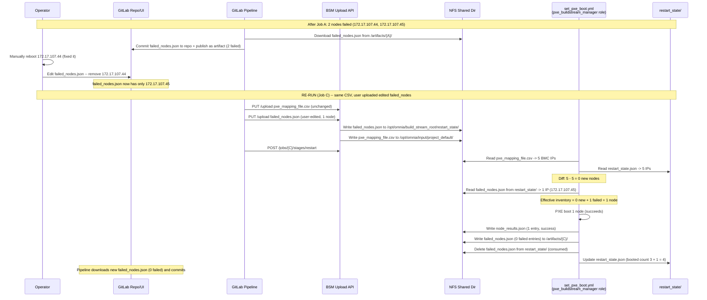
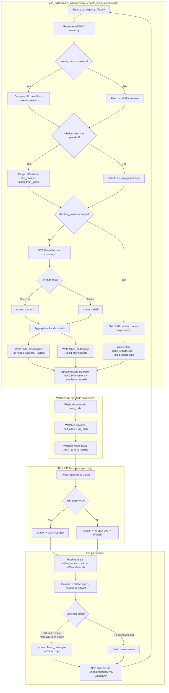
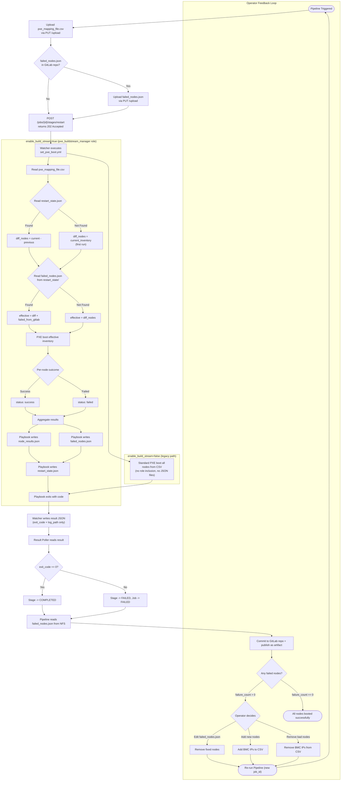

# Module Specification: Add and Remove Node

## Document Metadata

| Field            | Value                        |
|------------------|------------------------------|
| **Document ID**  | MS-002                       |
| **Module Name**  | Add and Remove Node          |
| **Status**       | Draft                        |
| **Version**      | 1.0                          |
| **Date Created** | 2026-05-04                  |
| **Date Updated** | 2026-05-04                 |
| **Author**       | Sowjanya Jagadish            |

---

## Table of Contents

1. [Module Overview](#1-module-overview)
2. [Purpose](#2-purpose)
3. [Component Roles & Responsibilities](#3-component-roles--responsibilities)
4. [Codebase Impact Analysis](#4-codebase-impact-analysis)
5. [Design Principles](#5-design-principles)
6. [JSON File Inventory](#6-json-file-inventory)
7. [NFS File Layout](#7-nfs-file-layout)
8. [Add Node Scenario](#8-add-node-scenario)
9. [Remove Node / Retry Failed Nodes Scenario](#9-remove-node--retry-failed-nodes-scenario)
10. [Success and Failed Nodes Data Flow](#10-success-and-failed-nodes-data-flow)
11. [Combined End-to-End Flow](#11-combined-end-to-end-flow)
12. [Schemas and Implementation Details](#12-schemas-and-implementation-details)
    - 12.1 `restart_state.json` Schema
    - 12.2 `node_results.json` Schema
    - 12.3 `failed_nodes.json` Schema
    - 12.4 `enable_build_stream` Guard Pattern
    - 12.5 `pxe_buildstream_manager` Role Structure
    - 12.6 Upload API Whitelist Addition
    - 12.7 GitLab CI Pipeline Changes
    - 12.8 Modified Files Summary
    - 12.9 Testing Specifications
    - 12.10 Acceptance Criteria
    - 12.11 Implementation Order
    - 12.12 Security Considerations
    - 12.13 Backward Compatibility
    - 12.14 Operational Notes
    - 12.15 Appendix: Sample Playbook Task

---

## 1. Module Overview

The **Add and Remove Node** module extends the Restart API flow with the ability to dynamically manage cluster node membership across pipeline runs. It enables operators to add new nodes to the PXE boot inventory, remove decommissioned nodes, retry previously failed nodes, and avoid re-booting nodes that have already been successfully provisioned. All per-node logic is encapsulated within an Ansible role (`pxe_buildstream_manager`), with no changes required to the Playbook Watcher Service, Result Poller, domain entities, or API routes.

---

## 2. Purpose

This module provides three capabilities, fully aligned with the `pxe_buildstream_manager` role implementation:

1. **Per-node result tracking (success/failed list)** — The Ansible playbook (via the `pxe_buildstream_manager` role) explicitly produces a structured JSON file reporting success or failure for every targeted node, and **writes `failed_nodes.json` directly to NFS** as part of the playbook's own task output.

2. **Inventory persistence and diffing (add/remove node lifecycle)** — On the first run, the full BMC inventory derived from `pxe_mapping_file.csv` is stored on NFS as persistent state. On every subsequent run, the new CSV-derived inventory is compared against the stored inventory; only **newly added nodes** (the diff) are kept in the effective run inventory. **Nodes removed from the CSV between runs are automatically excluded from future targeting.**

3. **Failed-nodes feedback loop via GitLab** — After each run, `failed_nodes.json` (written by the playbook) is published as a GitLab pipeline artifact. The operator can **edit this file in GitLab** (removing nodes they manually rebooted). On the next pipeline run the edited file is uploaded back to NFS via the Upload API. The playbook merges: `effective_inventory = diff_new_nodes + remaining_failed_nodes_from_gitlab`.

---

## 3. Component Roles & Responsibilities

To eliminate ambiguity, the responsibilities of each runtime component are fixed as follows:

| Component | Responsibility | Writes `failed_nodes.json`? | Writes `node_results.json`? | Writes `restart_state.json`? |
|-----------|---------------|----------------------------|----------------------------|------------------------------|
| **Ansible Playbook (`pxe_buildstream_manager` role)** | Executes PXE boot tasks against BMC inventory; performs inventory diff; writes all per-node JSON artifacts directly to NFS at the conclusion of the run. | **YES — playbook is the sole writer** | **YES** | **YES** |
| **Playbook Watcher Service** | Monitors the NFS `requests/` directory for new playbook submissions; executes the playbook inside `omnia_core` container via `podman exec`; captures the exit code; writes a high-level result JSON (exit code + log path) to the NFS `results/` directory. **Does not parse, transform, or write per-node JSON files.** | No | No | No |
| **Result Poller** | Polls the NFS `results/` directory for completed jobs; reads the high-level result JSON written by the Watcher; transitions the stage state in the database to `COMPLETED` or `FAILED` based on the exit code. **Does not parse `node_results.json`, does not write `failed_nodes.json`, and does not interact with per-node artifacts.** | No | No | No |
| **GitLab CI Pipeline** | After the job completes, downloads `failed_nodes.json` directly from the NFS artifacts directory, commits the file to the GitLab repository for operator editing, and publishes it as a pipeline artifact. | No (read-only) | No (read-only) | No |

### Key Clarifications

- **The playbook is the single source of truth for all per-node JSON outputs.** Both `node_results.json` and `failed_nodes.json` are produced by the playbook's own tasks and dropped onto the shared NFS directory.
- **The Watcher is a process executor.** It only runs the playbook and reports the overall exit code. It is not aware of per-node semantics.
- **The Result Poller is a state synchronizer.** It only reads the Watcher's high-level result JSON and updates the stage state. It does not extract or transform per-node data.

---

## 4. Codebase Impact Analysis

| File / Component | Changes Required? | Reason |
|------------------|------------------|--------|
| `build_stream/api/jobs/routes.py` | **No** | Existing API endpoints already expose stage state and artifact retrieval. No new business logic is needed in routes for this flow. |
| `build_stream/core/localrepo/entities.py` | **No** | The `PlaybookResult` entity already captures `exit_code` and `log_file_path`, which is everything the Watcher needs to report. No per-node fields are required because the Result Poller does not consume per-node data. |
| `build_stream/playbook-watcher/playbook_watcher_service.py` | **No** | The Watcher continues to do exactly what it does today — execute the playbook, capture exit code, write result JSON. The new playbook role drops `failed_nodes.json` directly to NFS without involving the Watcher. |
| `build_stream/orchestrator/common/result_poller.py` | **No** | The Result Poller continues to consume only `exit_code` from the Watcher's result. Stage transitions to `COMPLETED` / `FAILED` work exactly as before. |
| `build_stream/orchestrator/upload/use_cases/upload_files.py` | **Yes** | Add `failed_nodes.json` to `ALLOWED_CONFIG_FILES` so the operator's edited file can be re-uploaded to NFS via the existing Upload API. |
| `utils/roles/pxe_buildstream_manager/` | **Yes (NEW)** | This is the new role that owns all per-node logic: inventory diff, PXE boot orchestration, and writing `node_results.json`, `failed_nodes.json`, and `restart_state.json`. |
| `utils/set_pxe_boot.yml` | **Yes** | Include the `pxe_buildstream_manager` role conditionally when `enable_build_stream` is true. |
| `gitlab/roles/hosted_gitlab/files/.gitlab-ci.yml` | **Yes** | Add steps to upload edited `failed_nodes.json` before triggering restart, and to download/commit/publish `failed_nodes.json` after restart completes. |

---

## 5. Design Principles

1. **Playbook owns all per-node logic** — Inventory diffing, PXE boot execution, and JSON artifact generation (`node_results.json`, `failed_nodes.json`, `restart_state.json`) are encapsulated entirely within the `pxe_buildstream_manager` Ansible role. No backend service parses or manipulates per-node data.

2. **`enable_build_stream` guard** — The `pxe_buildstream_manager` role is included in `set_pxe_boot.yml` conditionally based on `enable_build_stream | default(false) | bool`. The flag is loaded from `build_stream_config.yml` by the existing credential utility. When disabled (the default), `set_pxe_boot.yml` behaves exactly as before — no role inclusion, no JSON files, no state persistence. Non-Build-Stream users see zero behavioral change.

3. **NFS as persistent state store** — A dedicated directory (`/opt/omnia/build_stream_root/restart_state/`) persists across jobs. Each re-run creates a new `job_id` since stages cannot be reset to `PENDING`. No new database tables, no new services.

4. **GitLab artifact = the operator's editing surface** — `failed_nodes.json` is a first-class GitLab artifact. The operator edits it directly in GitLab UI to mark manually-rebooted nodes. The pipeline re-uploads it on the next run via the existing Upload API.

5. **No backend changes required for per-node flow** — Because the playbook writes directly to NFS, there is no need to modify the Watcher, Result Poller, `entities.py`, or `routes.py`. The existing exit-code-based stage lifecycle remains the source of truth for stage state.

6. **Minimal JSON files (3 total)** — Only 3 JSON files serve the entire feature: `restart_state.json` (persistent state), `node_results.json` (per-run results), and `failed_nodes.json` (user-editable retry list).

7. **Idempotent updates** — After every run, `restart_state.json` is fully overwritten by the playbook to prevent duplicates and stale data.

8. **Backward compatible** — If the persistent state file does not exist (first run or legacy environment), the playbook falls back to processing all nodes from the CSV. The existing exit-code-based `COMPLETED` / `FAILED` flow is unchanged.

---

## 6. JSON File Inventory

| File | Written By | Read By | Location | Purpose | Persists Across Jobs? |
|------|-----------|---------|----------|---------|----------------------|
| **`restart_state.json`** | `pxe_buildstream_manager` role (playbook) | `pxe_buildstream_manager` role (next run) | `/opt/omnia/build_stream_root/restart_state/restart_state.json` | Persistent state: previous CSV inventory + cumulative successfully booted nodes. Used for inventory diffing on subsequent runs. | Yes (NFS) |
| **`node_results.json`** | `pxe_buildstream_manager` role (playbook) | GitLab CI (display only); operator (manual review) | `/opt/omnia/build_stream_root/artifacts/<job_id>/node_results.json` | Per-run output explicitly logging `status: "success"` or `status: "failed"` for every attempted node. | No (per-job artifact) |
| **`failed_nodes.json`** | `pxe_buildstream_manager` role (playbook) | GitLab CI (download, commit, publish); operator (edit); `pxe_buildstream_manager` role (next run, after upload) | `/opt/omnia/build_stream_root/artifacts/<job_id>/failed_nodes.json`; uploaded back via `/opt/omnia/build_stream_root/restart_state/failed_nodes.json` on re-run | Strictly filtered subset of failed nodes. Operator removes manually-fixed nodes via GitLab UI. Uploaded back on re-run as retry input. | No (per-job, cycles through GitLab) |

---

## 7. NFS File Layout

```
/opt/omnia/build_stream_root/restart_state/
    restart_state.json           # Persistent: previous inventory + booted nodes (written by playbook)
    failed_nodes.json            # User-edited retry list (uploaded from GitLab repo via Upload API)

/opt/omnia/input/project_default/
    pxe_mapping_file.csv         # Source of truth (uploaded by pipeline)

/opt/omnia/build_stream_root/artifacts/<job_id>/
    node_results.json            # Per-node results (written by playbook)
    failed_nodes.json            # Failed-only subset (written by playbook, published to GitLab)
```

---

## 8. Add Node Scenario

```mermaid
sequenceDiagram
    participant Op as Operator
    participant GL as GitLab Repo
    participant Pipe as GitLab Pipeline
    participant API as BSM Upload API
    participant NFS as NFS Shared Dir
    participant Watcher as Playbook Watcher
    participant PB as set_pxe_boot.yml<br/>(pxe_buildstream_manager role)
    participant Poller as Result Poller
    participant State as restart_state/

    Note over Op,State: FIRST RUN (Job A) -- 5 nodes in CSV

    Op->>GL: Commit pxe_mapping_file.csv (5 nodes)
    Pipe->>API: PUT /upload pxe_mapping_file.csv
    API->>NFS: Write to /opt/omnia/input/project_default/
    Pipe->>API: POST /jobs/{A}/stages/restart

    Watcher->>PB: Execute playbook in omnia_core
    PB->>NFS: Read pxe_mapping_file.csv -> 5 BMC IPs
    PB->>State: Check restart_state.json -> NOT FOUND (first run)
    Note over PB: No diff needed -- boot all 5 nodes
    PB->>PB: PXE boot 5 nodes (3 succeed, 2 fail)
    PB->>NFS: Write node_results.json (5 entries: 3 success, 2 failed)
    PB->>NFS: Write failed_nodes.json (2 failed entries)
    PB->>State: Write restart_state.json (5 IPs inventory + 3 booted)
    PB-->>Watcher: exit_code = 2 (partial failure)
    Watcher->>NFS: Write result JSON to results/ (exit_code, log_path)
    Poller->>NFS: Read result JSON
    Poller->>Poller: Transition stage -> FAILED (exit_code != 0)

    Note over Op,State: SECOND RUN (Job B) -- 3 new nodes added to CSV (8 total)

    Op->>GL: Update pxe_mapping_file.csv (8 nodes)
    Pipe->>API: PUT /upload pxe_mapping_file.csv
    API->>NFS: Write to /opt/omnia/input/project_default/
    Pipe->>API: POST /jobs/{B}/stages/restart

    Watcher->>PB: Execute playbook
    PB->>NFS: Read pxe_mapping_file.csv -> 8 BMC IPs
    PB->>State: Read restart_state.json -> 5 IPs (from Job A)
    Note over PB: Diff: 8 - 5 = 3 new nodes
    PB->>NFS: Check failed_nodes.json -> NOT FOUND (user did not upload)
    Note over PB: Effective inventory = 3 new nodes only
    PB->>PB: PXE boot 3 nodes (all succeed)
    PB->>NFS: Write node_results.json (3 entries: 3 success)
    PB->>NFS: Write failed_nodes.json (0 failed entries)
    PB->>State: Update restart_state.json (8 IPs inventory + 6 booted)
    PB-->>Watcher: exit_code = 0
    Watcher->>NFS: Write result JSON to results/
    Poller->>NFS: Read result JSON
    Poller->>Poller: Transition stage -> COMPLETED
```



---

## 9. Remove Node / Retry Failed Nodes Scenario



---

## 10. Success and Failed Nodes Data Flow



---

## 11. Combined End-to-End Flow



---

## 12. Schemas and Implementation Details

### 12.1 `restart_state.json` Schema (Persistent State)

**Path:** `/opt/omnia/build_stream_root/restart_state/<job_id>/restart_state.json`
**Written by:** `pxe_buildstream_manager` role (playbook)
**Read by:** `pxe_buildstream_manager` role (next run, for diffing)

```json
{
  "updated_at": "2026-04-10T16:32:15Z",
  "previous_inventory": {
    "source": "pxe_mapping_file.csv",
    "nodes": [
      {"bmc_ip": "172.17.107.52", "hostname": "slurm-control-node1", "service_tag": "79WWJ91"},
      {"bmc_ip": "172.17.107.43", "hostname": "slurm-node1", "service_tag": "79WWJ92"},
      {"bmc_ip": "172.17.107.44", "hostname": "slurm-node2", "service_tag": "79WWJ93"},
      {"bmc_ip": "172.17.107.45", "hostname": "slurm-node3", "service_tag": "79WWJ94"},
      {"bmc_ip": "172.17.107.41", "hostname": "login-compiler-node1", "service_tag": "ABCD78"}
    ]
  },
  "booted_nodes": [
    {"bmc_ip": "172.17.107.52", "hostname": "slurm-control-node1", "booted_at": "2026-04-10T16:32:15Z"},
    {"bmc_ip": "172.17.107.43", "hostname": "slurm-node1", "booted_at": "2026-04-10T16:32:15Z"},
    {"bmc_ip": "172.17.107.41", "hostname": "login-compiler-node1", "booted_at": "2026-04-10T16:32:15Z"}
  ]
}
```

| Field | Type | Description |
|-------|------|-------------|
| `updated_at` | string | ISO 8601 timestamp of last update |
| `previous_inventory.source` | string | Always `"pxe_mapping_file.csv"` |
| `previous_inventory.nodes[]` | array | Full BMC inventory from the CSV used in the last run |
| `previous_inventory.nodes[].bmc_ip` | string | iDRAC IP address |
| `previous_inventory.nodes[].hostname` | string | Server hostname from CSV |
| `previous_inventory.nodes[].service_tag` | string | Dell service tag from CSV |
| `booted_nodes[]` | array | Cumulative list of successfully booted nodes across all runs |
| `booted_nodes[].bmc_ip` | string | iDRAC IP address |
| `booted_nodes[].hostname` | string | Server hostname |
| `booted_nodes[].booted_at` | string | ISO 8601 timestamp when node was successfully booted |

### 12.2 `node_results.json` Schema (Per-Run Results)

**Path:** `/opt/omnia/build_stream_root/artifacts/<job_id>/node_results.json`
**Written by:** `pxe_buildstream_manager` role (playbook)
**Read by:** GitLab CI (display only); operator (manual review)

```json
{
  "job_id": "018f3c4b-7b5b-7a9d-b6c4-9f3b4f9b2c10",
  "stage_name": "restart",
  "timestamp": "2026-04-10T16:32:15Z",
  "total_nodes": 5,
  "success_count": 3,
  "failure_count": 2,
  "nodes": [
    {
      "bmc_ip": "172.17.107.52",
      "hostname": "slurm-control-node1",
      "service_tag": "79WWJ91",
      "status": "success",
      "message": "PXE Boot: OK | Power: Restart OK"
    },
    {
      "bmc_ip": "172.17.107.44",
      "hostname": "slurm-node2",
      "service_tag": "79WWJ93",
      "status": "failed",
      "message": "Failed. iDRAC is not ready. Retry again after iDRAC is ready"
    }
  ]
}
```

### 12.3 `failed_nodes.json` Schema (User-Editable GitLab Artifact)

**NFS path (output, written by playbook):** `/opt/omnia/build_stream_root/artifacts/<job_id>/failed_nodes.json`
**NFS path (input, uploaded by user):** `/opt/omnia/build_stream_root/restart_state/failed_nodes.json`
**GitLab artifact:** `failed_nodes.json` (downloadable from pipeline, committable to repo)
**Written by:** `pxe_buildstream_manager` role (playbook) — **the playbook is the sole writer of this file**
**Read by:** GitLab CI (download, commit, publish); operator (edit); `pxe_buildstream_manager` role (next run, after upload)

```json
{
  "job_id": "018f3c4b-7b5b-7a9d-b6c4-9f3b4f9b2c10",
  "stage_name": "restart",
  "timestamp": "2026-04-10T16:32:15Z",
  "total_nodes": 5,
  "failure_count": 2,
  "failed_nodes": [
    {
      "bmc_ip": "172.17.107.44",
      "hostname": "slurm-node2",
      "service_tag": "79WWJ93",
      "status": "failed",
      "message": "Failed. iDRAC is not ready. Retry again after iDRAC is ready"
    },
    {
      "bmc_ip": "172.17.107.45",
      "hostname": "slurm-node3",
      "service_tag": "79WWJ94",
      "status": "failed",
      "message": "iDRAC is unreachable. pxe boot might be set. Please check the host reboot status manually"
    }
  ]
}
```

The operator edits this file in GitLab to remove entries for nodes they manually rebooted. On the next pipeline run, the edited file is uploaded back to NFS and only the remaining entries are used as retry targets.

### 12.4 `enable_build_stream` Guard Pattern

The `enable_build_stream` flag is defined in `input/build_stream_config.yml` and loaded by the credential utility (`credential_utility/get_config_credentials.yml`) via `include_vars`. By the time the new role would execute, the flag is available as `enable_build_stream` on localhost.

**Guard pattern in `set_pxe_boot.yml`:**

```yaml
- name: Include pxe_buildstream_manager role for Build Stream flow
  ansible.builtin.include_role:
    name: pxe_buildstream_manager
  when: enable_build_stream | default(false) | bool
```

**Non-Build-Stream behavior:** When `enable_build_stream` is `false` (the default), the `pxe_buildstream_manager` role is not included. The playbook executes exactly as before — `pre_checks` generates inventory from the full CSV, all nodes are PXE booted, and the existing reporting play reports results to console. No JSON files are written, no state is persisted.

### 12.5 `pxe_buildstream_manager` Role Structure

The new role is located at `utils/roles/pxe_buildstream_manager/` and encapsulates all Build Stream-specific logic.

```
utils/roles/pxe_buildstream_manager/
|-- defaults/
|   `-- main.yml                    # Default vars (paths, timeouts)
|-- tasks/
|   |-- main.yml                    # Entry point: orchestrates diff + boot + reporting
|   |-- compute_inventory_diff.yml  # Reads CSV + restart_state + failed_nodes; computes effective inventory
|   |-- execute_pxe_boot.yml        # Iterates effective inventory and triggers PXE boot via idrac_pxe_boot
|   |-- write_node_results.yml      # Writes node_results.json
|   |-- write_failed_nodes.yml      # Writes failed_nodes.json (failed-only subset)
|   `-- update_restart_state.yml    # Writes/overwrites restart_state.json
`-- vars/
    `-- main.yml                    # Path constants
```

#### Role Execution Flow

1. **`compute_inventory_diff.yml`** — Reads `pxe_mapping_file.csv`, loads existing `restart_state.json` (if present), loads uploaded `failed_nodes.json` (if present in `restart_state/`), computes `effective_bmc_ips = (current - previous) UNION uploaded_failed_ips`, and uses `add_host` to override the `bmc` group with the effective list.

2. **`execute_pxe_boot.yml`** — Delegates to the existing `idrac_pxe_boot` role for the hosts in the (now overridden) `bmc` group. Captures per-host `reboot_failed` and `reboot_status` facts.

3. **`write_node_results.yml`** — Aggregates per-host results into a single `node_results.json` and writes it to `/opt/omnia/build_stream_root/artifacts/<job_id>/node_results.json`.

4. **`write_failed_nodes.yml`** — Filters `node_results.json` for `status == "failed"` entries and writes the subset to `/opt/omnia/build_stream_root/artifacts/<job_id>/failed_nodes.json`. **This is the playbook writing `failed_nodes.json` directly to NFS — no backend service is involved.**

5. **`update_restart_state.yml`** — Overwrites `/opt/omnia/build_stream_root/restart_state/restart_state.json` with the current full CSV inventory and the merged (deduplicated) booted nodes list. Also deletes any consumed `failed_nodes.json` from `restart_state/` to prevent reuse on subsequent runs.

### 12.6 Upload API Whitelist Addition

**File:** `build_stream/orchestrator/upload/use_cases/upload_files.py`

This is the **only** backend code change required for this feature. Add `failed_nodes.json` to the allowed upload list so the operator's edited file can be re-uploaded to NFS.

```python
ALLOWED_CONFIG_FILES = {
    "local_repo_config.yml",
    "network_spec.yml",
    "provision_config.yml",
    "pxe_mapping_file.csv",
    "storage_config.yml",
    "telemetry_config.yml",
    "security_config.yml",
    "high_availability_config.yml",
    "omnia_config.yml",
    "build_stream_config.yml",
    "failed_nodes.json",              # <-- NEW: user-edited retry list from GitLab
}
```

The Upload API must also be configured to write `failed_nodes.json` to the `restart_state/` directory (not the standard input directory) so the playbook can read it on the next run. This may require a small mapping addition in the upload handler:

```python
UPLOAD_TARGET_DIRECTORY = {
    "failed_nodes.json": "/opt/omnia/build_stream_root/restart_state/",
    # All other files default to /opt/omnia/input/project_default/
}
```

### 12.7 GitLab CI Pipeline Changes

**File:** `gitlab/roles/hosted_gitlab/files/.gitlab-ci.yml`

#### Before triggering restart: upload user-edited `failed_nodes.json`

```bash
# Upload user-edited failed_nodes.json if it exists in the repo
if [ -f "failed_nodes.json" ]; then
  echo "  Uploading user-edited failed_nodes.json..."
  HTTP_CODE=$(api_call_with_retry upload_failed_response.json \
    -X PUT "${BSM_API_URL}/api/v1/jobs/${JOB_ID}/upload" \
    -F "files=@failed_nodes.json" \
    --cacert "${BSM_CERT_FILE}")
  if [ "$HTTP_CODE" = "200" ]; then
    echo "  [OK] failed_nodes.json uploaded"
  else
    echo "  WARNING: Failed to upload failed_nodes.json (HTTP ${HTTP_CODE})"
  fi
fi
```


### 12.8 Modified Files Summary

| File | Change | Component | Lines Changed |
|------|--------|-----------|---------------|
| `utils/set_pxe_boot.yml` | Conditionally include `pxe_buildstream_manager` role when `enable_build_stream` is true | Playbook | ~5 lines |
| `utils/roles/pxe_buildstream_manager/` | **NEW ROLE**: encapsulates inventory diff, PXE boot orchestration, and writes `node_results.json`, `failed_nodes.json`, `restart_state.json` | New Ansible role | ~250 lines (new) |
| `build_stream/orchestrator/upload/use_cases/upload_files.py` | Add `failed_nodes.json` to `ALLOWED_CONFIG_FILES` and route it to `restart_state/` directory | Upload whitelist | ~3 lines |
| `gitlab/roles/hosted_gitlab/files/.gitlab-ci.yml` | Upload edited `failed_nodes.json` | GitLab CI | ~40 lines |

**Files explicitly NOT modified:**
- `build_stream/playbook-watcher/playbook_watcher_service.py` — no changes
- `build_stream/orchestrator/common/result_poller.py` — no changes
- `build_stream/core/localrepo/entities.py` — no changes
- `build_stream/api/jobs/routes.py` — no changes
- `build_stream/api/restart/routes.py` — no changes

### 12.9 Testing Specifications

#### 12.9.1 Unit Tests (Ansible Role)

**File:** `tests/unit/roles/pxe_buildstream_manager/test_compute_inventory_diff.yml`

| Test Case | Expected Result |
|-----------|-----------------|
| First run: no `restart_state.json` exists | Effective inventory = full CSV (all nodes) |
| Second run: 3 new nodes added to CSV | Effective inventory = 3 diff nodes only |
| Second run: nodes removed from CSV | Removed nodes excluded from effective inventory |
| Re-run with user-edited `failed_nodes.json` (1 node remaining) | Effective inventory = diff + 1 failed node |
| Re-run with no new nodes AND no `failed_nodes.json` | Effective inventory is empty, PXE boot skipped |
| Malformed `restart_state.json` | Graceful fallback, treat as first run |
| Malformed `failed_nodes.json` | Graceful fallback, treat as no retry input |

**File:** `tests/unit/roles/pxe_buildstream_manager/test_write_results.yml`

| Test Case | Expected Result |
|-----------|-----------------|
| All nodes succeed | `node_results.json` has 0 failed; `failed_nodes.json` has empty array |
| All nodes fail | `node_results.json` has all failed; `failed_nodes.json` matches all entries |
| Mixed success/failure | `failed_nodes.json` contains only `status == "failed"` entries |
| Empty effective inventory | Both files written with empty arrays and zero counts |
| `restart_state.json` booted_nodes accumulates across runs | Merge is deduplicated, no overlap |
| `restart_state.json` previous_inventory fully overwritten each run | Contains only current CSV content |

