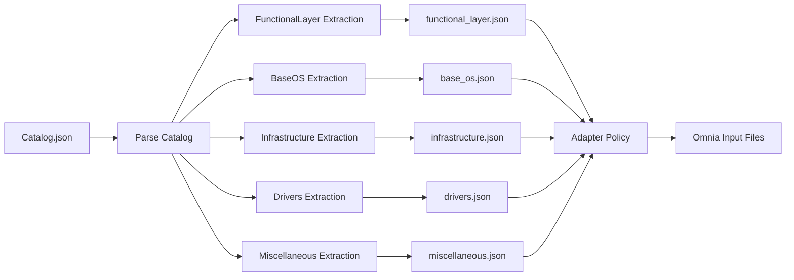
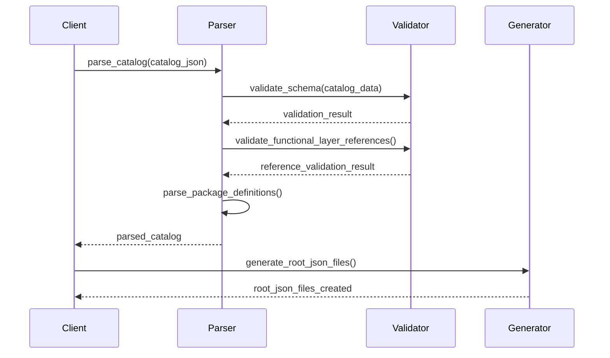
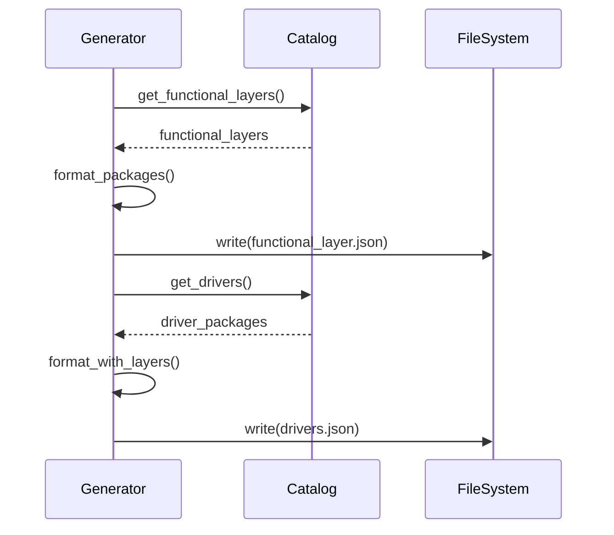
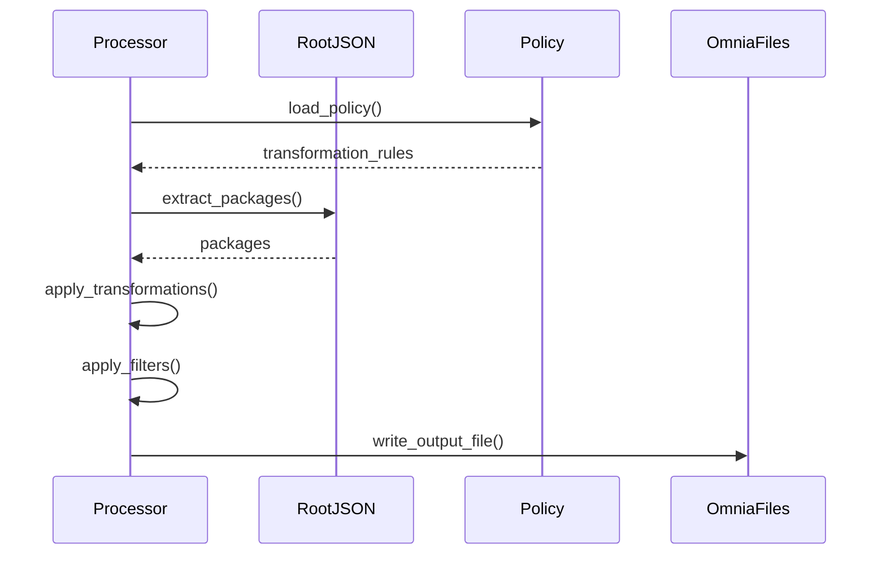

# Module Specification — Catalog Schema Enhancements with FunctionalLayer Association

| | |
|---|---|
| **Document ID** | MSPEC-BS-CATALOG-2026-001 |
| **Current Version** | 1.0 |
| **Date** | 04/13/2026 |
| **Author** | Venugopal Puttaraju |
| **Team** | Dell Omnia — BuildStream |
| **Document Type** | Module Specification |
| **SDD Phase** | 5b — Module Specification |
| **Parent Component Spec** | CSPEC-BS-C1 (Build Pipeline API) |
| **Implementation Task** | Catalog Schema Enhancement |
| **Owner** | SD-1 (primary), SD-2 (review) |

---

**Dell Confidential - Internal Use Only**

Copyright 2026 Dell Inc. or its subsidiaries. All Rights Reserved.

---

## Revision History

| Version | Date | Description | Author(s) |
|---------|------|-------------|-----------|
| 1.0 | 04/13/2026 | Initial module spec — Catalog schema enhancements with FunctionalLayer association approach, schema validation, migration strategy, and adapter policy updates | Venugopal Puttaraju |

---

## Schema Version

| Schema Version | Catalog Schema Version | Description |
|----------------|------------------------|-------------|
| 1.1 | 1.1 | Introduction of `ApplicableFunctionalLayers` attribute for DriverPackages, InfrastructurePackages, and MiscellaneousPackages. Maintains backward compatibility with version 1.0 catalogs. |
| 1.0 | 1.0 | Current production schema without `ApplicableFunctionalLayers` attribute |

**Version Compatibility:**
- **Schema 1.1** catalogs include the `ApplicableFunctionalLayers` attribute
- **Schema 1.0** catalogs are fully supported and continue to work without modification
- Both versions can coexist during migration

---

## Table of Contents

- [1 References](#1-references)
- [2 Purpose & Scope](#2-purpose--scope)
- [3 Current State Analysis](#3-current-state-analysis)
  - [3.1 Current Schema Structure](#31-current-schema-structure)
  - [3.2 Key Issues](#32-key-issues)
  - [3.3 Current File Flow](#33-current-file-flow)
- [4 Proposed Schema Enhancements](#4-proposed-schema-enhancements)
  - [4.1 Core Principle](#41-core-principle)
  - [4.2 Key Changes from Schema 1.0](#42-key-changes-from-schema-10)
  - [4.3 Proposed Structure](#43-proposed-structure)
  - [4.4 Enhanced Package Definitions](#44-enhanced-package-definitions)
- [5 Schema Changes](#5-schema-changes)
  - [5.1 CatalogSchemaVersion Field](#51-catalogschemaversion-field)
  - [5.2 ApplicableFunctionalLayers Attribute](#52-applicablefunctionallayers-attribute)
  - [5.3 JSON Schema Updates](#53-json-schema-updates)
- [6 Implementation Details](#6-implementation-details)
  - [6.1 File Layout](#61-file-layout)
  - [6.2 Schema Validation](#62-schema-validation)
  - [6.3 Package Definition Models](#63-package-definition-models)
  - [6.4 Catalog Parser Modifications](#64-catalog-parser-modifications)
- [7 Root JSON Generation](#7-root-json-generation)
  - [7.1 Generation Logic](#71-generation-logic)
  - [7.2 File Structure Examples](#72-file-structure-examples)
- [8 Adapter Policy Updates](#8-adapter-policy-updates)
  - [8.1 Transformation Rules](#81-transformation-rules)
  - [8.2 Filtering Logic](#82-filtering-logic)
  - [8.3 Omnia Input File Generation](#83-omnia-input-file-generation)
- [9 Migration Strategy](#9-migration-strategy)
  - [9.1 Phase 1: Optional Field Addition](#91-phase-1-optional-field-addition)
  - [9.2 Phase 2: Data Population](#92-phase-2-data-population)
  - [9.3 Phase 3: Required Field Enforcement](#93-phase-3-required-field-enforcement)
  - [9.4 Phase 4: Validation and Filtering](#94-phase-4-validation-and-filtering)
- [10 Validation Rules](#10-validation-rules)
  - [10.1 Schema Validation](#101-schema-validation)
  - [10.2 Business Logic Validation](#102-business-logic-validation)
  - [10.3 Cross-Reference Validation](#103-cross-reference-validation)
- [11 Use Cases](#11-use-cases)
  - [11.1 Targeted Package Installation](#111-targeted-package-installation)
  - [11.2 Package Compatibility Validation](#112-package-compatibility-validation)
  - [11.3 Dynamic Package Selection](#113-dynamic-package-selection)
- [12 Benefits](#12-benefits)
- [13 Sequence Diagrams](#13-sequence-diagrams)
  - [13.1 Catalog Parsing with FunctionalLayer Association](#131-catalog-parsing-with-functionallayer-association)
  - [13.2 Root JSON Generation Flow](#132-root-json-generation-flow)
  - [13.3 Adapter Policy Transformation Flow](#133-adapter-policy-transformation-flow)
- [14 Test Cases](#14-test-cases)
- [15 Traceability](#15-traceability)

---

## 1. References

| Source | ID | Description |
|--------|----|-------------|
| Proposal Document | catalog_schema_revised_proposal.md | Original proposal for catalog schema enhancements with FunctionalLayer association |
| Engineering Spec (HLD) | BuildStream_Engineering_Spec(HLD).md v0.6, Section 4.1.2 | Catalog schema structure, package definitions |
| API Specification | API_Spec.md v2.0, Section 6 | Catalog parsing endpoint contracts |
| Component Spec (C1) | CSPEC-BS-C1, Section 4 | Parse-catalog component design |
| Codebase | `build_stream/core/catalog/` | Existing catalog parsing logic |

---

## 2. Purpose & Scope

This module specification defines the **catalog schema enhancements** to support FunctionalLayer association for Driver, Infrastructure, and Miscellaneous packages. This enhancement enables:

1. **Package-to-FunctionalLayer mapping**: Clear visibility of which packages support which functional layers
2. **Enhanced package management**: Better filtering, selection, and validation capabilities
3. **Flexible deployment**: Support for multiple functional layers per package
4. **Backward compatibility**: Minimal disruption to existing catalog processing

**This spec covers:**
- Schema modifications to existing catalog structure
- New `ApplicableFunctionalLayers` attribute for package definitions
- Schema validation updates
- Root JSON generation logic
- Adapter policy transformation updates
- Migration strategy (4-phase approach)

**This spec does NOT cover:**
- ORM model changes for catalog storage (if applicable)
- API endpoint modifications beyond schema validation
- Playbook integration for package installation
- UI/UX changes for catalog management

---

## 3. Current State Analysis

### 3.1 Current Schema Structure

**Schema Version: 1.0 (Current Production)**

The current catalog schema follows a hierarchical structure with separate top-level sections:

```json
{
  "Catalog": {
    "Name": "string",
    "Version": "string", 
    "Identifier": "string",
    "FunctionalLayer": [...],      // Node types with functional packages
    "BaseOS": [...],               // Base OS packages
    "Infrastructure": [...],       // Infrastructure packages
    "Miscellaneous": [...],        // Miscellaneous packages (simple array)
    "Drivers": [...],              // Driver categories
    "DriverPackages": {...},       // Driver package definitions
    "FunctionalPackages": {...},   // Functional package definitions
    "OSPackages": {...},           // OS package definitions
    "InfrastructurePackages": {...} // Infrastructure package definitions
  }
}
```

**Note**: Schema 1.0 does not include:
- `CatalogSchemaVersion` field
- `ApplicableFunctionalLayers` attribute in package definitions

#### Package Reference Sub-Lists

```json
{
  "FunctionalLayer": [{
    "Name": "string",
    "FunctionalPackages": ["string", "string", ...]  // Package ID references
  }],
  "BaseOS": [{
    "Name": "string",
    "Version": "string", 
    "osPackages": ["string", "string", ...]  // Package ID references
  }],
  "Infrastructure": [{
    "Name": "string",
    "InfrastructurePackages": ["string", "string", ...]  // Package ID references
  }],
  "Drivers": [{
    "Name": "string",
    "DriverPackages": ["string", "string", ...]  // Package ID references
  }],
  "Miscellaneous": ["string", "string", ...]  // Direct package references
}
```

### 3.2 Key Issues

| Issue | Description | Impact |
|-------|-------------|--------|
| **No Layer Association** | Driver, Infrastructure, and Miscellaneous packages don't specify applicable functional layers/roles | **BLOCKER**: Cannot determine which packages belong to which role images, preventing proper role-based package deployment |

**Rationale:** The fundamental limitation is that without FunctionalLayer association, the system cannot properly support driver, infrastructure, and miscellaneous packages in role-based image generation. These packages cannot be mapped to specific roles, making it impossible to create targeted images for different node types.

### 3.3 Current File Flow



---

## 4. Proposed Schema Enhancements

### 4.1 Core Principle

**Maintain the current structure** with separate sections for Drivers, Infrastructure, and Miscellaneous, but:
1. Add `ApplicableFunctionalLayers` attribute to DriverPackages, InfrastructurePackages, and MiscellaneousPackages
2. Preserve existing package definition sections at the top level (no wrapper)
3. Preserve existing reference arrays for backward compatibility

### 4.2 Key Changes from Schema 1.0

| Change | Change Type | Schema 1.0 | Schema 1.1 | Rationale | Example Snippet |
|--------|-------------|-------------|-------------|-----------|-----------------|
| **CatalogSchemaVersion Field** | Add | Not present | Required field identifying catalog version | Enables version detection and backward compatibility handling | `"CatalogSchemaVersion": "1.1"` |
| **ApplicableFunctionalLayers** | Add | Not available in package definitions | Added to DriverPackages, InfrastructurePackages, MiscellaneousPackages | Allows mapping packages to specific functional layers/roles for targeted deployment | `"ApplicableFunctionalLayers": ["login_node_x86_64", "slurm_node_x86_64"]` |
| **Package Structure** | Modified | Driver/Infra/Misc packages without layer association | Same structure + layer association | Maintains backward compatibility while adding role-based support | See enhanced package definitions in section 4.4 |

### 4.3 Proposed Structure

**Schema Version: 1.1**

```json
{
  "Catalog": {
    "Name": "string",
    "Version": "string",
    "CatalogSchemaVersion": "1.1",                // NEW - Catalog schema version identifier
    "Identifier": "string",
    "FunctionalLayer": [...],           // Unchanged - only functional packages
    "BaseOS": [...],                    // Unchanged
    "Infrastructure": [...],            // Unchanged - reference arrays
    "Drivers": [...],                   // Unchanged - reference arrays
    "Miscellaneous": [...],             // Unchanged - reference array
    "FunctionalPackages": {...},        // Unchanged
    "DriverPackages": {...},            // Enhanced with ApplicableFunctionalLayers
    "InfrastructurePackages": {...},    // Enhanced with ApplicableFunctionalLayers
    "MiscellaneousPackages": {...},     // Enhanced with ApplicableFunctionalLayers
    "OSPackages": {...}                 // Unchanged
  }
}
```

### 4.4 Enhanced Package Definitions

#### DriverPackages with FunctionalLayer Support

```json
"DriverPackages": {
  "driver_1": {
    "Name": "nvidia-driver",
    "Version": "525.85",
    "Uri": "http://example.com/nvidia-driver-525.85.rpm",
    "Architecture": ["x86_64", "aarch64"],
    "Type": "rpm",
    "Config": {
      "DriverBrand": "nvidia",
      "DriverType": "gpu"
    },
    "ApplicableFunctionalLayers": [
      "login_node_x86_64",
      "slurm_node_x86_64",
      "service_kube_node_x86_64"
    ]
  }
}
```

#### InfrastructurePackages with FunctionalLayer Support

```json
"InfrastructurePackages": {
  "infra_1": {
    "Name": "monitoring-agent",
    "Version": "1.0.0",
    "Type": "rpm",
    "Architecture": ["x86_64", "aarch64"],
    "Uri": "http://example.com/monitoring-agent-1.0.0.rpm",
    "SupportedFunctions": [{"Name": "metrics"}],
    "ApplicableFunctionalLayers": [
      "login_node_x86_64",
      "login_compiler_node_aarch64",
      "service_kube_control_plane_x86_64"
    ]
  }
}
```

#### MiscellaneousPackages with FunctionalLayer Support

```json
"MiscellaneousPackages": {
  "misc_1": {
    "Name": "utility-script",
    "Version": "2.1.0",
    "Type": "script",
    "Uri": "http://example.com/utility-script-2.1.0.sh",
    "Architecture": ["x86_64", "aarch64"],
    "ApplicableFunctionalLayers": [
      "login_node_x86_64",
      "slurm_control_node_x86_64"
    ]
  },
  "misc_2": {
    "Name": "config-file",
    "Version": "1.0.0",
    "Type": "config",
    "Uri": "http://example.com/config-file-1.0.0.conf",
    "Architecture": ["x86_64"],
    "ApplicableFunctionalLayers": [
      "service_kube_control_plane_x86_64"
    ]
  }
}
```

---

## 5. Schema Changes

### 5.1 CatalogSchemaVersion Field

**New top-level field in Catalog:**

```json
{
  "CatalogSchemaVersion": {
    "type": "string",
    "description": "Catalog schema version identifier",
    "pattern": "^[0-9]+\\.[0-9]+$",
    "examples": ["1.1", "1.0"]
  }
}
```

**Purpose**: Enables version detection and backward compatibility handling.

### 5.2 ApplicableFunctionalLayers Attribute

**New attribute for DriverPackages, InfrastructurePackages, MiscellaneousPackages:**

```json
{
  "ApplicableFunctionalLayers": {
    "type": "array",
    "items": {"type": "string"},
    "description": "List of functional layer names this package applies to",
    "minItems": 1
  }
}
```

### 5.3 JSON Schema Updates

See the complete JSON schema definition in the implementation section below.

---

## 6. Implementation Details

### 6.1 File Layout

```
build_stream/core/catalog/
├── __init__.py
├── schemas/
│   ├── __init__.py
│   ├── catalog_schema.json          # MODIFIED — updated JSON schema
│   └── validator.py                 # MODIFIED — enhanced validation
├── models/
│   ├── __init__.py
│   ├── catalog.py                   # MODIFIED — catalog model
│   └── value_objects.py             # MODIFIED — new value objects
├── parsers/
│   ├── __init__.py
│   ├── catalog_parser.py            # MODIFIED — enhanced parsing logic
│   └── package_extractor.py         # NEW — package extraction utilities
├── generators/
│   ├── __init__.py
│   ├── root_json_generator.py       # NEW — generates root JSON files
│   └── adapter_policy_processor.py  # MODIFIED — updated transformation
└── exceptions.py                    # MODIFIED — new exceptions
```

### 6.2 Schema Validation

Implementation of catalog schema validator with functional layer reference validation.

### 6.3 Package Definition Models

Enhanced existing domain models for DriverPackage, InfrastructurePackage, and MiscellaneousPackage to include ApplicableFunctionalLayers attribute.

### 6.4 Catalog Parser Modifications

Enhanced catalog parser with validation and package definition parsing.

---

## 7. Root JSON Generation

### 7.1 Generation Logic

The root JSON generator creates intermediate files from the catalog:
- `functional_layer.json`: Packages grouped by functional layer
- `base_os.json`: OS packages grouped by OS name
- `infrastructure.json`: Infrastructure packages with layer support
- `drivers.json`: Driver packages with layer support
- `miscellaneous.json`: Miscellaneous packages with layer support

### 7.2 File Structure Examples

#### functional_layer.json
```json
{
  "login_node_x86_64": [
    {
      "package": "vim-enhanced",
      "type": "rpm",
      "repo_name": "x86_64_appstream",
      "architecture": "x86_64",
      "version": "9.1",
      "uri": "https://repo.example.com/vim-enhanced-9.1.x86_64.rpm"
    }
  ]
}
```

#### drivers.json
```json
{
  "nvidia_drivers": [
    {
      "package": "nvidia-driver",
      "type": "rpm",
      "architecture": ["x86_64", "aarch64"],
      "version": "525.85",
      "uri": "http://example.com/nvidia-driver-525.85.rpm",
      "config": {
        "driver_brand": "nvidia",
        "driver_type": "gpu"
      },
      "applicable_functional_layers": [
        "login_node_x86_64",
        "slurm_node_x86_64"
      ]
    }
  ]
}
```

---

## 8. Adapter Policy Updates

### 8.1 Transformation Rules

The adapter policy processor transforms root JSON files into Omnia input files with:
- Field mapping (e.g., `uri` → `url`)
- Field exclusions (e.g., remove `architecture`, `applicable_functional_layers`)
- Filtering by allowlist or functional layers
- Deduplication

### 8.2 Filtering Logic

Supports filtering by:
1. **Allowlist**: Only include specific packages
2. **FunctionalLayer**: Only include packages supporting target layers
3. **Deduplication**: Remove duplicates by (name, version)

### 8.3 Omnia Input File Generation

Example generated files:

#### default_packages.json
```json
{
  "default_packages": {
    "cluster": [
      {
        "package": "systemd",
        "type": "rpm",
        "repo_name": "x86_64_baseos",
        "version": "254",
        "url": "https://repo.example.com/systemd-254.x86_64.rpm"
      }
    ]
  }
}
```

---

## 9. Migration Strategy

### Why Migration is Required

The migration from Schema 1.0 to Schema 1.1 is essential to enable **role-based package deployment** for driver, infrastructure, and miscellaneous packages. Currently, these packages cannot be mapped to specific functional layers/roles, making it impossible to:

- **Deploy targeted packages** for specific node types (login nodes, compute nodes, control plane nodes)
- **Filter packages by role** during image generation
- **Validate package compatibility** with target functional layers
- **Support dynamic package selection** based on role requirements

Migration enables the `ApplicableFunctionalLayers` attribute that provides the critical mapping between packages and the roles they support, unlocking the full potential of role-based infrastructure deployment.

### 9.1 Phase 1: Optional Field Addition

**Changes:**
1. Add `CatalogSchemaVersion` field as optional (defaults to "1.0" if missing)
2. Add `ApplicableFunctionalLayers` as optional field
3. Update schema validation to accept both Schema 1.0 and 1.1 catalogs
4. Implement version detection logic

**Schema Version Handling:**
- Catalogs without `CatalogSchemaVersion` field are treated as Schema 1.0
- Catalogs with `CatalogSchemaVersion: "1.1"` can include `ApplicableFunctionalLayers` (optional in this phase)
- Parser logs informational messages for Schema 1.0 catalogs

**Validation:**
- Existing Schema 1.0 catalogs continue to work without changes
- New Schema 1.1 catalogs can optionally include `ApplicableFunctionalLayers`

### 9.2 Phase 2: Data Population

**Changes:**
1. Populate `ApplicableFunctionalLayers` for all existing packages using migration scripts
2. Set `CatalogSchemaVersion: "1.1"` in migrated catalogs
3. Validate populated data

**Migration Script Updates:**
- Automatically adds `CatalogSchemaVersion: "1.1"` field
- Populates `ApplicableFunctionalLayers` with empty arrays `[]` requiring manual configuration
- Creates backup of original Schema 1.0 catalogs
- Generates migration report listing packages requiring manual configuration

**Rationale for Empty Arrays:**
- **Accuracy**: Prevents incorrect assumptions about package applicability
- **Safety**: Avoids deploying packages to inappropriate roles  
- **Control**: Requires explicit administrator decisions for each package
- **Validation**: Empty arrays are valid in Phase 1 (optional field phase)

**Post-Migration Manual Configuration:**
- Administrators must review each package and specify appropriate functional layers
- Migration script provides guidance based on package types and naming patterns
- Validation will ensure non-empty arrays before Phase 3 enforcement
- Configuration templates available for common package categories

### 9.3 Phase 3: Required Field Enforcement

**Changes:**
1. Make `CatalogSchemaVersion` field required for new catalogs
2. Make `ApplicableFunctionalLayers` required for Schema 1.1 catalogs
3. Enable strict validation for Schema 1.1 catalogs

**Backward Compatibility:**
- Schema 1.0 catalogs continue to be fully supported
- Both Schema 1.0 and 1.1 can coexist

### 9.4 Phase 4: Validation and Filtering

**Changes:**
1. Implement functional layer reference validation
2. Enable filtering by `ApplicableFunctionalLayers` in adapter policy
3. Update root JSON generation to include layer information
4. Deploy full feature set

**Validation:**
- All Schema 1.1 packages have valid `ApplicableFunctionalLayers`
- All layer references exist in `FunctionalLayer` array
- Filtering works correctly in adapter policy
- Schema 1.0 catalogs continue to work as before

---

## 10. Validation Rules

### 10.1 Schema Validation

| Rule | Description | Error Code |
|------|-------------|------------|
| **Required Fields** | All required fields must be present | `SCHEMA_001` |
| **Field Types** | Fields must match expected types | `SCHEMA_002` |
| **Array Constraints** | Arrays must meet min/max item requirements | `SCHEMA_003` |
| **Schema Version** | `CatalogSchemaVersion` must be valid semver format (e.g., "1.1", "1.0") | `SCHEMA_004` |
| **Schema Compatibility** | Schema 1.1 catalogs must include required new fields | `SCHEMA_005` |

### 10.2 Business Logic Validation

| Rule | Description | Error Code |
|------|-------------|------------|
| **Unique Package IDs** | Package IDs must be unique within each category | `BIZ_001` |
| **Non-Empty Layers** | `ApplicableFunctionalLayers` must have at least one entry | `BIZ_002` |
| **Version Consistency** | Schema 1.1 catalogs must have `ApplicableFunctionalLayers` in all applicable packages | `BIZ_003` |

### 10.3 Cross-Reference Validation

| Rule | Description | Error Code |
|------|-------------|------------|
| **Layer Exists** | Referenced functional layers must exist in `FunctionalLayer` array | `REF_001` |
| **Package Exists** | Referenced package IDs must exist in package definition sections | `REF_002` |

---

## 11. Use Cases

### 11.1 Targeted Package Installation

Install packages for a specific functional layer with optional driver/infrastructure inclusion.

### 11.2 Package Compatibility Validation

Validate that packages are compatible with target functional layers before deployment.

### 11.3 Dynamic Package Selection

Programmatically select packages based on functional layer requirements.

---

## 12. Benefits

1. **Maintained Structure Compatibility**: Preserves existing catalog structure
2. **Enhanced Package-FunctionalLayer Mapping**: Clear visibility of package support
3. **Improved Package Management**: Better filtering and validation
4. **Flexible Deployment Options**: Support for multiple layers per package
5. **Backward Compatibility**: Minimal disruption to existing workflows

---

## 13. Sequence Diagrams

### 13.1 Catalog Parsing with FunctionalLayer Association



### 13.2 Root JSON Generation Flow



### 13.3 Adapter Policy Transformation Flow



---

## 14. Test Cases

| Test ID | Description | Expected Result |
|---------|-------------|-----------------|
| TC-001 | Parse catalog with valid ApplicableFunctionalLayers | Success |
| TC-002 | Parse catalog with missing ApplicableFunctionalLayers (Phase 1) | Success (optional) |
| TC-003 | Parse catalog with invalid layer reference | Validation error REF_001 |
| TC-004 | Generate root JSON files | All files created with correct structure |
| TC-005 | Filter packages by functional layer | Only matching packages included |
| TC-006 | Migrate old catalog to new schema | All packages have ApplicableFunctionalLayers |
| TC-007 | Validate duplicate package IDs | Error BIZ_001 |
| TC-008 | Transform root JSON to Omnia input files | Correct field mapping and filtering |

---

## 15. Traceability

| Requirement | Implementation | Test Case |
|-------------|----------------|-----------|
| Support FunctionalLayer association | `ApplicableFunctionalLayers` attribute | TC-001, TC-003 |
| Maintain backward compatibility | Optional field in Phase 1 | TC-002 |
| Validate layer references | Cross-reference validation | TC-003 |
| Generate root JSON files | `RootJSONGenerator` class | TC-004 |
| Filter by functional layer | Adapter policy filtering | TC-005 |
| Migrate existing catalogs | Migration script | TC-006 |
| Prevent duplicate packages | Business logic validation | TC-007 |
| Transform to Omnia format | `AdapterPolicyProcessor` | TC-008 |

---

**End of Module Specification**
