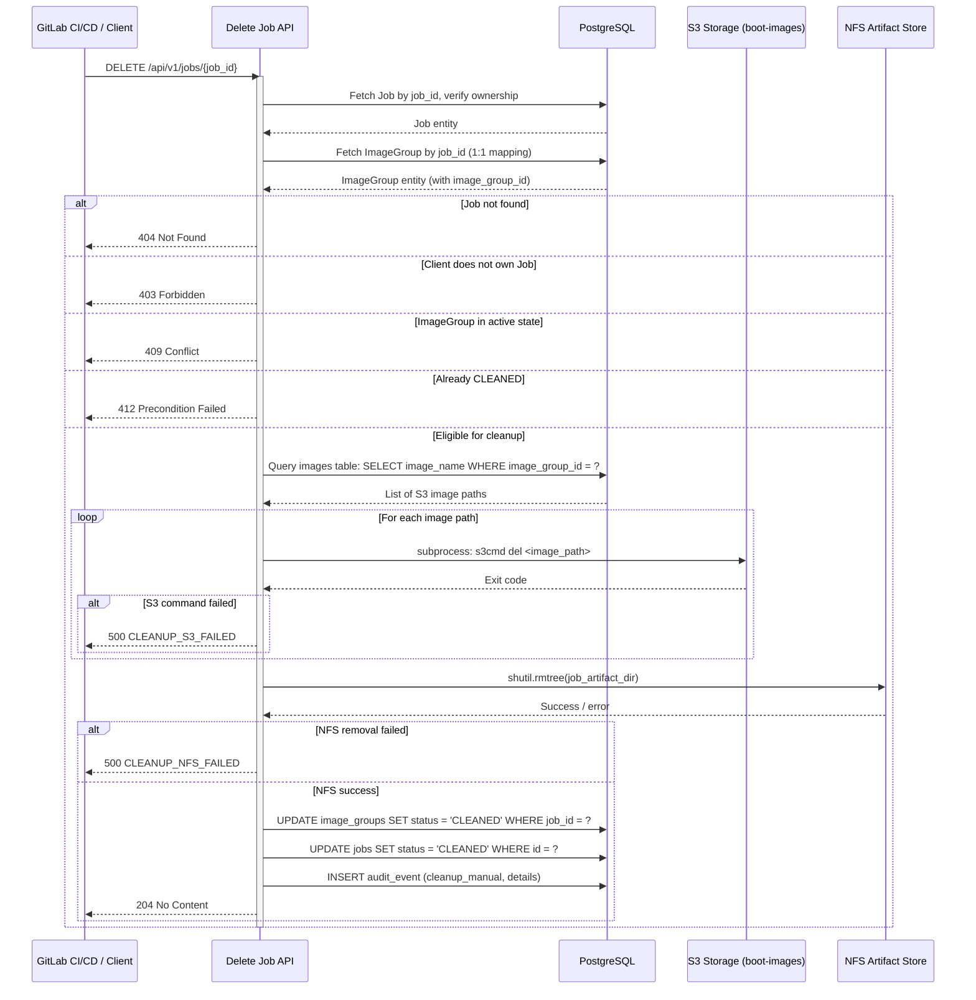
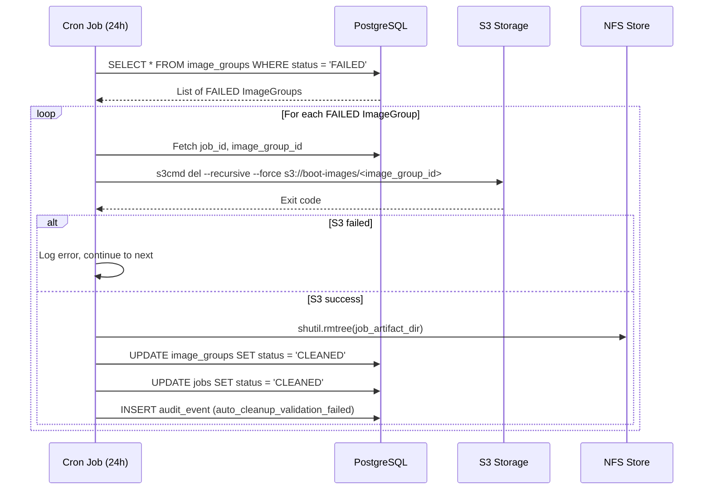

# Module Specification: Job Delete API (Hard Delete with CleanUp)

## Document Metadata

| Field            | Value                        |
|------------------|------------------------------|
| **Document ID**  | MS-007                       |
| **Module Name**  | Job Delete API (Hard Delete) |
| **Status**       | Draft                        |
| **Version**      | 1.0                          |
| **Date Created** | 2026-04-24                   |
| **Date Updated** | 2026-04-24                   |
| **Author**       | Dell Omnia Team              |

---

## 1. Module Overview

### 1.1 Purpose

Enhance the existing `DELETE /api/v1/jobs/{job_id}` endpoint to perform **hard deletion** of all artifacts and images associated with a given Job. The API accepts a `job_id`, internally resolves the associated `image_group_id` (via the strict 1:1 mapping), queries the `images` table to retrieve all S3 image paths, deletes each image from S3 storage using `s3cmd`, removes NFS artifact files, and transitions the Image Group and Job to `CLEANED` status.

Additionally, this module specifies:
- **Automated cleanup cron job** — runs every 24 hours inside the BuildStream container to clean up Image Groups with `FAILED` status.
- **Image retention limit** — enforces a maximum of 50 non-CLEANED Image Groups; aborts the build pipeline if the limit is reached.

### 1.2 Scope

- Enhanced `DELETE /api/v1/jobs/{job_id}` endpoint with hard delete functionality
- Query `images` table to retrieve all S3 image paths for the Image Group
- S3 image deletion via `s3cmd del <image_path>` for each image
- NFS artifact directory removal for the Job
- Image Group and Job status transitions to `CLEANED`
- Audit trail for all cleanup operations (manual and automated)
- Cron-based automated cleanup of `FAILED` Image Groups (24-hour interval)
- Retention limit check integrated into the `build-image` stage guard
- CleanUp Pipeline definition (`.gitlab-ci-cleanup.yml`)

### 1.3 Dependencies

- **Build Stream API (FastAPI):** Existing application in `build_stream/api/`
- **Build Stream Core Domain:** Existing job/stage entities, repositories, value objects
- **PostgreSQL Database:** `jobs`, `image_groups`, `images`, `job_stages` tables
- **NFS Artifact Store:** Per-Job artifact directories
- **S3 Storage (boot-images):** `s3cmd` CLI tool available inside the BuildStream container
- **Build Stream Orchestrator:** Existing use case patterns in `build_stream/orchestrator/`
- **Existing Delete Job Route:** `build_stream/api/jobs/routes.py` — `DELETE /{job_id}` (currently soft delete/tombstone) — enhanced by this module to perform hard delete

### 1.4 What This Module Does NOT Do

- No asynchronous playbook execution — S3 cleanup uses direct `s3cmd` subprocess calls (synchronous), not the NFS playbook queue (which is for asynchronous operations)
- No per-image granular deletion — cleanup is all-or-nothing for an Image Group
- No database record deletion — DB records are preserved with `CLEANED` status for audit trail
- No changes to the Playbook Watcher Service or Result Poller
- No changes to image naming convention — existing S3 paths with job_id component are preserved

---

## 2. Functional Requirements

### 2.1 API Endpoint Specification

#### Endpoint: `DELETE /api/v1/jobs/{job_id}`

**Description:** Performs hard deletion of all images and artifacts for a given Job. Resolves the Image Group ID internally via the 1:1 mapping, queries the `images` table for all S3 paths, deletes each image from S3 storage, removes NFS artifact files, and transitions statuses to `CLEANED`.

**Authentication:** Bearer Token with `jobs:write` scope.

**Path Parameters:**

| Parameter | Type           | Description                    |
|-----------|----------------|--------------------------------|
| `job_id`  | string (UUID)  | Job identifier                 |

**Request Headers:**

| Header              | Description                            |
|---------------------|----------------------------------------|
| `Authorization`     | `Bearer <access_token>`                |
| `X-Client-Id`       | Client identifier for ownership        |
| `X-Correlation-ID`  | Optional UUID for request tracing      |

**Request Body:** None. This endpoint takes no request body parameters.

**Success Response (204 No Content):**
No response body. The operation completed successfully.

**Error Response:**
```json
{
  "error": "JOB_NOT_FOUND",
  "message": "Job 018f3c4b-... not found",
  "correlation_id": "018f3c4b-2d9e-...",
  "timestamp": "2026-04-24T10:30:00Z"
}
```

**HTTP Status Codes:**

| Status | Error Code                  | Description                                            |
|--------|-----------------------------|--------------------------------------------------------|
| `204`  | —                           | Cleanup completed successfully (No Content)            |
| `400`  | `INVALID_JOB_ID`           | Invalid `job_id` format                                |
| `401`  | `UNAUTHORIZED`             | Missing or invalid token                               |
| `403`  | `FORBIDDEN`                | Insufficient scope or client does not own the Job      |
| `404`  | `JOB_NOT_FOUND`            | Job does not exist                                     |
| `409`  | `CLEANUP_STATE_INVALID`    | Image Group in active state (DEPLOYING/RESTARTING/VALIDATING) |
| `412`  | `ALREADY_CLEANED`          | Job has already been cleaned                           |
| `500`  | `CLEANUP_S3_FAILED`        | S3 deletion command failed                             |
| `500`  | `CLEANUP_NFS_FAILED`       | NFS artifact removal failed                            |
| `500`  | `INTERNAL_ERROR`           | Unexpected server error                                |

### 2.2 Cleanup Lifecycle

The cleanup operation is **synchronous** (not queued via the NFS playbook queue):

```
API Request
  → Validate job_id, ownership, state
  → Resolve image_group_id (1:1 mapping)
  → Query images table for all image_name (S3 paths)
  → For each image path: Delete from S3 (s3cmd subprocess)
  → Delete NFS artifacts (shutil.rmtree)
  → Update ImageGroup status → CLEANED
  → Update Job status → CLEANED
  → Record audit event
  → Return 204 No Content
```

**State preconditions:**

| Image Group Status | Cleanup Allowed? | Notes                                    |
|--------------------|-----------------|------------------------------------------|
| `BUILT`            | Yes             | Never deployed — eligible for cleanup    |
| `DEPLOYING`        | **No**          | Active operation — `409 Conflict`        |
| `DEPLOYED`         | Yes             | Deployment completed — eligible          |
| `RESTARTING`       | **No**          | Active operation — `409 Conflict`        |
| `RESTARTED`        | Yes             | Ready for validation — eligible          |
| `VALIDATING`       | **No**          | Active operation — `409 Conflict`        |
| `PASSED`           | Yes             | Terminal — eligible                      |
| `FAILED`           | Yes             | Terminal — eligible                      |
| `CLEANED`          | **No**          | Already cleaned — `412 Precondition`     |

### 2.3 Automated Cleanup (Cron Job)

**Trigger:** Cron job inside the BuildStream container, fires every 24 hours (configurable via `CLEANUP_INTERVAL_HOURS` environment variable, default: `24`).

**Execution Flow:**
1. Query `image_groups` table for all records with `status = 'FAILED'`.
2. For each FAILED Image Group:
   a. Resolve `job_id` and `image_group_id`.
   b. Query `images` table to retrieve all `image_name` values (S3 paths) for the Image Group.
   c. For each image path, execute `s3cmd del <image_path>` to remove the image from S3.
   d. Remove NFS artifact files for the associated Job.
   e. Update Image Group status to `CLEANED`.
   f. Update Job status to `CLEANED`.
   g. Record audit event with reason `auto_cleanup_validation_failed`.
3. If cleanup fails for a specific Image Group, log the error and continue with the next one. Failed cleanups are retried on the next cron cycle.

**Cron Configuration (container crontab):**
```cron
0 */24 * * * /usr/bin/python3 /opt/omnia/build_stream/cleanup_cron.py >> /opt/omnia/log/build_stream/cleanup_cron.log 2>&1
```

### 2.4 Image Retention Limit

**Trigger:** Checked during the `build-image` stage, before playbook execution begins.

**Logic:**
1. Query `SELECT COUNT(*) FROM image_groups WHERE status != 'CLEANED'`.
2. If count >= `IMAGE_RETENTION_LIMIT` (default: `50`, configurable via environment variable):
   - Mark the `build_image` stage as `FAILED` with error code `RETENTION_LIMIT_EXCEEDED`.
   - Mark the Job as `FAILED`.
   - Return error message: `"Image retention limit reached (50). Please clean up existing jobs using the CleanUp Pipeline before building new images."`

### 2.5 Image Naming Convention

**Current naming convention is preserved.** The `images.image_name` column stores the full S3 path, for example:

```
s3://boot-images/slurm_node_x86_64/rhel-slurm_node_x86_64_d539a459-023e-4572-b0b8-ef9513b7e26e-image-build1/rhel10.0-rhel-slurm_node_x86_64_d539a459-023e-4572-b0b8-ef9513b7e26e-image-build1-10.0
```

**Cleanup approach:** The system queries the `images` table to retrieve all `image_name` values for the Image Group, then executes `s3cmd del <image_path>` for each individual image path.

---

## 3. Technical Architecture

### 3.1 Sequence Diagram — Manual CleanUp



### 3.2 Sequence Diagram — Automated CleanUp (Cron)



### 3.3 Data Flow Summary

```
Manual CleanUp (DELETE endpoint):
1. Client/Pipeline calls DELETE /api/v1/jobs/{job_id}
2. API validates job_id format, job existence, client ownership
3. API fetches ImageGroup via 1:1 mapping, validates state
4. API queries images table for all image_name (S3 paths)
5. For each image path: API executes s3cmd del <path> (subprocess)
6. API removes NFS artifact directory (shutil.rmtree)
7. API updates DB: ImageGroup → CLEANED, Job → CLEANED
8. API records audit event
9. API returns 204 No Content

Automated CleanUp:
1. Cron fires every 24 hours
2. Script queries DB for FAILED ImageGroups
3. For each: query images table → s3cmd del each path → NFS remove → DB update → audit
4. Errors logged, next ImageGroup processed
5. Failed cleanups retried on next cycle

Retention Limit:
1. build-image stage triggered
2. UseCase queries count of non-CLEANED ImageGroups
3. If count >= 50: abort with RETENTION_LIMIT_EXCEEDED
4. Else: proceed with build
```

---

## 4. Code Structure

### 4.1 New Files

```
build_stream/
  core/
    cleanup/
      __init__.py
      exceptions.py          # CleanUp-specific domain exceptions
      s3_service.py          # S3CleanupService interface (abstract)
  infra/
    s3/
      __init__.py
      s3cmd_cleanup.py       # S3CmdCleanupService (subprocess-based impl)
  cleanup_cron.py            # Standalone script for cron-based auto-cleanup
```

### 4.2 Modified Files

| File | Change |
|------|--------|
| `build_stream/api/jobs/routes.py` | Enhance existing `DELETE /{job_id}` endpoint to perform hard delete with S3 + NFS cleanup |
| `build_stream/container.py` | Wire `S3CmdCleanupService` into DI container |
| `build_stream/api/dependencies.py` | Add `get_s3_cleanup_service` provider |
| `build_stream/orchestrator/build_image/use_cases/create_build_image.py` | Add retention limit check before build execution |
| `build_stream/infra/db/repositories.py` | Add `count_non_cleaned_image_groups()` and `find_images_by_image_group_id()` query methods |

---

## 5. Module Specifications

### 5.1 Route Handler Enhancement (`api/jobs/routes.py`)

**Note:** The existing `DELETE /{job_id}` endpoint in `api/jobs/routes.py` will be enhanced to perform hard delete with S3 and NFS cleanup. The current soft-delete (tombstone) logic will be replaced with the following implementation:

```python
from fastapi import APIRouter, Depends, HTTPException, status
from typing import Annotated

from api.auth.jwt_handler import verify_token
from api.cleanup.schemas import CleanupResponse, CleanupErrorResponse
from api.cleanup.dependencies import get_cleanup_use_case
from api.dependencies import get_correlation_id
from api.logging_utils import log_secure_info
from core.jobs.value_objects import JobId, ClientId, CorrelationId
from core.jobs.exceptions import JobNotFoundError
from core.cleanup.exceptions import (
    CleanupStateInvalidError,
    AlreadyCleanedError,
    CleanupS3FailedError,
    CleanupNfsFailedError,
)
from orchestrator.cleanup.commands.cleanup_job import CleanupJobCommand
from orchestrator.cleanup.use_cases.cleanup_job import CleanupJobUseCase

router = APIRouter(prefix="/jobs", tags=["CleanUp"])


@router.post(
    "/{job_id}/cleanup",
    response_model=CleanupResponse,
    status_code=status.HTTP_200_OK,
    summary="Clean up job artifacts and images",
    description=(
        "Performs hard cleanup of all images and artifacts for a given Job. "
        "Deletes OS images from S3 storage, removes NFS artifact files, "
        "and transitions the Job and Image Group to CLEANED status."
    ),
    responses={
        200: {"description": "Cleanup completed", "model": CleanupResponse},
        400: {"description": "Invalid request", "model": CleanupErrorResponse},
        401: {"description": "Unauthorized", "model": CleanupErrorResponse},
        403: {"description": "Forbidden", "model": CleanupErrorResponse},
        404: {"description": "Job not found", "model": CleanupErrorResponse},
        409: {"description": "State conflict", "model": CleanupErrorResponse},
        412: {"description": "Already cleaned", "model": CleanupErrorResponse},
        500: {"description": "Internal error", "model": CleanupErrorResponse},
    },
)
async def cleanup_job(
    job_id: str,
    token_data: Annotated[dict, Depends(verify_token)],
    use_case: CleanupJobUseCase = Depends(get_cleanup_use_case),
    correlation_id: CorrelationId = Depends(get_correlation_id),
) -> CleanupResponse:
    """Clean up all artifacts and images for a Job."""
    client_id = ClientId(token_data["client_id"])

    log_secure_info(
        "info",
        f"Cleanup job request: job_id={job_id}, "
        f"correlation_id={correlation_id.value}",
        identifier=client_id.value,
        job_id=job_id,
    )

    try:
        validated_job_id = JobId(job_id)
    except ValueError as e:
        raise HTTPException(
            status_code=status.HTTP_400_BAD_REQUEST,
            detail=_build_error_response(
                "INVALID_JOB_ID",
                f"Invalid job_id format: {job_id}",
                correlation_id.value,
            ),
        ) from e

    try:
        command = CleanupJobCommand(
            job_id=validated_job_id,
            client_id=client_id,
            correlation_id=correlation_id,
        )
        result = use_case.execute(command)

        log_secure_info(
            "info",
            f"Cleanup job success: job_id={job_id}, "
            f"image_group_id={result.image_group_id}, "
            f"s3_deleted={result.s3_objects_deleted}, "
            f"nfs_deleted={result.nfs_files_deleted}, status=200",
            job_id=job_id,
            end_section=True,
        )
        return CleanupResponse(
            job_id=result.job_id,
            image_group_id=result.image_group_id,
            status=result.status,
            cleanup_type=result.cleanup_type,
            s3_objects_deleted=result.s3_objects_deleted,
            nfs_files_deleted=result.nfs_files_deleted,
            cleaned_at=result.cleaned_at,
            correlation_id=str(correlation_id.value),
        )

    except JobNotFoundError as e:
        log_secure_info(
            "warning",
            f"Cleanup job failed: job_id={job_id}, "
            f"reason=not_found, status=404",
            job_id=job_id,
            end_section=True,
        )
        raise HTTPException(
            status_code=status.HTTP_404_NOT_FOUND,
            detail=_build_error_response(
                "JOB_NOT_FOUND", e.message, correlation_id.value,
            ),
        ) from e

    except CleanupStateInvalidError as e:
        log_secure_info(
            "warning",
            f"Cleanup job failed: job_id={job_id}, "
            f"reason=invalid_state, status=409",
            job_id=job_id,
            end_section=True,
        )
        raise HTTPException(
            status_code=status.HTTP_409_CONFLICT,
            detail=_build_error_response(
                "CLEANUP_STATE_INVALID", e.message, correlation_id.value,
            ),
        ) from e

    except AlreadyCleanedError as e:
        log_secure_info(
            "warning",
            f"Cleanup job failed: job_id={job_id}, "
            f"reason=already_cleaned, status=412",
            job_id=job_id,
            end_section=True,
        )
        raise HTTPException(
            status_code=status.HTTP_412_PRECONDITION_FAILED,
            detail=_build_error_response(
                "ALREADY_CLEANED", e.message, correlation_id.value,
            ),
        ) from e

    except CleanupS3FailedError as e:
        log_secure_info(
            "error",
            f"Cleanup job failed: job_id={job_id}, "
            f"reason=s3_cleanup_failed, status=500",
            job_id=job_id,
            exc_info=True,
            end_section=True,
        )
        raise HTTPException(
            status_code=status.HTTP_500_INTERNAL_SERVER_ERROR,
            detail=_build_error_response(
                "CLEANUP_S3_FAILED", e.message, correlation_id.value,
            ),
        ) from e

    except CleanupNfsFailedError as e:
        log_secure_info(
            "error",
            f"Cleanup job failed: job_id={job_id}, "
            f"reason=nfs_cleanup_failed, status=500",
            job_id=job_id,
            exc_info=True,
            end_section=True,
        )
        raise HTTPException(
            status_code=status.HTTP_500_INTERNAL_SERVER_ERROR,
            detail=_build_error_response(
                "CLEANUP_NFS_FAILED", e.message, correlation_id.value,
            ),
        ) from e

    except Exception as e:
        log_secure_info(
            "error",
            f"Cleanup job failed: job_id={job_id}, "
            f"reason=unexpected_error, status=500",
            job_id=job_id,
            exc_info=True,
            end_section=True,
        )
        raise HTTPException(
            status_code=status.HTTP_500_INTERNAL_SERVER_ERROR,
            detail=_build_error_response(
                "INTERNAL_ERROR",
                "An unexpected error occurred",
                correlation_id.value,
            ),
        ) from e


def _build_error_response(error_code: str, message: str, correlation_id: str) -> dict:
    """Build standardized error response dict."""
    from datetime import datetime, timezone
    return {
        "error": error_code,
        "message": message,
        "correlation_id": correlation_id,
        "timestamp": datetime.now(timezone.utc).isoformat().replace("+00:00", "Z"),
    }
```

### 5.2 Schemas (`api/cleanup/schemas.py`)

```python
from pydantic import BaseModel, Field


class CleanupResponse(BaseModel):
    """Response model for cleanup operation (200 OK)."""
    job_id: str = Field(..., description="Job identifier")
    image_group_id: str = Field(..., description="Image Group identifier")
    status: str = Field(..., description="Final status (CLEANED)")
    cleanup_type: str = Field(..., description="Cleanup type (manual or auto)")
    s3_objects_deleted: int = Field(..., description="Number of S3 objects deleted")
    nfs_files_deleted: int = Field(..., description="Number of NFS files deleted")
    cleaned_at: str = Field(..., description="Cleanup timestamp (ISO 8601)")
    correlation_id: str = Field(..., description="Correlation identifier")


class CleanupErrorResponse(BaseModel):
    """Standard error response body for cleanup operations."""
    error: str = Field(..., description="Error code")
    message: str = Field(..., description="Error message")
    correlation_id: str = Field(..., description="Request correlation ID")
    timestamp: str = Field(..., description="Error timestamp (ISO 8601)")
```

### 5.3 Command (`orchestrator/cleanup/commands/cleanup_job.py`)

```python
from dataclasses import dataclass
from core.jobs.value_objects import JobId, ClientId, CorrelationId


@dataclass(frozen=True)
class CleanupJobCommand:
    """Command to trigger cleanup for a Job.

    Attributes:
        job_id: Job identifier from URL path.
        client_id: Client who owns this job (from auth).
        correlation_id: Request correlation identifier for tracing.
    """
    job_id: JobId
    client_id: ClientId
    correlation_id: CorrelationId
```

### 5.4 Response DTO (`orchestrator/cleanup/dtos/cleanup_response.py`)

```python
from dataclasses import dataclass


@dataclass(frozen=True)
class CleanupResult:
    """Response DTO for cleanup operation."""
    job_id: str
    image_group_id: str
    status: str
    cleanup_type: str
    s3_objects_deleted: int
    nfs_files_deleted: int
    cleaned_at: str
```

### 5.5 Domain Exceptions (`core/cleanup/exceptions.py`)

```python
class CleanupStateInvalidError(Exception):
    """Raised when Image Group is in an active state that does not allow cleanup."""
    def __init__(self, image_group_id: str, current_status: str):
        self.message = (
            f"Image Group '{image_group_id}' is in state '{current_status}' "
            f"which does not allow cleanup. Cleanup is only permitted for "
            f"BUILT, DEPLOYED, RESTARTED, PASSED, or FAILED states."
        )
        super().__init__(self.message)


class AlreadyCleanedError(Exception):
    """Raised when the Job has already been cleaned."""
    def __init__(self, job_id: str):
        self.message = f"Job '{job_id}' has already been cleaned."
        super().__init__(self.message)


class CleanupS3FailedError(Exception):
    """Raised when S3 image deletion fails."""
    def __init__(self, image_group_id: str, exit_code: int, stderr: str):
        self.message = (
            f"S3 cleanup failed for Image Group '{image_group_id}': "
            f"s3cmd exit code {exit_code}. Error: {stderr[:500]}"
        )
        super().__init__(self.message)


class CleanupNfsFailedError(Exception):
    """Raised when NFS artifact removal fails."""
    def __init__(self, job_id: str, path: str, error: str):
        self.message = (
            f"NFS cleanup failed for Job '{job_id}': "
            f"could not remove '{path}'. Error: {error[:500]}"
        )
        super().__init__(self.message)


class RetentionLimitExceededError(Exception):
    """Raised when image retention limit is reached."""
    def __init__(self, current_count: int, limit: int):
        self.message = (
            f"Image retention limit reached ({current_count}/{limit}). "
            f"Please clean up existing jobs using the CleanUp Pipeline "
            f"before building new images."
        )
        super().__init__(self.message)
```

### 5.6 S3 Cleanup Service Interface (`core/cleanup/s3_service.py`)

```python
from abc import ABC, abstractmethod
from dataclasses import dataclass


@dataclass(frozen=True)
class S3CleanupResult:
    """Result of an S3 cleanup operation."""
    objects_deleted: int
    exit_code: int
    success: bool


class S3CleanupService(ABC):
    """Abstract interface for S3 image cleanup."""

    @abstractmethod
    def delete_image_group(self, image_group_id: str) -> S3CleanupResult:
        """Delete all S3 objects under the image_group_id prefix.

        Args:
            image_group_id: The Image Group ID used as S3 prefix.

        Returns:
            S3CleanupResult with deletion details.

        Raises:
            CleanupS3FailedError: If the S3 deletion command fails.
        """
        ...
```

### 5.7 S3 Cleanup Implementation (`infra/s3/s3cmd_cleanup.py`)

```python
import subprocess
import re
from api.logging_utils import log_secure_info
from core.cleanup.s3_service import S3CleanupService, S3CleanupResult
from core.cleanup.exceptions import CleanupS3FailedError

S3_BUCKET = "s3://boot-images"
S3CMD_TIMEOUT_SECONDS = 300


class S3CmdCleanupService(S3CleanupService):
    """S3 cleanup implementation using s3cmd subprocess."""

    def delete_image_group(self, image_group_id: str) -> S3CleanupResult:
        """Delete all S3 objects under s3://boot-images/<image_group_id>."""
        # Sanitize image_group_id to prevent command injection
        if not re.match(r'^[a-zA-Z0-9._\-]+$', image_group_id):
            raise CleanupS3FailedError(
                image_group_id, -1,
                f"Invalid image_group_id format: {image_group_id}"
            )

        s3_path = f"{S3_BUCKET}/{image_group_id}/"
        cmd = ["s3cmd", "del", "--recursive", "--force", s3_path]

        log_secure_info(
            "info",
            f"S3 cleanup: executing s3cmd del for {s3_path}",
        )

        try:
            result = subprocess.run(
                cmd,
                capture_output=True,
                text=True,
                timeout=S3CMD_TIMEOUT_SECONDS,
                check=False,
            )
        except subprocess.TimeoutExpired as e:
            raise CleanupS3FailedError(
                image_group_id, -1, f"s3cmd timed out after {S3CMD_TIMEOUT_SECONDS}s"
            ) from e

        if result.returncode != 0:
            raise CleanupS3FailedError(
                image_group_id, result.returncode, result.stderr
            )

        # Parse s3cmd output to count deleted objects
        deleted_count = result.stdout.count("delete:")
        if deleted_count == 0:
            # Try alternate output format
            deleted_count = len(
                [line for line in result.stdout.splitlines() if line.strip()]
            )

        log_secure_info(
            "info",
            f"S3 cleanup complete: {deleted_count} objects deleted from {s3_path}",
        )

        return S3CleanupResult(
            objects_deleted=deleted_count,
            exit_code=result.returncode,
            success=True,
        )
```

### 5.8 Use Case (`orchestrator/cleanup/use_cases/cleanup_job.py`)

```python
import os
import shutil
from datetime import datetime, timezone
from api.logging_utils import log_secure_info
from core.cleanup.exceptions import (
    CleanupStateInvalidError,
    AlreadyCleanedError,
    CleanupNfsFailedError,
)
from core.cleanup.s3_service import S3CleanupService
from core.jobs.exceptions import JobNotFoundError
from orchestrator.cleanup.commands.cleanup_job import CleanupJobCommand
from orchestrator.cleanup.dtos.cleanup_response import CleanupResult

# Active states that block cleanup
ACTIVE_STATES = {"DEPLOYING", "RESTARTING", "VALIDATING"}

# NFS artifact base directory (configurable via env var)
NFS_ARTIFACT_BASE = os.environ.get(
    "NFS_ARTIFACT_BASE", "/opt/omnia/build_stream/jobs"
)


class CleanupJobUseCase:
    """Use case for cleaning up a Job's artifacts and images.

    Orchestrates:
    - Job ownership verification
    - Image Group state validation
    - S3 image deletion via s3cmd
    - NFS artifact directory removal
    - Database status transitions (ImageGroup → CLEANED, Job → CLEANED)
    - Audit trail recording
    """

    def __init__(
        self,
        job_repo,
        image_group_repo,
        s3_cleanup_service: S3CleanupService,
    ) -> None:
        self._job_repo = job_repo
        self._image_group_repo = image_group_repo
        self._s3_cleanup_service = s3_cleanup_service

    def execute(self, command: CleanupJobCommand) -> CleanupResult:
        """Execute cleanup for the given job."""
        # 1. Validate job exists and belongs to client
        job = self._job_repo.find_by_id(command.job_id)
        if job is None:
            raise JobNotFoundError(
                str(command.job_id), str(command.correlation_id)
            )
        if job.client_id != command.client_id:
            raise JobNotFoundError(
                str(command.job_id), str(command.correlation_id)
            )

        # 2. Fetch Image Group via 1:1 mapping
        image_group = self._image_group_repo.find_by_job_id(command.job_id)
        if image_group is None:
            raise JobNotFoundError(
                str(command.job_id), str(command.correlation_id)
            )

        image_group_id = image_group.id

        # 3. Guard: already cleaned
        if image_group.status == "CLEANED":
            raise AlreadyCleanedError(str(command.job_id))

        # 4. Guard: active state
        if image_group.status in ACTIVE_STATES:
            raise CleanupStateInvalidError(
                image_group_id, image_group.status
            )

        # 5. Delete S3 images
        s3_result = self._s3_cleanup_service.delete_image_group(
            image_group_id
        )

        # 6. Delete NFS artifacts
        nfs_deleted = self._delete_nfs_artifacts(
            str(command.job_id), image_group_id
        )

        # 7. Update statuses
        image_group.status = "CLEANED"
        self._image_group_repo.save(image_group)

        job.status = "CLEANED"
        self._job_repo.save(job)

        cleaned_at = (
            datetime.now(timezone.utc).isoformat().replace("+00:00", "Z")
        )

        log_secure_info(
            "info",
            f"Cleanup completed: job_id={command.job_id}, "
            f"image_group_id={image_group_id}, "
            f"s3_deleted={s3_result.objects_deleted}, "
            f"nfs_deleted={nfs_deleted}",
            job_id=str(command.job_id),
        )

        return CleanupResult(
            job_id=str(command.job_id),
            image_group_id=image_group_id,
            status="CLEANED",
            cleanup_type="manual",
            s3_objects_deleted=s3_result.objects_deleted,
            nfs_files_deleted=nfs_deleted,
            cleaned_at=cleaned_at,
        )

    def _delete_nfs_artifacts(
        self, job_id: str, image_group_id: str
    ) -> int:
        """Remove NFS artifact directory for the given job."""
        artifact_dir = os.path.join(NFS_ARTIFACT_BASE, job_id)
        if not os.path.exists(artifact_dir):
            log_secure_info(
                "warning",
                f"NFS artifact directory not found: {artifact_dir}",
                job_id=job_id,
            )
            return 0

        try:
            # Count files before deletion
            file_count = sum(
                len(files)
                for _, _, files in os.walk(artifact_dir)
            )
            shutil.rmtree(artifact_dir)
            return file_count
        except OSError as e:
            raise CleanupNfsFailedError(
                job_id, artifact_dir, str(e)
            ) from e
```

### 5.9 Cron Script (`cleanup_cron.py`)

```python
#!/usr/bin/env python3
"""Automated cleanup cron script for validation-failed Image Groups.

Runs every 24 hours (configurable via CLEANUP_INTERVAL_HOURS).
Queries image_groups with status='FAILED' and cleans up S3 + NFS artifacts.
"""
import os
import sys
import shutil
import subprocess
import re
from datetime import datetime, timezone

# Add build_stream to path for imports
sys.path.insert(0, os.path.dirname(os.path.abspath(__file__)))

from api.logging_utils import log_secure_info

S3_BUCKET = "s3://boot-images"
S3CMD_TIMEOUT_SECONDS = 300
NFS_ARTIFACT_BASE = os.environ.get(
    "NFS_ARTIFACT_BASE", "/opt/omnia/build_stream/jobs"
)


def get_db_session():
    """Create a database session for the cron job."""
    from infra.db.session import get_session_factory
    session_factory = get_session_factory()
    return session_factory()


def get_failed_image_groups(session):
    """Query all image_groups with status='FAILED'."""
    from infra.db.models import ImageGroupModel
    return session.query(ImageGroupModel).filter(
        ImageGroupModel.status == "FAILED"
    ).all()


def cleanup_image_group(session, image_group):
    """Clean up a single FAILED Image Group."""
    image_group_id = image_group.id
    job_id = str(image_group.job_id)

    log_secure_info(
        "info",
        f"Auto-cleanup starting: image_group_id={image_group_id}, "
        f"job_id={job_id}",
    )

    # 1. Delete S3 images
    if not re.match(r'^[a-zA-Z0-9._\-]+$', image_group_id):
        log_secure_info(
            "error",
            f"Auto-cleanup skipped: invalid image_group_id format: "
            f"{image_group_id}",
        )
        return False

    s3_path = f"{S3_BUCKET}/{image_group_id}/"
    cmd = ["s3cmd", "del", "--recursive", "--force", s3_path]

    try:
        result = subprocess.run(
            cmd,
            capture_output=True,
            text=True,
            timeout=S3CMD_TIMEOUT_SECONDS,
            check=False,
        )
        if result.returncode != 0:
            log_secure_info(
                "error",
                f"Auto-cleanup S3 failed: image_group_id={image_group_id}, "
                f"exit_code={result.returncode}, stderr={result.stderr[:200]}",
            )
            return False
    except subprocess.TimeoutExpired:
        log_secure_info(
            "error",
            f"Auto-cleanup S3 timeout: image_group_id={image_group_id}",
        )
        return False

    # 2. Delete NFS artifacts
    artifact_dir = os.path.join(NFS_ARTIFACT_BASE, job_id)
    if os.path.exists(artifact_dir):
        try:
            shutil.rmtree(artifact_dir)
        except OSError as e:
            log_secure_info(
                "error",
                f"Auto-cleanup NFS failed: job_id={job_id}, "
                f"path={artifact_dir}, error={str(e)[:200]}",
            )
            return False

    # 3. Update statuses
    from infra.db.models import JobModel
    image_group.status = "CLEANED"
    image_group.updated_at = datetime.now(timezone.utc)

    job = session.query(JobModel).filter(JobModel.id == image_group.job_id).first()
    if job:
        job.status = "CLEANED"
        job.updated_at = datetime.now(timezone.utc)

    session.commit()

    log_secure_info(
        "info",
        f"Auto-cleanup complete: image_group_id={image_group_id}, "
        f"job_id={job_id}, reason=auto_cleanup_validation_failed",
    )
    return True


def main():
    """Main entry point for the cleanup cron script."""
    log_secure_info("info", "Auto-cleanup cron job started")

    session = get_db_session()
    try:
        failed_groups = get_failed_image_groups(session)
        total = len(failed_groups)
        cleaned = 0
        errors = 0

        log_secure_info(
            "info", f"Auto-cleanup found {total} FAILED Image Groups"
        )

        for ig in failed_groups:
            try:
                if cleanup_image_group(session, ig):
                    cleaned += 1
                else:
                    errors += 1
            except Exception:
                log_secure_info(
                    "error",
                    f"Auto-cleanup unexpected error for "
                    f"image_group_id={ig.id}",
                    exc_info=True,
                )
                errors += 1
                session.rollback()

        log_secure_info(
            "info",
            f"Auto-cleanup cron job completed: "
            f"total={total}, cleaned={cleaned}, errors={errors}",
        )
    finally:
        session.close()


if __name__ == "__main__":
    main()
```

---

## 6. Configuration Changes

### 6.1 Environment Variables

| Variable | Default | Description |
|----------|---------|-------------|
| `CLEANUP_INTERVAL_HOURS` | `24` | Interval in hours between automated cleanup runs |
| `IMAGE_RETENTION_LIMIT` | `50` | Maximum number of non-CLEANED Image Groups before build is aborted |
| `NFS_ARTIFACT_BASE` | `/opt/omnia/build_stream/jobs` | Base directory for per-Job NFS artifact storage |
| `S3_BUCKET` | `s3://boot-images` | S3 bucket for built OS images |
| `S3CMD_TIMEOUT_SECONDS` | `300` | Timeout for s3cmd subprocess execution |

### 6.2 Router Registration

**File:** `build_stream/api/router.py`

```python
from api.cleanup.routes import router as cleanup_router

api_router.include_router(cleanup_router)
```

### 6.3 DI Container Wiring

**File:** `build_stream/container.py`

```python
from infra.s3.s3cmd_cleanup import S3CmdCleanupService
from orchestrator.cleanup.use_cases.cleanup_job import CleanupJobUseCase

s3_cleanup_service = providers.Singleton(S3CmdCleanupService)

cleanup_job_use_case = providers.Factory(
    CleanupJobUseCase,
    job_repo=job_repository,
    image_group_repo=image_group_repository,
    s3_cleanup_service=s3_cleanup_service,
)
```

### 6.4 Dependencies Provider

**File:** `build_stream/api/dependencies.py` (addition)

```python
def get_cleanup_use_case():
    """Provide CleanupJobUseCase instance via DI container."""
    return container.cleanup_job_use_case()
```

### 6.5 Retention Limit Integration

**File:** `build_stream/orchestrator/build_image/use_cases/create_build_image.py` (modification)

Add the following check at the start of the `execute()` method, before any build logic:

```python
import os
from core.cleanup.exceptions import RetentionLimitExceededError

IMAGE_RETENTION_LIMIT = int(os.environ.get("IMAGE_RETENTION_LIMIT", "50"))

# Inside execute() method, before build logic:
non_cleaned_count = self._image_group_repo.count_non_cleaned()
if non_cleaned_count >= IMAGE_RETENTION_LIMIT:
    raise RetentionLimitExceededError(non_cleaned_count, IMAGE_RETENTION_LIMIT)
```

### 6.6 Repository Addition

**File:** `build_stream/infra/db/repositories.py` (addition to ImageGroupRepository)

```python
def count_non_cleaned(self) -> int:
    """Count Image Groups that are not in CLEANED status."""
    return (
        self._session.query(func.count(ImageGroupModel.id))
        .filter(ImageGroupModel.status != "CLEANED")
        .scalar()
    ) or 0
```

### 6.7 Cron Job Setup

**Container Dockerfile addition:**
```dockerfile
RUN echo "0 0 * * * /usr/bin/python3 /opt/omnia/build_stream/cleanup_cron.py >> /opt/omnia/log/build_stream/cleanup_cron.log 2>&1" | crontab -
```

Or alternatively, via container entrypoint script:
```bash
# Start cron daemon for automated cleanup
crond -b -l 8
```

---

## 7. Error Handling

### 7.1 Error Codes

| Error Code                    | HTTP Status | Description                                          |
|-------------------------------|-------------|------------------------------------------------------|
| `INVALID_JOB_ID`             | 400         | `job_id` is not a valid UUID                         |
| `UNAUTHORIZED`               | 401         | Missing or invalid token                             |
| `FORBIDDEN`                  | 403         | Insufficient scope or client does not own the Job    |
| `JOB_NOT_FOUND`              | 404         | Job does not exist or client mismatch                |
| `CLEANUP_STATE_INVALID`      | 409         | Image Group in active state (cannot clean up)        |
| `ALREADY_CLEANED`            | 412         | Job has already been cleaned                         |
| `CLEANUP_S3_FAILED`          | 500         | S3 deletion command failed                           |
| `CLEANUP_NFS_FAILED`         | 500         | NFS artifact removal failed                          |
| `RETENTION_LIMIT_EXCEEDED`   | 409         | Build aborted — retention limit reached              |
| `INTERNAL_ERROR`             | 500         | Unexpected server error                              |

### 7.2 Failure Atomicity

**Design principle:** If S3 cleanup fails, the NFS cleanup is **not** attempted and the Image Group remains in its original state. This prevents partial cleanup where images are deleted from NFS but remain in S3 (or vice versa).

**Failure ordering:**
1. S3 deletion executed first (most likely to fail — external dependency).
2. NFS deletion executed second (local filesystem, unlikely to fail).
3. DB status update executed last (transactional, reliable).

If step 1 fails → return `500 CLEANUP_S3_FAILED`, no state change.
If step 2 fails → S3 images already deleted but NFS remains; return `500 CLEANUP_NFS_FAILED`, no state change. Manual intervention may be needed.
If step 3 fails → transaction rollback, return `500 INTERNAL_ERROR`.

### 7.3 Security Considerations

- **Input sanitization:** The `image_group_id` is validated against `^[a-zA-Z0-9._\-]+$` regex before being passed to the `s3cmd` subprocess to prevent command injection.
- **Subprocess execution:** `s3cmd` is invoked via `subprocess.run()` with a list of arguments (not shell=True) to prevent shell injection.
- **Path traversal prevention:** NFS artifact directory paths are constructed by joining `NFS_ARTIFACT_BASE` with the `job_id` and verified to be within the expected base directory.
- **No secrets in logs:** All logging uses `log_secure_info` which automatically redacts sensitive data.

---

## 8. CleanUp Pipeline (`.gitlab-ci-cleanup.yml`)

### 8.1 Pipeline Architecture

```
Parent Router (.gitlab-ci.yml)
  └── CleanUp Pipeline (.gitlab-ci-cleanup.yml) — triggered manually
        ├── auth stage — obtain JWT token
        ├── list_images stage — query API, generate cleanup_child.yml
        └── trigger_cleanup — trigger:include:artifact → cleanup_child.yml
              ├── select_<image_group> (manual) — operator selects job
              └── cleanup (auto) — calls POST /jobs/{id}/cleanup
```

### 8.2 Pipeline Definition

```yaml
# .gitlab-ci-cleanup.yml
stages:
  - auth
  - list_images
  - trigger_cleanup

auth:
  stage: auth
  script:
    - |
      TOKEN=$(curl -s -X POST "${BUILDSTREAM_URL}/api/v1/auth/token" \
        -H "Content-Type: application/json" \
        -d "{\"client_id\": \"${BSM_CLIENT_ID}\", \"client_secret\": \"${BSM_CLIENT_SECRET}\", \"grant_type\": \"client_credentials\"}" \
        | python3 -c "import sys,json; print(json.load(sys.stdin)['access_token'])")
      echo "BSM_TOKEN=${TOKEN}" >> auth.env
  artifacts:
    reports:
      dotenv: auth.env

list_images:
  stage: list_images
  needs: [auth]
  script:
    - |
      # Query available image groups (all non-CLEANED statuses)
      IMAGES=$(curl -s -H "Authorization: Bearer ${BSM_TOKEN}" \
        "${BUILDSTREAM_URL}/api/v1/images?include_all=true")
      
      # Generate dynamic child pipeline for selection
      python3 -c "
      import json, sys
      data = json.loads('''${IMAGES}''')
      groups = data.get('image_groups', [])
      
      yml = 'stages:\\n  - select\\n  - cleanup\\n\\n'
      for g in groups:
          if g['status'] == 'CLEANED':
              continue
          job_id = g['job_id']
          ig_id = g['image_group_id']
          status = g['status']
          yml += f'''select_{ig_id}:\\n  stage: select\\n  when: manual\\n  script:\\n    - echo \"JOB_ID={job_id}\" >> select.env\\n    - echo \"IMAGE_GROUP_ID={ig_id}\" >> select.env\\n    - echo \"Selected: {ig_id} (Job: {job_id}, Status: {status})\"\\n  artifacts:\\n    reports:\\n      dotenv: select.env\\n\\n'''
      
      yml += '''cleanup:\\n  stage: cleanup\\n  needs: []\\n  when: manual\\n  script:\\n    - |\\n      RESULT=\$(curl -s -w \"\\n%{http_code}\" -X POST \\\\\\n        -H \"Authorization: Bearer \${BSM_TOKEN}\" \\\\\\n        \"\${BUILDSTREAM_URL}/api/v1/jobs/\${JOB_ID}/cleanup\")\\n      HTTP_CODE=\$(echo \"\$RESULT\" | tail -1)\\n      BODY=\$(echo \"\$RESULT\" | head -1)\\n      echo \"\$BODY\" | python3 -m json.tool\\n      if [ \"\$HTTP_CODE\" != \"200\" ]; then exit 1; fi\\n'''
      
      with open('cleanup_child.yml', 'w') as f:
          f.write(yml)
      "
  artifacts:
    paths:
      - cleanup_child.yml

trigger_cleanup:
  stage: trigger_cleanup
  needs: [list_images]
  trigger:
    include:
      - artifact: cleanup_child.yml
        job: list_images
    strategy: depend
```

---

## 9. Testing Specifications

### 9.1 Unit Tests

**File:** `tests/unit/orchestrator/cleanup/test_cleanup_job_use_case.py`

| Test Case                                        | Expected Result                                     |
|--------------------------------------------------|-----------------------------------------------------|
| Valid request, ImageGroup in BUILT state          | S3 + NFS deleted, status → CLEANED, 200 OK          |
| Valid request, ImageGroup in PASSED state         | S3 + NFS deleted, status → CLEANED, 200 OK          |
| Valid request, ImageGroup in FAILED state         | S3 + NFS deleted, status → CLEANED, 200 OK          |
| Valid request, ImageGroup in DEPLOYED state       | S3 + NFS deleted, status → CLEANED, 200 OK          |
| Valid request, ImageGroup in RESTARTED state      | S3 + NFS deleted, status → CLEANED, 200 OK          |
| Job not found                                    | `JobNotFoundError` raised                           |
| Client ID mismatch                               | `JobNotFoundError` raised                           |
| ImageGroup in DEPLOYING state                    | `CleanupStateInvalidError` raised                   |
| ImageGroup in RESTARTING state                   | `CleanupStateInvalidError` raised                   |
| ImageGroup in VALIDATING state                   | `CleanupStateInvalidError` raised                   |
| ImageGroup already CLEANED                       | `AlreadyCleanedError` raised                        |
| S3 deletion fails (non-zero exit code)           | `CleanupS3FailedError` raised, no state change      |
| S3 deletion times out                            | `CleanupS3FailedError` raised, no state change      |
| NFS removal fails (OSError)                      | `CleanupNfsFailedError` raised, no state change     |
| NFS artifact directory does not exist            | Returns 0 files deleted, continues normally          |
| Image Group ID with special characters rejected  | `CleanupS3FailedError` raised (input sanitization)  |

**File:** `tests/unit/infra/s3/test_s3cmd_cleanup.py`

| Test Case                                        | Expected Result                                     |
|--------------------------------------------------|-----------------------------------------------------|
| s3cmd returns exit code 0                        | `S3CleanupResult(success=True, ...)`                |
| s3cmd returns non-zero exit code                 | `CleanupS3FailedError` raised                       |
| s3cmd times out                                  | `CleanupS3FailedError` raised                       |
| Invalid image_group_id (command injection attempt)| `CleanupS3FailedError` raised                       |
| s3cmd output parsed correctly for deleted count  | `objects_deleted` matches parsed count               |

**File:** `tests/unit/core/cleanup/test_retention_limit.py`

| Test Case                                        | Expected Result                                     |
|--------------------------------------------------|-----------------------------------------------------|
| Count < limit (49 of 50)                         | No error raised, build proceeds                     |
| Count == limit (50 of 50)                        | `RetentionLimitExceededError` raised                |
| Count > limit (55 of 50)                         | `RetentionLimitExceededError` raised                |

### 9.2 Integration Tests

**File:** `tests/integration/api/cleanup/test_cleanup_api.py`

| Test Case                              | Method | Endpoint                              | Status |
|----------------------------------------|--------|---------------------------------------|--------|
| Successful cleanup                     | POST   | `/api/v1/jobs/{id}/cleanup`           | 200    |
| Invalid job_id format                  | POST   | `/api/v1/jobs/invalid/cleanup`        | 400    |
| Missing auth token                     | POST   | `/api/v1/jobs/{id}/cleanup`           | 401    |
| Non-existent job                       | POST   | `/api/v1/jobs/{id}/cleanup`           | 404    |
| ImageGroup in active state             | POST   | `/api/v1/jobs/{id}/cleanup`           | 409    |
| Already cleaned job                    | POST   | `/api/v1/jobs/{id}/cleanup`           | 412    |
| Response schema validation             | POST   | `/api/v1/jobs/{id}/cleanup`           | 200    |
| Idempotency: cleanup already cleaned   | POST   | `/api/v1/jobs/{id}/cleanup`           | 412    |
| Retention limit blocks build           | POST   | `/api/v1/jobs/{id}/stages/build-image`| 409    |

---

## 10. Acceptance Criteria

### 10.1 Functional — Manual CleanUp
- [ ] `POST /api/v1/jobs/{job_id}/cleanup` returns `200 OK` with cleanup summary
- [ ] S3 images deleted via `s3cmd del --recursive --force s3://boot-images/<image_group_id>`
- [ ] NFS artifact directory for the Job is fully removed
- [ ] Image Group status transitions to `CLEANED`
- [ ] Job status transitions to `CLEANED`
- [ ] Audit event recorded with cleanup details
- [ ] `404` returned for non-existent Job
- [ ] `409` returned for active Image Group states (DEPLOYING/RESTARTING/VALIDATING)
- [ ] `412` returned for already-cleaned Job
- [ ] `500` returned if S3 or NFS cleanup fails; Image Group remains in previous state

### 10.2 Functional — Automated CleanUp
- [ ] Cron job runs every 24 hours inside the BuildStream container
- [ ] All `FAILED` Image Groups are cleaned up automatically
- [ ] Each auto-cleanup records an audit event with reason `auto_cleanup_validation_failed`
- [ ] Errors for individual Image Groups do not stop processing of remaining groups
- [ ] Failed auto-cleanups are retried on the next cron cycle

### 10.3 Functional — Retention Limit
- [ ] `build-image` stage checks count of non-CLEANED Image Groups before building
- [ ] Build is aborted with `RETENTION_LIMIT_EXCEEDED` if count >= 50
- [ ] Error message instructs user to clean up via CleanUp Pipeline

### 10.4 Functional — Image Naming
- [ ] Image names in `images` table use format `<image_group_id>/<role>.img`
- [ ] `image_name` matches the S3 object key
- [ ] No Job ID in image names

### 10.5 Non-Functional
- [ ] API response time < 30 seconds (includes S3 subprocess)
- [ ] `image_group_id` input sanitized against command injection
- [ ] All logging uses `log_secure_info`
- [ ] Follows existing code conventions (FastAPI, Pydantic, DI, DDD)
- [ ] Unit test coverage > 80%

### 10.6 Integration
- [ ] CleanUp Pipeline (`.gitlab-ci-cleanup.yml`) works end-to-end
- [ ] No regressions in existing build/deploy pipeline
- [ ] `cleanup` endpoint appears in OpenAPI/Swagger docs
- [ ] Existing `DELETE /api/v1/jobs/{job_id}` tombstone endpoint unaffected

---

## 11. Implementation Order

1. Create domain exceptions (`core/cleanup/exceptions.py`)
2. Create S3 cleanup service interface (`core/cleanup/s3_service.py`)
3. Create S3 cleanup implementation (`infra/s3/s3cmd_cleanup.py`)
4. Create command and DTO (`orchestrator/cleanup/commands/`, `orchestrator/cleanup/dtos/`)
5. Create use case (`orchestrator/cleanup/use_cases/cleanup_job.py`)
6. Create API schemas (`api/cleanup/schemas.py`)
7. Create API route handler (`api/cleanup/routes.py`)
8. Create DI dependencies (`api/cleanup/dependencies.py`)
9. Wire into DI container (`container.py`, `dependencies.py`)
10. Register `cleanup_router` in `api/router.py`
11. Add `count_non_cleaned()` to ImageGroupRepository (`infra/db/repositories.py`)
12. Add retention limit check to `create_build_image` use case
13. Update image naming in `build_image` use case (remove Job ID from names)
14. Create cron script (`cleanup_cron.py`)
15. Configure container crontab
16. Create CleanUp Pipeline YAML (`.gitlab-ci-cleanup.yml`)
17. Write unit tests
18. Write integration tests
19. Run full test suite to verify no regressions

---

## Appendix A: Existing Infrastructure Reused

| Component                          | Existing | New Code Required |
|------------------------------------|----------|-------------------|
| FastAPI application                | Yes      | No                |
| JWT authentication                 | Yes      | No                |
| Job entities & repositories        | Yes      | No                |
| ImageGroup entities & repositories | Yes      | Query addition only |
| PostgreSQL database                | Yes      | No schema changes  |
| NFS Artifact Store                 | Yes      | No                |
| `s3cmd` CLI tool                   | Yes      | No (already in container) |
| DI container (`container.py`)      | Yes      | Wiring only       |
| `log_secure_info` logging          | Yes      | No                |
| Error response patterns            | Yes      | No (follow existing) |

## Appendix B: Comparison — Soft Delete vs. CleanUp

| Aspect              | Soft Delete (`DELETE /jobs/{id}`)     | CleanUp (`POST /jobs/{id}/cleanup`)        |
|---------------------|---------------------------------------|---------------------------------------------|
| **Method**          | DELETE                                | POST                                        |
| **Behavior**        | Tombstone — marks Job as deleted      | Hard delete — removes S3 images + NFS files |
| **DB Records**      | Preserved (tombstoned)                | Preserved with `CLEANED` status             |
| **S3 Images**       | Not touched                           | Deleted via `s3cmd`                         |
| **NFS Artifacts**   | Not touched                           | Removed via `shutil.rmtree`                 |
| **Image Group**     | No state change                       | Status → `CLEANED`                          |
| **Audit Trail**     | Job tombstone event                   | Full cleanup audit with details             |
| **Scope**           | Job metadata only                     | Job + ImageGroup + images + artifacts       |
| **Use Case**        | Administrative soft delete            | Storage reclamation and lifecycle cleanup    |

## Appendix C: S3 Storage Structure

```
s3://boot-images/
  ├── omnia-cluster-v1.2/
  │   ├── slurm_node.img
  │   ├── slurm_controller_node.img
  │   ├── kube_control_plane.img
  │   └── kube_node.img
  ├── omnia-cluster-v1.3/
  │   ├── slurm_node.img
  │   └── login_node.img
  └── ...
```

`s3cmd del --recursive --force s3://boot-images/omnia-cluster-v1.2/` removes the entire `omnia-cluster-v1.2/` subtree.

---

**End of Module Specification**
