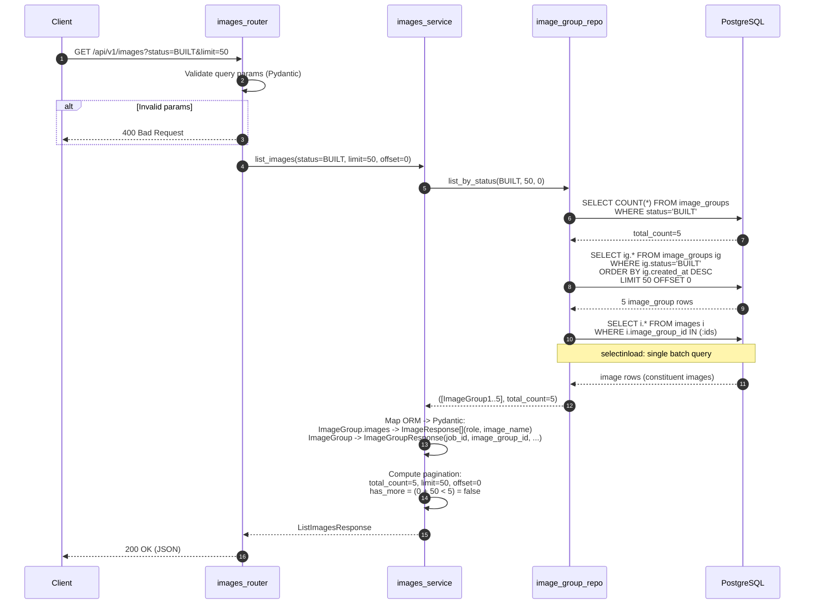

# Module Specification — Images API (GET /api/v1/images)

| | |
|---|---|
| **Document ID** | MSPEC-BS-IMAGES-2026-001 |
| **Current Version** | 1.0 |
| **Date** | 04/07/2026 |
| **Author** | Rajeshkumar S |
| **Team** | Dell Omnia — BuildStream |
| **Document Type** | Module Specification |
| **SDD Phase** | 5b — Module Specification |
| **Parent Component Spec** | CSPEC-BS-C2-2026-001 (Deploy Pipeline API, Section 5.1) |
| **Parent API Spec** | API_Spec.md v2.0, Section 4.3 (ListImages API) |
| **Implementation Task** | S1-5 |
| **Owner** | SD-1 (primary), SD-2 (review) |

---

**Dell Confidential - Internal Use Only**

Copyright 2026 Dell Inc. or its subsidiaries. All Rights Reserved.

---

## Revision History

| Version | Date | Description | Author(s) |
|---------|------|-------------|-----------|
| 1.0 | 04/07/2026 | Initial module spec — Images API implementation details, DB queries, pagination, response assembly | Dell Omnia Team |

---

## Table of Contents

- [1 References](#1-references)
- [2 Purpose & Scope](#2-purpose--scope)
- [3 Module Architecture](#3-module-architecture)
  - [3.1 File Layout](#31-file-layout)
  - [3.2 Layer Responsibilities](#32-layer-responsibilities)
- [4 Interface Contract](#4-interface-contract)
  - [4.1 HTTP Interface](#41-http-interface)
  - [4.2 Query Parameters](#42-query-parameters)
  - [4.3 Response Schema](#43-response-schema)
- [5 Implementation Detail](#5-implementation-detail)
  - [5.1 Router Layer](#51-router-layer)
  - [5.2 Service Layer](#52-service-layer)
  - [5.3 Repository Layer](#53-repository-layer)
  - [5.4 SQL Query Patterns](#54-sql-query-patterns)
- [6 DB Schema Dependencies](#6-db-schema-dependencies)
  - [6.1 Tables Read](#61-tables-read)
  - [6.2 Indexes Used](#62-indexes-used)
  - [6.3 Schema Requirements](#63-schema-requirements)
- [7 Pydantic Schemas](#7-pydantic-schemas)
- [8 Error Handling](#8-error-handling)
- [9 Edge Cases & Behaviors](#9-edge-cases--behaviors)
- [10 Sequence Diagram](#10-sequence-diagram)
- [11 Test Cases](#11-test-cases)
- [12 Traceability](#12-traceability)

---

## 1. References

| Source | ID | Description |
|--------|----|-------------|
| API Specification | API_Spec.md v2.0, Section 4.3 | ListImages API endpoint contract — request/response format, authentication, error codes |
| Component Spec | CSPEC-BS-C2-2026-001, Section 5.1 | Component-level design: module interaction flow, repository query, error behavior |
| Engineering Spec (HLD) | BuildStream_Engineering_Spec(HLD).md v0.6, Sections 3.2.3, 4.1.3.3 | System-level flow, DB schema for `image_groups` and `images` tables |
| Functional Spec | BuildStream_Functional_Spec.md v1.2, Section 4.6 | Functional requirements for ListImages query processing |
| Implementation Plan | BuildStream_Implementation_Plan.md, S1-5 | Task definition, owner, dependencies |

---

## 2. Purpose & Scope

This module specification provides the implementation-level detail for the **GET /api/v1/images** endpoint (Images API). This is the entry point for the Deploy Pipeline — it enables the pipeline or operator to list available Image Groups with their constituent images, select a target for deployment, and obtain the Job ID required for subsequent deploy stage calls.

**What this document covers that the Component Spec does not:**

| Aspect | Component Spec Coverage | This Document |
|--------|------------------------|---------------|
| SQL query optimization | General query pattern | Exact query plan, index usage, pagination strategy |
| Empty result handling | Returns empty array | Explicit 200 OK with empty `image_groups` array and `total_count: 0` |
| Response assembly | High-level mapping | Field-by-field ORM → Pydantic mapping, `selectinload` strategy |
| Status filter validation | Pydantic validation | Allowed enum values, default behavior, error messages |
| Pagination edge cases | `limit`/`offset` basics | `offset > total`, `limit = 0` (rejected), concurrent inserts |
| Performance considerations | Not covered | Query plan analysis, N+1 avoidance, index strategy |

**Out of scope:**
- Authentication/authorization (handled by common middleware per API Spec Section 2)
- Rate limiting (handled by common middleware per API Spec Section 9.4)
- Database schema creation (handled by Component 4 — Alembic migrations)

---

## 3. Module Architecture

### 3.1 File Layout

```
build_stream/
├── api/
│   ├── router.py                      # MODIFIED: add images_router inclusion
│   ├── dependencies.py                # MODIFIED: add image_group repo factories
│   └── images/                        # NEW: Images API module
│       ├── __init__.py
│       ├── routes.py                  # Router: GET /images endpoint
│       ├── schemas.py                 # Pydantic schemas: request/response
│       └── dependencies.py            # DI: use case / service providers
├── orchestrator/
│   └── images/                        # NEW: Images use case (thin)
│       └── use_cases/
│           └── list_images_use_case.py
├── core/
│   └── image_group/                   # Shared domain (from Module_ImageGroup_DataModel)
│       ├── repositories.py            # ImageGroupRepository interface
│       └── value_objects.py           # ImageGroupStatus enum
├── infra/
│   └── db/
│       ├── models.py                  # ImageGroupModel, ImageModel (centralized)
│       └── repositories.py            # SqlImageGroupRepository (centralized)
└── container.py                       # MODIFIED: register image_group_repository
```

### 3.2 Layer Responsibilities

| Layer | Module | Responsibility | Allowed Dependencies |
|-------|--------|---------------|---------------------|
| **Router** | `api/images/routes.py` | Parse query params, validate via Pydantic, delegate to use case, format HTTP response | Use case (via `Depends`), Pydantic schemas |
| **Use Case** | `orchestrator/images/use_cases/list_images_use_case.py` | Orchestrate query: call repository, assemble response DTO | `ImageGroupRepository` interface |
| **Repository** | `infra/db/repositories.py` (`SqlImageGroupRepository`) | Execute SQL queries: count + data with eager-loaded images | SQLAlchemy `Session` (synchronous), ORM models |

**Note:** The Domain (UseCase) layer's guard checks and state transitions (in `core/image_group/state_machine.py`) are not involved in the Images API read path. This endpoint is read-only.

**DI Pattern:** Following existing codebase conventions, the use case is provided via `api/images/dependencies.py` which creates `SqlImageGroupRepository` in prod (using the shared DB session) or returns the in-memory version from the DI container in dev.

---

## 4. Interface Contract

### 4.1 HTTP Interface

| Attribute | Value |
|-----------|-------|
| **Method** | `GET` |
| **Path** | `/api/v1/images` |
| **Authentication** | Bearer Token with `catalog:read` scope |
| **Content-Type** | N/A (no request body) |
| **Response Content-Type** | `application/json` |
| **Success Status** | `200 OK` |

### 4.2 Query Parameters

| Parameter | Type | Required | Default | Constraints | Description |
|-----------|------|----------|---------|-------------|-------------|
| `status` | string | No | `BUILT` | Must be valid `ImageGroupStatus` enum value | Filter image groups by lifecycle status |
| `limit` | integer | No | `100` | `1 ≤ limit ≤ 1000` | Maximum number of results per page |
| `offset` | integer | No | `0` | `offset ≥ 0` | Pagination offset |

**Default behavior:** When called with no query parameters, the API returns up to 100 image groups with status `BUILT`, ordered by `created_at DESC` (most recent first).

### 4.3 Response Schema

**Success (200 OK):**

```json
{
  "image_groups": [
    {
      "job_id": "018f3c4b-7b5b-7a9d-b6c4-9f3b4f9b2c10",
      "image_group_id": "omnia-cluster-v1.2",
      "images": [
        {"role": "slurm_node", "image_name": "slurm_node.img"},
        {"role": "slurm_controller_node", "image_name": "slurm_controller_node.img"},
        {"role": "login_node", "image_name": "login_node.img"}
      ],
      "status": "BUILT",
      "created_at": "2026-03-15T10:30:00Z",
      "updated_at": "2026-03-15T14:45:00Z"
    }
  ],
  "pagination": {
    "total_count": 1,
    "limit": 100,
    "offset": 0,
    "has_more": false
  }
}
```

**Empty results (200 OK):**

```json
{
  "image_groups": [],
  "pagination": {
    "total_count": 0,
    "limit": 100,
    "offset": 0,
    "has_more": false
  }
}
```

---

## 5. Implementation Detail

### 5.1 Router Layer

```python
# build_stream/api/images/routes.py

from typing import Annotated, Optional

from fastapi import APIRouter, Depends, Header, Query, status
from fastapi.exceptions import HTTPException

from build_stream.api.dependencies import verify_token, require_catalog_read
from build_stream.api.images.dependencies import get_list_images_use_case
from build_stream.api.images.schemas import (
    ListImagesResponse,
    ListImagesQueryParams,
    ErrorResponse,
)
from build_stream.api.logging_utils import log_secure_info
from build_stream.core.image_group.value_objects import ImageGroupStatus

router = APIRouter(prefix="/jobs", tags=["images"])


@router.get(
    "/images",
    response_model=ListImagesResponse,
    status_code=status.HTTP_200_OK,
    summary="List available Image Groups",
    description="Returns paginated Image Groups with constituent images.",
    responses={
        200: {"description": "Image groups listed", "model": ListImagesResponse},
        400: {"description": "Invalid query parameters", "model": ErrorResponse},
        401: {"description": "Unauthorized", "model": ErrorResponse},
        403: {"description": "Forbidden", "model": ErrorResponse},
        500: {"description": "Internal server error", "model": ErrorResponse},
    },
)
def list_images(
    status_filter: Optional[str] = Query(
        default="BUILT",
        alias="status",
        description="Filter by ImageGroup status",
    ),
    limit: int = Query(default=100, ge=1, le=1000),
    offset: int = Query(default=0, ge=0),
    token_data: Annotated[dict, Depends(verify_token)] = None,
    scope_data: Annotated[dict, Depends(require_catalog_read)] = None,
    use_case=Depends(get_list_images_use_case),
) -> ListImagesResponse:
    """
    List available Image Groups with constituent images.

    This endpoint is the entry point for the Deploy Pipeline —
    it provides the Job ID <-> Image Group ID mapping needed
    to select a deployment target.
    """
    log_secure_info("info", "ListImages request received", extra={
        "status": status_filter, "limit": limit, "offset": offset,
    })

    try:
        # Validate status enum value
        params = ListImagesQueryParams(
            status=status_filter, limit=limit, offset=offset
        )
    except ValueError as e:
        raise HTTPException(
            status_code=status.HTTP_400_BAD_REQUEST,
            detail={
                "error_code": "INVALID_STATUS",
                "message": str(e),
            },
        ) from e

    try:
        result = use_case.execute(
            status=params.status,
            limit=params.limit,
            offset=params.offset,
        )
        return result
    except Exception as e:
        log_secure_info("error", f"ListImages failed: {e}", exc_info=True)
        raise HTTPException(
            status_code=status.HTTP_500_INTERNAL_SERVER_ERROR,
            detail={"error_code": "INTERNAL_ERROR", "message": str(e)},
        ) from e
```

**Router Responsibilities:**
1. Extract and validate query parameters via Pydantic `ListImagesQueryParams`
2. Authenticate via `verify_token` and authorize via `require_catalog_read` (shared dependencies)
3. Delegate to `ListImagesUseCase.execute()` (injected via `Depends`)
4. Return `ListImagesResponse` (FastAPI auto-serializes to JSON)

**Router Registration** (in `build_stream/api/router.py`):
```python
from api.images.routes import router as images_router
api_router.include_router(images_router)
```

### 5.1.1 Dependencies

```python
# build_stream/api/images/dependencies.py

import os
from fastapi import Depends
from sqlalchemy.orm import Session

from build_stream.api.dependencies import get_db_session, _create_sql_image_group_repo

_ENV = os.getenv("ENV", "prod").lower()


def _get_container():
    from build_stream.container import container
    return container


def get_list_images_use_case(
    db_session: Session = Depends(get_db_session),
):
    """Provide ListImagesUseCase with appropriate repository."""
    if _ENV == "prod":
        from build_stream.orchestrator.images.use_cases.list_images_use_case import (
            ListImagesUseCase,
        )
        return ListImagesUseCase(
            image_group_repo=_create_sql_image_group_repo(db_session),
        )
    return _get_container().list_images_use_case()
```

### 5.2 Use Case Layer

```python
# build_stream/orchestrator/images/use_cases/list_images_use_case.py

from build_stream.api.images.schemas import (
    ImageResponse,
    ImageGroupResponse,
    PaginationResponse,
    ListImagesResponse,
)
from build_stream.core.image_group.repositories import ImageGroupRepository
from build_stream.core.image_group.value_objects import ImageGroupStatus


class ListImagesUseCase:
    """Orchestrates the Images API query and response assembly."""

    def __init__(self, image_group_repo: ImageGroupRepository):
        self._repo = image_group_repo

    def execute(
        self,
        status: ImageGroupStatus,
        limit: int,
        offset: int,
    ) -> ListImagesResponse:
        """
        Query image_groups + images, assemble paginated response.

        Steps:
        1. Call repository to get (image_groups_domain_entities, total_count)
        2. Map domain entities -> Pydantic response models
        3. Compute pagination metadata
        4. Return assembled ListImagesResponse
        """
        image_groups, total_count = self._repo.list_by_status(
            status=status, limit=limit, offset=offset
        )

        # Map domain entities -> Pydantic
        group_responses = []
        for ig in image_groups:
            images = [
                ImageResponse(role=img.role, image_name=img.image_name)
                for img in ig.images
            ]
            group_responses.append(
                ImageGroupResponse(
                    job_id=str(ig.job_id),
                    image_group_id=str(ig.id),
                    images=images,
                    status=ig.status,
                    created_at=ig.created_at,
                    updated_at=ig.updated_at,
                )
            )

        pagination = PaginationResponse(
            total_count=total_count,
            limit=limit,
            offset=offset,
            has_more=(offset + limit) < total_count,
        )

        return ListImagesResponse(
            image_groups=group_responses,
            pagination=pagination,
        )
```

**Use Case Responsibilities:**
1. Delegate DB query to repository (via abstract interface)
2. Map domain `ImageGroup` + `Image` entities to Pydantic `ImageGroupResponse` + `ImageResponse`
3. Compute pagination (`has_more = offset + limit < total_count`)
4. Assemble and return `ListImagesResponse`

### 5.3 Repository Layer

The `SqlImageGroupRepository.list_by_status()` method is defined in the shared `build_stream/infra/db/repositories.py` file (see Module_ImageGroup_DataModel.md, Section 8).

```python
# build_stream/infra/db/repositories.py — SqlImageGroupRepository.list_by_status()
# (Synchronous SQLAlchemy per existing codebase convention)

def list_by_status(
    self, status: ImageGroupStatus, limit: int, offset: int
) -> Tuple[List[ImageGroup], int]:
    """
    Returns (image_groups_with_images, total_count).
    Images are eagerly loaded via selectinload to avoid N+1 queries.
    Uses synchronous Session (per existing codebase convention).
    """
    # Count query — uses idx_image_groups_status index
    count_stmt = (
        select(func.count())
        .select_from(ImageGroupModel)
        .where(ImageGroupModel.status == status.value)
    )
    total_count = self.session.execute(count_stmt).scalar()

    # Data query — selectinload avoids N+1 on images
    data_stmt = (
        select(ImageGroupModel)
        .where(ImageGroupModel.status == status.value)
        .options(selectinload(ImageGroupModel.images))
        .order_by(ImageGroupModel.created_at.desc())
        .limit(limit)
        .offset(offset)
    )
    result = self.session.execute(data_stmt)
    models = result.scalars().unique().all()

    return [ImageGroupMapper.to_domain(m) for m in models], total_count
```

**Repository Responsibilities:**
1. Execute count query for pagination `total_count`
2. Execute data query with `selectinload(ImageGroupModel.images)` to eagerly load constituent images
3. Order by `created_at DESC` (most recent first)
4. Apply `LIMIT` and `OFFSET` for pagination
5. Map ORM models to domain entities via `ImageGroupMapper`
6. Return tuple of `(image_groups, total_count)`

### 5.4 SQL Query Patterns

**Count Query:**
```sql
SELECT COUNT(*)
FROM image_groups
WHERE status = :status;
-- Uses: idx_image_groups_status
```

**Data Query (two-phase via selectinload):**

Phase 1 — Fetch image groups:
```sql
SELECT image_groups.*
FROM image_groups
WHERE image_groups.status = :status
ORDER BY image_groups.created_at DESC
LIMIT :limit OFFSET :offset;
-- Uses: idx_image_groups_status, sort by created_at
```

Phase 2 — Fetch images for matched groups (selectinload):
```sql
SELECT images.*
FROM images
WHERE images.image_group_id IN (:ig_id_1, :ig_id_2, ...);
-- Uses: idx_images_image_group_id
```

**N+1 Avoidance:** SQLAlchemy's `selectinload` issues a single `IN` query for all images across all matched image groups, rather than one query per group. This is critical for pagination with large result sets.

**Query Performance:**
- Count query uses `idx_image_groups_status` index → O(1) index scan
- Data query uses the same index + `LIMIT/OFFSET` → bounded result set
- Images subquery uses `idx_images_image_group_id` → single batch load
- Total: 2 SQL queries regardless of result set size

---

## 6. DB Schema Dependencies

### 6.1 Tables Read

| Table | Access | Columns Used |
|-------|--------|-------------|
| `image_groups` | SELECT | `id`, `job_id`, `status`, `created_at`, `updated_at` |
| `images` | SELECT (via selectinload) | `id`, `image_group_id`, `role`, `image_name`, `created_at` |

### 6.2 Indexes Used

| Index | Table | Purpose |
|-------|-------|---------|
| `idx_image_groups_status` | `image_groups` | Filter by status in WHERE clause |
| `idx_image_groups_job_id` (UNIQUE) | `image_groups` | Not directly used by this query, but ensures 1:1 Job mapping integrity |
| `idx_images_image_group_id` | `images` | Efficient lookup of constituent images by Image Group |

### 6.3 Schema Requirements

**Prerequisite:** The `image_groups` and `images` tables must exist before this endpoint is operational. These tables are:
- Created by Component 1 during `parse-catalog` (S1-3) and `build-image` (S1-4) stages
- Populated with data when image builds complete successfully
- Managed by Alembic migrations (Component 4)

**Data Population Contract:**
- S1-3 (`parse-catalog`): Extracts `image_group_id` from catalog, creates initial `ImageGroup` record placeholder (validates uniqueness)
- S1-4 (`build-image`): On success, inserts `image_groups` record with `status: BUILT` and corresponding `images` records for each functional role

---

## 7. Pydantic Schemas

All schemas are defined in `build_stream/api/images/schemas.py`:

```python
# build_stream/api/images/schemas.py

from datetime import datetime
from typing import List, Optional
from pydantic import BaseModel, Field
from build_stream.core.image_group.value_objects import ImageGroupStatus


class ImageResponse(BaseModel):
    """Single constituent image within an Image Group."""
    role: str = Field(
        ...,
        description="Functional role name (e.g., slurm_node, kube_control_plane)",
        examples=["slurm_node"]
    )
    image_name: str = Field(
        ...,
        description="Generated image file name on NFS",
        examples=["slurm_node.img"]
    )

    class Config:
        from_attributes = True


class ImageGroupResponse(BaseModel):
    """Single Image Group with its constituent images."""
    job_id: str = Field(..., description="Associated Job ID (UUID v7)")
    image_group_id: str = Field(
        ..., description="Image Group identifier from catalog"
    )
    images: list[ImageResponse] = Field(
        default_factory=list,
        description="Constituent images within this Image Group"
    )
    status: ImageGroupStatus = Field(
        ..., description="Current lifecycle status"
    )
    created_at: datetime = Field(
        ..., description="Image Group creation timestamp"
    )
    updated_at: datetime = Field(
        ..., description="Last status update timestamp"
    )

    class Config:
        from_attributes = True


class PaginationResponse(BaseModel):
    """Pagination metadata."""
    total_count: int = Field(..., ge=0)
    limit: int = Field(..., ge=1, le=1000)
    offset: int = Field(..., ge=0)
    has_more: bool


class ListImagesResponse(BaseModel):
    """Response for GET /api/v1/images."""
    image_groups: list[ImageGroupResponse]
    pagination: PaginationResponse


class ListImagesQueryParams(BaseModel):
    """Query parameters for GET /api/v1/images."""
    status: Optional[ImageGroupStatus] = Field(
        default=ImageGroupStatus.BUILT,
        description="Filter by ImageGroup status"
    )
    limit: int = Field(default=100, ge=1, le=1000)
    offset: int = Field(default=0, ge=0)

class ErrorResponse(BaseModel):
    """Standard error response model."""
    error_code: str = Field(..., description="Machine-readable error code")
    message: str = Field(..., description="Human-readable error message")
    correlation_id: Optional[str] = Field(default=None, description="Request tracing ID")
```

---

## 8. Error Handling

| Condition | HTTP Status | Error Code | Source |
|-----------|-------------|------------|--------|
| Invalid `status` enum value | 400 | `INVALID_STATUS` | Pydantic validation on `ListImagesQueryParams` |
| Invalid `limit` (< 1 or > 1000) | 400 | `VALIDATION_ERROR` | Pydantic `ge=1, le=1000` constraint |
| Invalid `offset` (< 0) | 400 | `VALIDATION_ERROR` | Pydantic `ge=0` constraint |
| No results matching filter | 200 | — | Returns empty `image_groups` array with `total_count: 0` |
| DB connection failure | 500 | `INTERNAL_ERROR` | Global exception handler catches `SQLAlchemyError` |
| Authentication failure | 401 | `UNAUTHORIZED` | Common auth middleware |
| Insufficient scope | 403 | `FORBIDDEN` | Common auth middleware (requires `catalog:read`) |

**Error Response Format** (per API_Spec.md Section 6.1):

```json
{
  "error": {
    "code": "INVALID_STATUS",
    "message": "Invalid status filter value 'INVALID'. Allowed values: BUILT, DEPLOYING, DEPLOYED, RESTARTING, RESTARTED, VALIDATING, PASSED, FAILED, CLEANED",
    "details": {
      "parameter": "status",
      "supplied_value": "INVALID",
      "allowed_values": ["BUILT", "DEPLOYING", "DEPLOYED", "RESTARTING", "RESTARTED", "VALIDATING", "PASSED", "FAILED", "CLEANED"]
    },
    "correlation_id": "018f3c4b-2d9e-7d1a-8a2b-111111111111",
    "timestamp": "2026-04-07T10:30:00Z"
  }
}
```

---

## 9. Edge Cases & Behaviors

| Edge Case | Expected Behavior |
|-----------|-------------------|
| **No image groups exist** | Returns 200 OK with empty `image_groups` array and `total_count: 0` |
| **`offset` exceeds total count** | Returns 200 OK with empty `image_groups` array; `total_count` reflects actual count; `has_more: false` |
| **Image group with zero images** | Returns the image group with an empty `images` array. This can occur if `parse-catalog` created the `image_groups` record but `build-image` has not yet completed |
| **Concurrent image group insert during query** | `READ COMMITTED` isolation: count and data queries may see slightly different results. Acceptable for listing endpoints — pagination is approximate. |
| **Multiple status values** | Current implementation supports single status filter. To query multiple statuses, issue separate requests. |
| **`status` = `null` (no filter)** | If `status` query param is omitted, defaults to `BUILT`. To query all statuses, a future enhancement would be needed. |
| **Large result sets** | `limit` is capped at 1000. Clients must paginate for larger datasets. |
| **Image group in DEPLOYING/RESTARTING/VALIDATING** | These groups are returned if queried with matching status filter. The default `BUILT` filter excludes them. |

---

## 10. Sequence Diagram



---

## 11. Test Cases

| ID | Test Case | Input | Expected Output | HLD Test Ref |
|----|-----------|-------|-----------------|-------------|
| IMG-001 | List BUILT image groups (default) | `GET /images` | 200 OK, image groups with status BUILT, includes constituent images | BS-008 |
| IMG-002 | List with explicit status filter | `GET /images?status=PASSED` | 200 OK, only PASSED image groups returned | BS-008 |
| IMG-003 | Pagination with limit and offset | `GET /images?limit=2&offset=1` | 200 OK, 2 results starting from offset 1, `has_more` computed correctly | BS-022 |
| IMG-004 | Empty result set | `GET /images?status=CLEANED` (no CLEANED groups) | 200 OK, `image_groups: [], total_count: 0` | BS-008 |
| IMG-005 | Invalid status value | `GET /images?status=INVALID` | 400 Bad Request, `INVALID_STATUS` | — |
| IMG-006 | Invalid limit (zero) | `GET /images?limit=0` | 400 Bad Request, `VALIDATION_ERROR` | — |
| IMG-007 | Invalid limit (exceeds max) | `GET /images?limit=5000` | 400 Bad Request, `VALIDATION_ERROR` | — |
| IMG-008 | Constituent images returned | `GET /images` | Each image group contains `images[]` with `role` + `image_name` | BS-022 |
| IMG-009 | Image group with no images | Create image group without images, then `GET /images` | Image group returned with empty `images: []` | — |
| IMG-010 | Offset exceeds total count | `GET /images?offset=1000` (only 5 groups exist) | 200 OK, `image_groups: [], has_more: false, total_count: 5` | — |
| IMG-011 | Authentication failure | `GET /images` without Bearer token | 401 Unauthorized | — |
| IMG-012 | Insufficient scope | `GET /images` with `job:write` scope only | 403 Forbidden | — |

---

## 12. Traceability

| Implementation Task | This Spec Section | Component Spec | HLD Section | API Spec | Functional Spec |
|--------------------|--------------------|---------------|-------------|----------|----------------|
| S1-5: GET /images | All sections | CSPEC-BS-C2-2026-001, Section 5.1 | 3.2.3, 4.1.3.3 | 4.3 ListImages API | 4.6 ListImages Query Processing |

| Upstream Dependency | Task | Description |
|--------------------|------|-------------|
| S1-3: parse-catalog | S1-3 | Creates `image_groups` records (validates uniqueness) |
| S1-4: build-image DB | S1-4 | Populates `image_groups` (status: BUILT) + `images` records |

| Downstream Consumer | Task | Description |
|--------------------|------|-------------|
| S1-6: POST /stages/deploy | S1-6 | Deploy Pipeline uses Images API response to select Job ID + Image Group ID |
| Deploy Pipeline (GitLab) | S2-3 | `list-images` stage calls this API to populate deployment selection |

---

*END OF DOCUMENT*

*Document Owner: Dell Omnia Team*
*Team: Dell Omnia — BuildStream*
*Classification: Dell Confidential - Internal Use Only*
