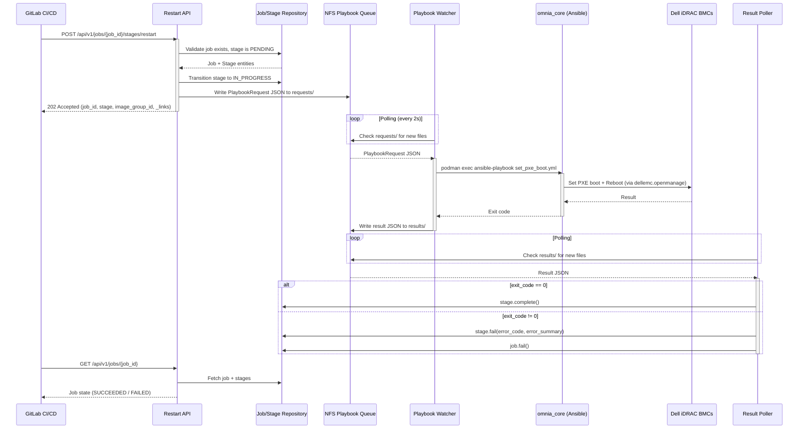

# Module Specification: Restart API

## Document Metadata

| Field            | Value                        |
|------------------|------------------------------|
| **Document ID**  | MS-001                       |
| **Module Name**  | Restart API                  |
| **Status**       | Draft                        |
| **Version**      | 3.0                          |
| **Date Created** | 2026-03-29                   |
| **Date Updated** | 2026-04-16                   |
| **Author**       | Sowjanya Jagadish            |

---

## Table of Contents

1. [Module Overview](#1-module-overview)
   - 1.1 Purpose
   - 1.2 Scope
   - 1.3 Dependencies
   - 1.4 What This Module Does NOT Do

2. [Functional Requirements](#2-functional-requirements)
   - 2.1 API Endpoint Specification
   - 2.2 Stage Lifecycle
   - 2.3 Request Validation
   - 2.4 Response Format
   - 2.5 Error Handling

3. [Technical Architecture](#3-technical-architecture)
   - 3.1 Sequence Diagram
   - 3.2 Component Interactions
   - 3.3 Data Flow

4. [Code Structure](#4-code-structure)
   - 4.1 API Routes
   - 4.2 Request/Response Models
   - 4.3 Service Layer
   - 4.4 Database Operations

5. [Module Specifications](#5-module-specifications)
   - 5.1 Restart Stage Handler
   - 5.2 Job State Management
   - 5.3 Queue Integration
   - 5.4 Result Processing

6. [Configuration Changes](#6-configuration-changes)
   - 6.1 Environment Variables
   - 6.2 Database Schema
   - 6.3 Queue Configuration

7. [Error Handling](#7-error-handling)
   - 7.1 Validation Errors
   - 7.2 System Errors
   - 7.3 Retry Logic

8. [Ansible Playbook (Existing)](#8-ansible-playbook-existing)
   - 8.1 Playbook Overview
   - 8.2 Inventory Management
   - 8.3 Execution Flow

9. [Testing Specifications](#9-testing-specifications)
   - 9.1 Unit Tests
   - 9.2 Integration Tests
   - 9.3 End-to-End Tests

10. [Acceptance Criteria](#10-acceptance-criteria)
    - 10.1 Functional Requirements
    - 10.2 Non-Build-Stream Safety
    - 10.3 Non-Functional Requirements

11. [Implementation Order](#11-implementation-order)

12. [Per-Node Result Reporting, Inventory Diff, and Add/Remove Node Lifecycle](#12-per-node-result-reporting-inventory-diff-and-addremove-node-lifecycle)
    - 12.1 Design Goals
    - 12.2 JSON File Inventory (3 files total)
    - 12.3 NFS File Layout
    - 12.4 Add Node Scenario
    - 12.5 Remove Node / Retry Failed Nodes Scenario
    - 12.6 Success and Failed Nodes Data Flow
    - 12.7 Combined End-to-End Flow (Add/Remove + Success/Fail)
    - 12.8 restart_state.json Schema (Persistent State -- Single File)
    - 12.9 node_results.json Schema (Per-Run Results)
    - 12.10 failed_nodes.json Schema (User-Editable GitLab Artifact)
    - 12.11 enable_build_stream Guard Pattern
    - 12.12 Playbook Changes (set_pxe_boot.yml)
    - 12.13 Watcher Service Change
    - 12.14 PlaybookResult Entity Extension
    - 12.15 Result Poller Change
    - 12.16 Upload API Whitelist Addition
    - 12.17 GitLab CI Pipeline Changes
    - 12.18 Section 12 Implementation Order
    - 12.19 Integration Tests
    - 12.20 Acceptance Criteria
    - 12.21 Security Considerations
    - 12.22 Section 12 Implementation Order

---

## 1. Module Overview

### 1.1 Purpose
Provide an asynchronous REST API endpoint that triggers the `restart` stage within a Build Stream job. The endpoint submits the existing `set_pxe_boot.yml` Ansible playbook to the Build Stream Playbook Queue for execution by the Playbook Watcher Service. The playbook configures Dell iDRAC-managed servers for PXE boot and reboots them for the deployed Image Group. The solution handles node diffs for PXE booting, ensuring that PXE boot is triggered only for newly added nodes and already booted nodes are explicitly excluded.

### 1.2 Scope
- Async REST API endpoint: `POST /api/v1/jobs/{job_id}/stages/restart`
- Submits `set_pxe_boot.yml` to the Build Stream Playbook Queue
- Node diff handling: only newly added nodes are PXE booted; already booted nodes are excluded
- Stage result (pass/fail) is determined by the playbook exit code
- Playbook failure transitions the `restart` stage to `FAILED`; success transitions to `COMPLETED`
- Follows the same async execution pattern as existing stage APIs (e.g., build-image)

### 1.3 Dependencies
- **Build Stream Playbook Queue (NFS):** Existing request/result queue infrastructure
- **Build Stream Playbook Watcher Service:** Existing watcher running in OIM Core container
- **Existing Ansible Playbook:** `utils/set_pxe_boot.yml`
- **Existing Ansible Role:** `utils/roles/idrac_pxe_boot`
- **Dell OpenManage Ansible Collection:** `dellemc.openmanage`
- **Build Stream API (FastAPI):** Existing application in `build_stream/api/`
- **Build Stream Core Domain:** Existing job/stage entities, repositories, value objects

### 1.4 What This Module Does NOT Do
- No MAC address lookup or NIC-specific boot configuration from the API layer
- No per-node success/failure reporting in the API response
- No synchronous playbook execution from the API process
- No custom inventory generation from the API layer; the playbook handles inventory internally

---

## 2. Functional Requirements

### 2.1 API Endpoint Specification

#### Endpoint: `POST /api/v1/jobs/{job_id}/stages/restart`

**Description:** Triggers PXE-based node restart for the deployed Image Group. Executes the `utils/set_pxe_boot.yml` playbook. This is an **asynchronous** API -- it validates the request, submits the playbook to the NFS queue, transitions the stage to `IN_PROGRESS`, and returns `202 Accepted`. The actual playbook execution happens in the Playbook Watcher Service.

**Authentication:** Bearer Token with `job:write` scope.

**Path Parameters:**

| Parameter | Type           | Description                    |
|-----------|----------------|--------------------------------|
| `job_id`  | string (UUID)  | Job identifier                 |

**Request Headers:**

| Header              | Description                            |
|---------------------|----------------------------------------|
| `Authorization`     | `Bearer <access_token>`                |
| `Content-Type`      | `application/json`                     |
| `X-Correlation-ID`  | Optional UUID for request tracing      |

**Request Body:** None. This endpoint takes no request body parameters.

**Success Response (202 Accepted):**
```json
{
  "job_id": "018f3c4b-7b5b-7a9d-b6c4-9f3b4f9b2c10",
  "stage": "restart",
  "status": "accepted",
  "submitted_at": "2026-03-15T16:30:00Z",
  "image_group_id": "omnia-cluster-v1.2",
  "correlation_id": "018f3c4b-2d9e-7d1a-8a2b-111111111111"
}
```

**Error Response:**
```json
{
  "error": "JOB_NOT_FOUND",
  "message": "Job 018f3c4b-... not found",
  "correlation_id": "018f3c4b-2d9e-...",
  "timestamp": "2026-03-15T16:30:00Z"
}
```

**HTTP Status Codes:**

| Status | Error Code                  | Description                                            |
|--------|-----------------------------|--------------------------------------------------------|
| `202`  | --                          | Stage accepted; playbook request submitted to queue    |
| `400`  | `INVALID_JOB_ID`           | Invalid `job_id` format                                |
| `401`  | `UNAUTHORIZED`             | Missing or invalid token                               |
| `403`  | `FORBIDDEN`                | Insufficient scope                                     |
| `404`  | `JOB_NOT_FOUND`            | Job does not exist                                     |
| `409`  | `INVALID_STATE_TRANSITION` | Job/stage not in valid state for restart               |
| `412`  | `PRECONDITION_FAILED`      | ImageGroup not in DEPLOYED status                      |
| `500`  | `RESTART_EXECUTION_ERROR`  | PXE boot playbook queue submission failed              |
| `500`  | `INTERNAL_ERROR`           | Unexpected server error                                |

### 2.2 Stage Lifecycle

The `restart` stage follows the standard Build Stream stage lifecycle:

```
PENDING (API call)> IN_PROGRESS (playbook succeeds)> COMPLETED
                                    (playbook fails)> FAILED
```

- **`PENDING`**: Initial state when the job is created
- **`IN_PROGRESS`**: Set by the API when the playbook request is submitted to the queue
- **`COMPLETED`**: Set by the Result Poller when the Watcher reports `exit_code == 0`
- **`FAILED`**: Set by the Result Poller when the Watcher reports `exit_code != 0`

When the stage transitions to `FAILED`, the parent job also transitions to `FAILED` (via `JobStateHelper`). The CI/CD pipeline checks the job/stage state to determine pass/fail.

### 2.3 Playbook Execution via Build Stream Watcher

**Execution Flow:**
1. API validates the request and transitions the `restart` stage to `IN_PROGRESS`
2. API constructs a `PlaybookRequest` and writes it to the NFS queue (`requests/` directory)
3. API returns `202 Accepted` immediately
4. Playbook Watcher polls the `requests/` directory, picks up the request
5. Watcher executes `set_pxe_boot.yml` inside the `omnia_core` container via `podman exec`
6. Watcher captures the exit code and writes a result JSON to `results/` directory
7. Result Poller reads the result and transitions the stage to `COMPLETED` or `FAILED`

**PlaybookRequest Fields:**

| Field                  | Value                                                     |
|------------------------|-----------------------------------------------------------|
| `job_id`               | Job UUID from the URL path                                |
| `stage_name`           | `restart`                                                 |
| `playbook_path`        | `set_pxe_boot.yml`                                        |
| `inventory_file_path`  | `null` (playbook auto-generates from PXE mapping file)    |
| `correlation_id`       | From request header or auto-generated                     |
| `timeout_minutes`      | `30` (default)                                            |
| `submitted_at`         | ISO 8601 timestamp                                        |
| `request_id`           | Auto-generated UUID                                       |

**Watcher Command:**
```bash
podman exec \
  -e ANSIBLE_LOG_PATH=/opt/omnia/log/build_stream/set_pxe_boot_20240420_103000.log \
  omnia_core \
  ansible-playbook /omnia/utils/set_pxe_boot.yml \
  -v
```

**Note:** After playbook completion, the log file is moved to: `/opt/omnia/log/build_stream/{job_id}/set_pxe_boot_20240420_103000.log`

**Watcher Result (success):**
```json
{
  "job_id": "018f3c4b-...",
  "stage_name": "restart",
  "request_id": "...",
  "correlation_id": "...",
  "status": "success",
  "exit_code": 0,
  "log_file_path": "/opt/omnia/log/build_stream/018f3c4b-7b5b-7a9d-b6c4-9f3b4f9b2c10/set_pxe_boot_20240420_103000.log",
  "started_at": "2026-03-15T16:30:05Z",
  "completed_at": "2026-03-15T16:32:15Z",
  "duration_seconds": 130,
  "timestamp": "2026-03-15T16:32:15Z"
}
```

**Watcher Result (failure):**
```json
{
  "job_id": "018f3c4b-...",
  "stage_name": "restart",
  "request_id": "...",
  "correlation_id": "...",
  "status": "failed",
  "exit_code": 2,
  "log_file_path": "/opt/omnia/log/build_stream/018f3c4b-7b5b-7a9d-b6c4-9f3b4f9b2c10/set_pxe_boot_20240420_103000.log",
  "error_code": "PLAYBOOK_EXECUTION_FAILED",
  "error_summary": "Ansible playbook set_pxe_boot.yml failed with exit code 2",
  "started_at": "2026-03-15T16:30:05Z",
  "completed_at": "2026-03-15T16:32:15Z",
  "duration_seconds": 130,
  "timestamp": "2026-03-15T16:32:15Z"
}
```

---

## 3. Technical Architecture

### 3.1 Sequence Diagram



### 3.2 Data Flow Summary

```
1. GitLab Pipeline calls POST /api/v1/jobs/{job_id}/stages/restart
2. API validates job and stage state
3. API transitions stage PENDING -> IN_PROGRESS
4. API writes PlaybookRequest to NFS queue (requests/)
5. API returns 202 Accepted immediately
6. Watcher picks up the request, executes set_pxe_boot.yml in omnia_core
7. set_pxe_boot.yml auto-generates BMC inventory from PXE mapping file
8. Playbook handles node diffs: PXE boots only newly added nodes, skips already booted nodes
9. Watcher writes result (exit code + log path) to NFS queue (results/)
10. Result Poller transitions stage to COMPLETED or FAILED based on exit code
11. Pipeline polls GET /api/v1/jobs/{job_id} to check final state
```

---

## 4. Code Structure

### 4.1 New Files

```
build_stream/
  api/
    restart/
      __init__.py
      routes.py              # FastAPI route: POST /{job_id}/stages/restart
      schemas.py             # Pydantic response models
      dependencies.py        # FastAPI DI providers for restart use case
  orchestrator/
    restart/
      __init__.py
      commands/
        __init__.py
        create_restart.py    # CreateRestartCommand dataclass
      dtos/
        __init__.py
        restart_response.py  # RestartResponse dataclass
      use_cases/
        __init__.py
        create_restart.py    # CreateRestartUseCase
```

### 4.2 Modified Files

| File | Change |
|------|--------|
| `build_stream/api/router.py` | Add `restart_router` to `api_router` |
| `build_stream/core/jobs/value_objects.py` | Add `RESTART = "restart"` to `StageType` enum |
| `build_stream/orchestrator/jobs/use_cases/create_job.py` | Include `restart` in initial stages |
| `build_stream/playbook-watcher/playbook_watcher_service.py` | Add `set_pxe_boot.yml` to `PLAYBOOK_NAME_TO_PATH` whitelist |
| `build_stream/container.py` | Wire `CreateRestartUseCase` into DI container |
| `build_stream/api/dependencies.py` | Add `get_create_restart_use_case` provider |

---

## 5. Module Specifications

### 5.1 Route Handler (`api/restart/routes.py`)

```python
router = APIRouter(prefix="/jobs", tags=["Restart"])

@router.post(
    "/{job_id}/stages/restart",
    response_model=CreateRestartResponse,
    status_code=status.HTTP_202_ACCEPTED,
    summary="Trigger restart stage",
    description=(
        "Triggers PXE-based node restart for the deployed Image Group. "
        "Executes utils/set_pxe_boot.yml via the playbook queue. "
        "Handles node diffs: only newly added nodes are PXE booted."
    ),
    responses={
        202: {"description": "Stage accepted", "model": CreateRestartResponse},
        400: {"description": "Invalid request", "model": RestartErrorResponse},
        401: {"description": "Unauthorized", "model": RestartErrorResponse},
        403: {"description": "Forbidden", "model": RestartErrorResponse},
        404: {"description": "Job not found", "model": RestartErrorResponse},
        409: {"description": "State conflict", "model": RestartErrorResponse},
        412: {"description": "Precondition failed", "model": RestartErrorResponse},
        500: {"description": "Internal error", "model": RestartErrorResponse},
    },
)
def create_restart(
    job_id: str,
    token_data: Annotated[dict, Depends(verify_token)],
    use_case: CreateRestartUseCase = Depends(get_create_restart_use_case),
    correlation_id: CorrelationId = Depends(get_restart_correlation_id),
    _: None = Depends(require_job_write),
) -> CreateRestartResponse:
    ...
```

**Error handling follows the same pattern as `build_image/routes.py`:**
- `JobNotFoundError` -> 404 `JOB_NOT_FOUND`
- `StageNotFoundError` -> 404 `STAGE_NOT_FOUND`
- `InvalidStateTransitionError` -> 409 `INVALID_STATE_TRANSITION`
- `TerminalStateViolationError` -> 412 `PRECONDITION_FAILED`
- Queue/domain errors -> 500 `RESTART_EXECUTION_ERROR`
- `Exception` -> 500 `INTERNAL_ERROR`

### 5.2 Schemas (`api/restart/schemas.py`)

```python
class RestartLinksResponse(BaseModel):
    """HATEOAS links for restart response."""
    self: str = Field(..., description="Job resource URL")
    status: str = Field(..., description="Job status URL")


class CreateRestartResponse(BaseModel):
    """Response model for restart stage acceptance (202 Accepted)."""
    job_id: str = Field(..., description="Job identifier")
    stage: str = Field(..., description="Stage identifier")
    status: str = Field(..., description="Acceptance status")
    submitted_at: str = Field(..., description="Submission timestamp (ISO 8601)")
    image_group_id: str = Field(..., description="Image group identifier")
    correlation_id: str = Field(..., description="Correlation identifier")
    _links: RestartLinksResponse = Field(..., alias="_links", description="HATEOAS links")

    class Config:
        populate_by_name = True


class RestartErrorResponse(BaseModel):
    """Standard error response body for restart operations."""
    error: str = Field(..., description="Error code")
    message: str = Field(..., description="Error message")
    correlation_id: str = Field(..., description="Request correlation ID")
    timestamp: str = Field(..., description="Error timestamp (ISO 8601)")
```

### 5.3 Command (`orchestrator/restart/commands/create_restart.py`)

```python
@dataclass(frozen=True)
class CreateRestartCommand:
    """Command to trigger restart stage.

    Attributes:
        job_id: Job identifier from URL path.
        client_id: Client who owns this job (from auth).
        correlation_id: Request correlation identifier for tracing.
    """

    job_id: JobId
    client_id: ClientId
    correlation_id: CorrelationId
```

### 5.4 Response DTO (`orchestrator/restart/dtos/restart_response.py`)

```python
@dataclass(frozen=True)
class RestartResponse:
    """Response DTO for restart stage acceptance."""
    job_id: str
    stage_name: str
    status: str
    submitted_at: str
    image_group_id: str
    correlation_id: str
```

### 5.5 Use Case (`orchestrator/restart/use_cases/create_restart.py`)

```python
PLAYBOOK_NAME = "set_pxe_boot.yml"
DEFAULT_TIMEOUT_MINUTES = 30

class CreateRestartUseCase:
    """Use case for triggering the restart stage.

    Orchestrates:
    - Job ownership verification
    - Stage guard enforcement (only PENDING -> IN_PROGRESS)
    - Image group ID retrieval from job metadata
    - PlaybookRequest construction and NFS queue submission
    - Audit trail (STAGE_STARTED event)
    """

    def __init__(
        self,
        job_repo: JobRepository,
        stage_repo: StageRepository,
        audit_repo: AuditEventRepository,
        queue_service: PlaybookQueueRequestService,
        uuid_generator: UUIDGenerator,
    ) -> None:
        self._job_repo = job_repo
        self._stage_repo = stage_repo
        self._audit_repo = audit_repo
        self._queue_service = queue_service
        self._uuid_generator = uuid_generator

    def execute(self, command: CreateRestartCommand) -> RestartResponse:
        """Execute the restart stage."""
        # 1. Validate job exists and belongs to client
        job = self._validate_job(command)

        # 2. Validate stage is PENDING
        stage = self._validate_stage(command)

        # 3. Retrieve image_group_id from job metadata
        image_group_id = self._get_image_group_id(job)

        # 4. Build PlaybookRequest
        request = self._build_playbook_request(command)

        # 5. Transition stage to IN_PROGRESS and submit to queue
        self._submit_to_queue(command, request, stage)

        # 6. Emit audit event
        self._emit_stage_started_event(command)

        # 7. Return 202 response DTO
        return RestartResponse(
            job_id=str(command.job_id),
            stage_name=StageType.RESTART.value,
            status="accepted",
            submitted_at=request.submitted_at,
            image_group_id=image_group_id,
            correlation_id=str(command.correlation_id),
        )

    def _get_image_group_id(self, job) -> str:
        """Extract image_group_id from job parameters/metadata."""
        params = job.parameters or {}
        return params.get("image_group_id", "")
```

**`_build_playbook_request` constructs:**
```python
def _build_playbook_request(self, command):
    return PlaybookRequest(
        job_id=str(command.job_id),
        stage_name=StageType.RESTART.value,
        playbook_path=PlaybookPath(PLAYBOOK_NAME),
        inventory_file_path=None,  # Playbook auto-generates from PXE mapping
        correlation_id=str(command.correlation_id),
        timeout=ExecutionTimeout(DEFAULT_TIMEOUT_MINUTES),
        submitted_at=datetime.now(timezone.utc).isoformat().replace("+00:00", "Z"),
        request_id=str(self._uuid_generator.generate()),
    )
```

**Route handler maps DTO to API response with `_links`:**
```python
# In routes.py, after use_case.execute(command):
return CreateRestartResponse(
    job_id=result.job_id,
    stage=result.stage_name,
    status=result.status,
    submitted_at=result.submitted_at,
    image_group_id=result.image_group_id,
    correlation_id=result.correlation_id,
    _links=RestartLinksResponse(
        self=f"/api/v1/jobs/{result.job_id}",
        status=f"/api/v1/jobs/{result.job_id}",
    ),
)
```

---

## 6. Configuration Changes

### 6.1 StageType Enum Addition

**File:** `build_stream/core/jobs/value_objects.py`

```python
class StageType(str, Enum):
    PARSE_CATALOG = "parse-catalog"
    GENERATE_INPUT_FILES = "generate-input-files"
    CREATE_LOCAL_REPOSITORY = "create-local-repository"
    BUILD_IMAGE_X86_64 = "build-image-x86_64"
    BUILD_IMAGE_AARCH64 = "build-image-aarch64"
    VALIDATE_IMAGE_ON_TEST = "validate-image-on-test"
    RESTART = "restart"                              # <-- NEW
```

### 6.2 Playbook Watcher Whitelist Addition

**File:** `build_stream/playbook-watcher/playbook_watcher_service.py`

```python
PLAYBOOK_NAME_TO_PATH = {
    "include_input_dir.yml": "/omnia/utils/include_input_dir.yml",
    "build_image_aarch64.yml": "/omnia/build_image_aarch64/build_image_aarch64.yml",
    "build_image_x86_64.yml": "/omnia/build_image_x86_64/build_image_x86_64.yml",
    "discovery.yml": "/omnia/discovery/discovery.yml",
    "local_repo.yml": "/omnia/local_repo/local_repo.yml",
    "set_pxe_boot.yml": "/omnia/utils/set_pxe_boot.yml",  # <-- NEW
}
```

### 6.3 Router Registration

**File:** `build_stream/api/router.py`

```python
from api.restart.routes import router as restart_router

api_router.include_router(restart_router)
```

### 6.4 DI Container Wiring

**File:** `build_stream/container.py`

```python
create_restart_use_case = providers.Factory(
    CreateRestartUseCase,
    job_repo=job_repository,
    stage_repo=stage_repository,
    audit_repo=audit_repository,
    queue_service=playbook_queue_request_service,
    uuid_generator=uuid_generator,
)
```

---

## 7. Error Handling

### 7.1 Error Codes

| Error Code                    | HTTP Status | Description                                          |
|-------------------------------|-------------|------------------------------------------------------|
| `INVALID_JOB_ID`             | 400         | `job_id` is not a valid UUID                         |
| `UNAUTHORIZED`               | 401         | Missing or invalid token                             |
| `FORBIDDEN`                  | 403         | Insufficient scope (`job:write` required)            |
| `JOB_NOT_FOUND`              | 404         | Job does not exist or client mismatch                |
| `INVALID_STATE_TRANSITION`   | 409         | Job/stage not in valid state for restart             |
| `PRECONDITION_FAILED`        | 412         | ImageGroup not in DEPLOYED status                    |
| `RESTART_EXECUTION_ERROR`    | 500         | PXE boot playbook queue submission failed            |
| `INTERNAL_ERROR`             | 500         | Unexpected server error                              |

### 7.2 Playbook-Level Failures

Playbook failures are **not** reported via the Restart API response. The API always returns `202 Accepted` if the request is valid. Playbook failures are:

1. Captured by the Watcher as a non-zero exit code
2. Written to the NFS result queue (including `log_file_path` for debugging)
3. Picked up by the Result Poller
4. Recorded as `stage.fail(error_code="PLAYBOOK_EXECUTION_FAILED", error_summary="...")`
5. The parent job also transitions to `FAILED`

The CI/CD pipeline detects this by polling `GET /api/v1/jobs/{job_id}` and checking `job_state` and `stages[].stage_state`.

---

## 8. Ansible Playbook (Existing)

### 8.1 `utils/set_pxe_boot.yml`

No changes are required to the playbook for the Restart API integration. The playbook already supports:

1. **Dynamic inventory generation:** When no custom inventory is provided (i.e., no `-i` flag), `pre_checks.yml` auto-generates BMC inventory from the PXE mapping file at `/opt/omnia/input/project_default/pxe_mapping_file.csv` and adds the BMC IPs to the in-memory `bmc` group via `add_host`.

2. **Credential retrieval:** Invokes `credential_utility/get_config_credentials.yml` to obtain BMC credentials from the Omnia vault.

3. **PXE boot + reboot:** The `idrac_pxe_boot` role sets the boot source override to PXE and reboots each host in the `bmc` group using `dellemc.openmanage` modules.

4. **Node diff handling:** The playbook handles node diffs at the inventory level, ensuring PXE boot is triggered only for newly added nodes and already booted nodes are excluded.

### 8.2 Playbook Flow Summary

```
Play 1 (localhost): pre_checks -> auto-generate BMC inventory from PXE mapping file
Play 2 (localhost): Fetch BMC credentials from vault
Play 3 (bmc hosts): Set PXE boot + reboot via iDRAC
Play 4 (bmc hosts): Report results
```

Exit code `0` = all target hosts rebooted successfully. Non-zero = at least one host failed.

---

## 9. Testing Specifications

### 9.1 Unit Tests

**File:** `tests/unit/orchestrator/restart/test_create_restart_use_case.py`

| Test Case                                        | Expected Result                                     |
|--------------------------------------------------|-----------------------------------------------------|
| Valid request, stage PENDING                     | Stage -> IN_PROGRESS, queue submission, 202         |
| Job not found                                    | `JobNotFoundError` raised                           |
| Stage not found                                  | `StageNotFoundError` raised                         |
| Stage already IN_PROGRESS                        | `InvalidStateTransitionError` raised                |
| Stage already COMPLETED                          | `TerminalStateViolationError` raised                |
| Stage already FAILED                             | `TerminalStateViolationError` raised                |
| Client ID mismatch                               | `JobNotFoundError` raised                           |
| Queue unavailable                                | `QueueUnavailableError` raised                      |
| Response includes `image_group_id` from job      | `image_group_id` matches job parameters              |
| Response includes `_links` with job URL          | `_links.self` and `_links.status` are correct        |

### 9.2 Integration Tests

**File:** `tests/integration/api/restart/test_restart_api.py`

| Test Case                              | Method | Endpoint                              | Status |
|----------------------------------------|--------|---------------------------------------|--------|
| Successful restart trigger             | POST   | `/api/v1/jobs/{id}/stages/restart`    | 202    |
| Invalid job_id format                  | POST   | `/api/v1/jobs/invalid/stages/restart` | 400    |
| Missing auth token                     | POST   | `/api/v1/jobs/{id}/stages/restart`    | 401    |
| Insufficient scope                     | POST   | `/api/v1/jobs/{id}/stages/restart`    | 403    |
| Non-existent job                       | POST   | `/api/v1/jobs/{id}/stages/restart`    | 404    |
| Stage already in progress              | POST   | `/api/v1/jobs/{id}/stages/restart`    | 409    |
| Stage already completed                | POST   | `/api/v1/jobs/{id}/stages/restart`    | 412    |
| Response contains `_links`             | POST   | `/api/v1/jobs/{id}/stages/restart`    | 202    |
| Response contains `image_group_id`     | POST   | `/api/v1/jobs/{id}/stages/restart`    | 202    |

---

## 10. Acceptance Criteria

### 10.1 Functional
- [ ] `POST /api/v1/jobs/{job_id}/stages/restart` returns `202 Accepted`
- [ ] `restart` stage transitions from `PENDING` to `IN_PROGRESS` on API call
- [ ] `PlaybookRequest` for `set_pxe_boot.yml` is written to NFS queue
- [ ] Watcher picks up and executes the playbook in `omnia_core`
- [ ] Playbook exit code `0` transitions stage to `COMPLETED`
- [ ] Playbook non-zero exit code transitions stage to `FAILED` and job to `FAILED`
- [ ] Response includes `image_group_id` and `_links`
- [ ] Error handling returns correct HTTP status codes and error codes

### 10.2 Non-Functional
- [ ] API response time < 2 seconds (queue submission only)
- [ ] No blocking I/O in the API request handler
- [ ] Follows existing code conventions (FastAPI, Pydantic, DI, DDD)
- [ ] Unit test coverage > 80%
- [ ] Audit trail emits `STAGE_STARTED` event

### 10.3 Integration
- [ ] No changes required to Playbook Watcher Service (except whitelist addition)
- [ ] No changes required to Result Poller
- [ ] No changes required to `set_pxe_boot.yml` playbook
- [ ] Compatible with existing job creation flow
- [ ] `restart` stage appears in `GET /api/v1/jobs/{job_id}` response

---

## 11. Implementation Order

1. Add `RESTART = "restart"` to `StageType` enum
2. Add `set_pxe_boot.yml` to Watcher's `PLAYBOOK_NAME_TO_PATH` whitelist
3. Create `orchestrator/restart/` (command, DTO, use case)
4. Create `api/restart/` (schemas, dependencies, routes)
5. Wire use case into DI container (`container.py`, `dependencies.py`)
6. Register `restart_router` in `api/router.py`
7. Update `create_job` to include `restart` in initial stages
8. Write unit tests
9. Write integration tests
10. Run full test suite to verify no regressions
---
**End of Module Specification**