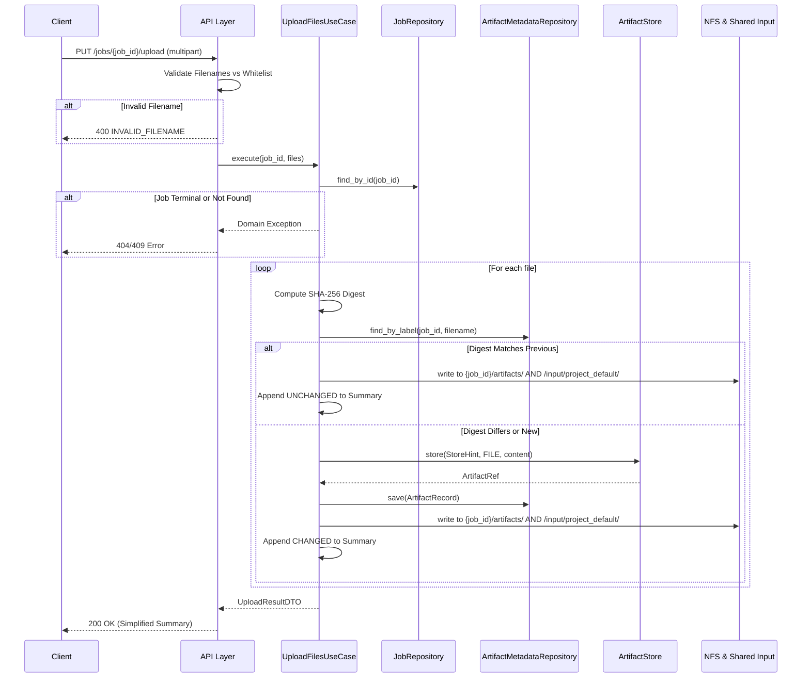

# Module Specification: Upload API

## Document Information

| Attribute | Value |
|-----------|-------|
| **Feature** | Configuration File Upload API |
| **API Endpoint** | `PUT /api/v1/jobs/{job_id}/upload` |
| **Component** | BuildStream Orchestrator & Core Domains |
| **Dependencies** | ArtifactStore, ArtifactMetadataRepository, NFS Storage |

---

## Table of Contents

- [1. High-Level Flow and Requirements](#1-high-level-flow-and-requirements)
- [2. API Contract](#2-api-contract)
  - [2.1 Endpoint Definition](#21-endpoint-definition)
  - [2.2 Validation Rules](#22-validation-rules)
  - [2.3 Response Specification](#23-response-specification)
- [3. Architecture & Storage Strategy](#3-architecture--storage-strategy)
  - [3.1 Components Involved](#31-components-involved)
  - [3.2 Storage Pattern](#32-storage-pattern)
- [4. Sequence & Logic Flow](#4-sequence--logic-flow)
  - [4.1 Change Detection Logic](#41-change-detection-logic)
  - [4.2 Sequence Diagram](#42-sequence-diagram)
- [5. Configuration & Path Management](#5-configuration--path-management)
  - [5.1 Centralized Path Configuration](#51-centralized-path-configuration)
  - [5.2 Configuration Loading Pattern](#52-configuration-loading-pattern)
  - [5.3 File Whitelist Configuration](#53-file-whitelist-configuration)
- [6. Stage State Management & Audit Events](#6-stage-state-management--audit-events)
  - [6.1 Upload Stage State Transitions](#61-upload-stage-state-transitions)
  - [6.2 Audit Event Specification](#62-audit-event-specification)
- [7. Security & Constraints Compliance](#7-security--constraints-compliance)
- [8. Test Specification](#8-test-specification)
  - [8.1 Unit Tests](#81-unit-tests)
  - [8.2 Integration Tests](#82-integration-tests)
  - [8.3 Security Tests](#83-security-tests)
  - [8.4 Error Handling Tests](#84-error-handling-tests)
  - [8.5 Performance Tests](#85-performance-tests)
  - [8.6 Test Coverage Requirements](#86-test-coverage-requirements)

---

## 1. High-Level Flow and Requirements

The Upload API serves as the unified file synchronization endpoint between external clients (e.g., GitLab CI/CD pipelines) and the BuildStream backend. It enables partial, idempotent updates of job-scoped configuration files across both Build and Deploy pipeline phases.

### 1.1 Core Requirements
- **Multiple File Upload**: Support uploading multiple configuration files in a single `multipart/form-data` request.
- **Whitelist Enforcement**: Accept only a predefined set of configuration files (e.g., `network_spec.yml`, `pxe_mapping_file.csv`). Reject unauthorized files immediately.
- **Multi-Destination Storage Strategy**:
  - **Immutable Audit Trail**: Store files in the content-addressed `ArtifactStore` and track via `ArtifactMetadataRepository`.
  - **Job-Scoped Artifacts**: Overwrite files in the job's mutable NFS directory (`{job_id}/artifacts/`) for job-specific execution context.
  - **Shared Input Directory**: Overwrite files in the global shared input directory (`/opt/omnia/input/project_default/`) for playbook execution.
- **Change Detection**: Compute SHA-256 hashes to detect if a file has actually changed compared to the last upload, optimizing downstream processing and maintaining an accurate audit trail.
- **Client-Focused Response**: Return a clean summary of what changed, abstracting away internal storage paths and artifact references.

---

## 2. API Contract

### 2.1 Endpoint Definition
`PUT /api/v1/jobs/{job_id}/upload`

**Authentication**: Bearer Token with `catalog:write` scope.

**Request Format**: `multipart/form-data`

| Field | Type | Required | Constraints | Description |
|-------|------|----------|-------------|-------------|
| `files` | file[] | Yes | ≤ 5 MB per file, UTF-8 encoded | Configuration files |

### 2.2 Validation Rules

1. **Job Preconditions**:
   - The `job_id` must exist.
   - The job must NOT be tombstoned (soft deleted).
   - Uploads are allowed for ALL job states (CREATED, IN_PROGRESS, FAILED, COMPLETED, CANCELLED) to support retry and re-trigger scenarios.
2. **File Whitelist**:
   - Every uploaded filename MUST strictly match one of the allowed configuration files:
     - `local_repo_config.yml`
     - `network_spec.yml`
     - `provision_config.yml`
     - `pxe_mapping_file.csv`
     - `storage_config.yml`
     - `telemetry_config.yml`
3. **Fail-Fast Principle**:
   - If *any* file in the request violates the whitelist or size limits, the *entire request* is rejected immediately (400 Bad Request).

### 2.3 Response Specification

**Success (200 OK)**
```json
{
  "job_id": "018f3c4b-7b5b-7a9d-b6c4-9f3b4f9b2c10",
  "upload_summary": {
    "total_files": 2,
    "changed_files": 1,
    "unchanged_files": 1
  },
  "files": [
    {
      "filename": "pxe_mapping_file.csv",
      "status": "CHANGED",
      "size_bytes": 512
    },
    {
      "filename": "network_spec.yml",
      "status": "UNCHANGED",
      "size_bytes": 1024
    }
  ]
}
```

**Error Codes**
- `400 INVALID_FILENAME`: File not in whitelist.
- `400 FILE_SIZE_EXCEEDED`: File exceeds max size limit.
- `404 JOB_NOT_FOUND`: Specified Job ID does not exist.
- `409 JOB_IN_TERMINAL_STATE`: Job is tombstoned (soft deleted) and cannot accept modifications.

---

## 3. Architecture & Storage Strategy

The API employs a multi-destination storage approach to satisfy audit compliance, job-scoped artifact retention, and playbook execution requirements.

### 3.1 Components Involved
- **API Layer**: FastAPI router handling `multipart/form-data` parsing and initial HTTP validation.
- **Application Layer**: `UploadFilesUseCase` orchestrating validation, change detection, and storage.
- **Domain Layer**: 
  - `ArtifactStore` port for immutable storage.
  - `ArtifactMetadataRepository` port for tracking.
  - Value Objects: `StoreHint`, `ArtifactRef`, `ArtifactRecord`.
- **Infrastructure Layer**: 
  - `FileArtifactStore` implementation.
  - Direct NFS filesystem writes (`{job_id}/artifacts/`).
  - Direct Shared Directory writes (`/opt/omnia/input/project_default/`).

### 3.2 Storage Pattern

For every valid, changed file uploaded:

1. **ArtifactStore (Immutable)**:
   - **Hint**: `StoreHint(namespace="config-files", label=filename, tags={"job_id": job_id})`
   - **Storage Key**: `config-files/{short_hash}/{filename}.bin`
2. **Metadata Repository (Tracking)**:
   - **Entity**: `ArtifactRecord(job_id=job_id, stage_name="upload", label=filename, artifact_ref=ref)`
3. **NFS Job Directory (Mutable, Job-Scoped)**:
   - **Path**: `{config.file_store.base_path}/{job_id}/artifacts/{filename}`
   - *Note*: Overwritten on every upload regardless of change status to ensure job filesystem integrity.
4. **Shared Input Directory (Mutable, Global)**:
   - **Path**: `/opt/omnia/input/project_default/{filename}`
   - *Note*: Overwritten on every upload to supply downstream playbook stages with the latest configurations.
   - **Important**: This path is hardcoded to match Omnia playbook expectations and is NOT derived from `config.paths.build_stream_base_path`.

**Path Configuration Summary:**
- NFS Job Directory uses: `config.file_store.base_path`
- Shared Input Directory uses: **Hardcoded constant** `/opt/omnia/input/project_default/`
  - Defined as `DEFAULT_PLAYBOOK_INPUT_DIR` in `upload_files.py`
  - Matches pattern used by `NfsInputRepository`
  - Required for compatibility with Omnia playbook infrastructure

---

## 4. Sequence & Logic Flow

### 4.1 Change Detection Logic

```python
# Pseudo-code for UploadFilesUseCase
for file in uploaded_files:
    current_hash = sha256(file.content)
    previous_record = metadata_repo.find_by_label(job_id, file.filename)

    if previous_record and previous_record.artifact_ref.digest == current_hash:
        status = "UNCHANGED"
        write_to_nfs(job_id, file.filename, file.content) # Ensure job-scoped NFS consistency
        write_to_shared_input(file.filename, file.content) # Ensure global playbook consistency
    else:
        status = "CHANGED"
        # 1. Immutable Store
        hint = StoreHint(namespace="config-files", label=file.filename, tags={"job_id": job_id})
        artifact_ref = artifact_store.store(hint, kind=FILE, content=file.content)
        
        # 2. Metadata Tracking
        record = ArtifactRecord(job_id=job_id, stage_name="upload", label=file.filename, artifact_ref=artifact_ref)
        metadata_repo.save(record)
        
        # 3. Mutable Stores (NFS + Shared Input)
        write_to_nfs(job_id, file.filename, file.content)
        write_to_shared_input(file.filename, file.content)
```

### 4.2 Sequence Diagram



---

## 5. Configuration & Path Management

### 5.1 Centralized Path Configuration

The Upload API uses the existing BuildStream configuration system for all filesystem paths to ensure consistency across the system:

| Configuration Variable | Source | Description | Default Value |
|------------------------|--------|-------------|---------------|
| `config.file_store.base_path` | `[file_store]` section | Base path for job-scoped artifacts storage | `/opt/omnia/build_stream_root/artifacts` |
| `config.paths.build_stream_base_path` | `[paths]` section | Base path for BuildStream operations | `/opt/omnia/build_stream_root` |
| `config.artifact_store.max_file_size_bytes` | `[artifact_store]` section | Maximum individual file size limit | `5242880` (5 MB) |

**Derived Paths:**
- **NFS Job Directory**: `{config.file_store.base_path}/{job_id}/artifacts/{filename}`
- **Shared Input Directory**: `{config.paths.build_stream_base_path}/input/project_default/{filename}`

### 5.2 Configuration Loading Pattern

The Upload API follows the same configuration loading pattern as other BuildStream components:

```python
from common.config import load_config

# Load configuration using existing BuildStream pattern
config = load_config()

# Access paths through configuration objects
artifacts_base_path = Path(config.file_store.base_path)
shared_input_base_path = Path(config.paths.build_stream_base_path) / "input" / "project_default"
max_file_size = config.artifact_store.max_file_size_bytes
```

### 5.3 File Whitelist Configuration

The allowed configuration files whitelist is defined as a constant in the upload module:

```python
ALLOWED_CONFIG_FILES = {
    "local_repo_config.yml",
    "network_spec.yml", 
    "provision_config.yml",
    "pxe_mapping_file.csv",
    "storage_config.yml",
    "telemetry_config.yml"
}
```

---

## 6. Stage State Management & Audit Events

### 6.1 Upload Stage State Transitions

The Upload API manages the upload stage lifecycle through state transitions:

**State Flow:**
```
PENDING → IN_PROGRESS → COMPLETED
```

**Transition Rules:**
1. **PENDING → IN_PROGRESS**: Triggered on first file upload to a job
2. **IN_PROGRESS → COMPLETED**: Triggered after successful processing of all files in upload request

**Implementation:**
- `UploadFilesUseCase` retrieves the upload stage via `StageRepository.find_by_job_and_name(job_id, "upload")`
- Stage transitions use domain entity methods: `stage.start()` and `stage.complete()`
- Stage state is persisted via `StageRepository.save(stage)` after each transition

### 6.2 Audit Event Specification

The Upload API emits comprehensive audit events for traceability and compliance.

#### 6.2.1 STAGE_STARTED Event

Emitted when upload stage transitions from PENDING to IN_PROGRESS.

**Event Structure:**
```json
{
  "event_type": "STAGE_STARTED",
  "job_id": "018f3c4b-7b5b-7a9d-b6c4-9f3b4f9b2c10",
  "client_id": "client-abc123",
  "correlation_id": "req-xyz789",
  "timestamp": "2026-04-13T10:30:00Z",
  "details": {
    "stage_name": "upload",
    "files": [
      "network_spec.yml",
      "provision_config.yml",
      "pxe_mapping_file.csv"
    ],
    "file_count": 3
  }
}
```

**Fields:**
- `stage_name`: Always "upload" for upload stage
- `files`: Array of filenames being uploaded in this request
- `file_count`: Total number of files in this upload request
- `client_id`: Extracted from JWT bearer token
- `correlation_id`: Extracted from `X-Correlation-ID` HTTP header

#### 6.2.2 STAGE_COMPLETED Event

Emitted when upload stage transitions to COMPLETED after all files are processed.

**Event Structure:**
```json
{
  "event_type": "STAGE_COMPLETED",
  "job_id": "018f3c4b-7b5b-7a9d-b6c4-9f3b4f9b2c10",
  "client_id": "client-abc123",
  "correlation_id": "req-xyz789",
  "timestamp": "2026-04-13T10:30:05Z",
  "details": {
    "stage_name": "upload",
    "total_files": 3,
    "changed_files": 2,
    "unchanged_files": 1,
    "files": [
      {
        "filename": "network_spec.yml",
        "status": "CHANGED",
        "size_bytes": 1024
      },
      {
        "filename": "provision_config.yml",
        "status": "CHANGED",
        "size_bytes": 2048
      },
      {
        "filename": "pxe_mapping_file.csv",
        "status": "UNCHANGED",
        "size_bytes": 512
      }
    ]
  }
}
```

**Fields:**
- `stage_name`: Always "upload" for upload stage
- `total_files`: Total number of files uploaded
- `changed_files`: Number of files that were new or modified (SHA-256 digest changed)
- `unchanged_files`: Number of files identical to previous upload (SHA-256 digest matched)
- `files`: Array of detailed file information:
  - `filename`: Name of the uploaded file
  - `status`: Either "CHANGED" or "UNCHANGED"
  - `size_bytes`: File size in bytes

#### 6.2.3 Audit Event Use Cases

These audit events enable:

1. **Traceability**: Track which files were uploaded in each request with timestamps
2. **Change Detection Analytics**: Identify which files actually changed vs. duplicate uploads
3. **Debugging**: Correlate upload operations with client requests via `correlation_id`
4. **Performance Monitoring**: Analyze upload patterns, file sizes, and change frequency
5. **Compliance**: Maintain complete audit trail of all file uploads with client attribution
6. **Troubleshooting**: Diagnose upload issues by reviewing detailed file-level status

#### 6.2.4 Implementation Details

**Dependencies Injected into `UploadFilesUseCase`:**
- `StageRepository`: For stage state management
- `AuditEventRepository`: For audit event persistence
- `UUIDGenerator`: For generating audit event IDs

**Command Fields:**
- `UploadFilesCommand` includes `client_id` and `correlation_id` fields
- API route extracts `client_id` from JWT token claims
- API route extracts `correlation_id` from `X-Correlation-ID` HTTP header (or generates UUID if missing)

**Audit Event Creation:**
- Events created using domain entity: `AuditEvent(event_id, event_type, job_id, client_id, correlation_id, details, timestamp)`
- Events persisted via `AuditEventRepository.save(event)`
- Pattern follows `ParseCatalogUseCase` implementation

---

## 7. Security & Constraints Compliance

Aligning with BuildStreaM Coding Standards (Sections 1-4):

- **Data Type Constraints**: Filename strings bounded by business limits (whitelist match). File size bounded to 5MB before processing.
- **Fail-Fast Validation**: Filename whitelist and job state invariants are checked *before* any payload hashing or storage IO occurs.
- **Sanitization**: Explicit whitelist prevents path traversal entirely. No user-supplied paths are used to construct storage destinations.
- **Correlation**: `job_id` and implicit context correlation IDs passed down to `ArtifactRecord` and logging facilities.
- **Error Sanitization**: API response deliberately omits internal `ArtifactRef` keys, digests, and absolute NFS paths.

---

## 8. Test Specification

### 8.1 Unit Tests

#### 8.1.1 Filename Validation Tests
| Test Case | Input | Expected Result |
|-----------|-------|-----------------|
| **Valid filename - YAML** | `network_spec.yml` | Validation passes |
| **Valid filename - CSV** | `pxe_mapping_file.csv` | Validation passes |
| **Invalid filename - not in whitelist** | `malicious.sh` | `400 INVALID_FILENAME` |
| **Invalid filename - path traversal** | `../etc/passwd` | `400 INVALID_FILENAME` |
| **Invalid filename - empty** | `""` | `400 INVALID_FILENAME` |

#### 7.1.2 File Size Validation Tests
| Test Case | File Size | Expected Result |
|-----------|-----------|-----------------|
| **Within limit** | 1 MB | Validation passes |
| **At limit** | 5 MB | Validation passes |
| **Exceeds limit** | 6 MB | `400 FILE_SIZE_EXCEEDED` |
| **Zero size** | 0 bytes | Validation passes (edge case) |

#### 7.1.3 Job State Validation Tests
| Test Case | Job State | Expected Result |
|-----------|-----------|-----------------|
| **Job in CREATED state** | `CREATED` | Upload allowed |
| **Job in RUNNING state** | `IN_PROGRESS` | Upload allowed |
| **Job in FAILED state** | `FAILED` | Upload allowed (retry scenario) |
| **Job in COMPLETED state** | `COMPLETED` | Upload allowed (re-trigger scenario) |
| **Job in CANCELLED state** | `CANCELLED` | Upload allowed (re-trigger scenario) |
| **Job in TOMBSTONED state** | `TOMBSTONED` | `409 JOB_IN_TERMINAL_STATE` |
| **Job not found** | N/A | `404 JOB_NOT_FOUND` |

#### 7.1.4 Change Detection Tests
| Test Case | Scenario | Expected Status |
|-----------|----------|-----------------|
| **First upload** | No previous record | `CHANGED` |
| **Same content re-upload** | Same SHA-256 digest | `UNCHANGED` |
| **Modified content** | Different SHA-256 digest | `CHANGED` |
| **Different filename, same content** | Different label, same digest | `CHANGED` (new file) |

#### 7.1.5 Storage Integration Tests
| Test Case | Validation | Expected Behavior |
|-----------|------------|-------------------|
| **ArtifactStore called for changed files** | Mock verification | `store()` called with correct `StoreHint` |
| **Metadata saved for changed files** | Mock verification | `save()` called with `ArtifactRecord` |
| **NFS write for all files** | File system check | File exists at `{job_id}/artifacts/{filename}` |
| **Shared input write for all files** | File system check | File exists at `/input/project_default/{filename}` |
| **Unchanged files skip ArtifactStore** | Mock verification | `store()` NOT called |

#### 8.1.6 Multi-File Upload Tests
| Test Case | Files Uploaded | Expected Result |
|-----------|----------------|-----------------|
| **Single file** | 1 valid file | Success with 1 file in response |
| **Multiple valid files** | 3 valid files | Success with 3 files in response |
| **Mixed valid/invalid** | 1 valid, 1 invalid | `400 INVALID_FILENAME` (fail-fast) |
| **All files unchanged** | 2 files, both unchanged | Success, all marked `UNCHANGED` |
| **Partial change** | 2 files, 1 changed | Success, 1 `CHANGED`, 1 `UNCHANGED` |

#### 8.1.7 Stage State Management Tests
| Test Case | Initial State | Action | Expected State | Expected Behavior |
|-----------|---------------|--------|----------------|-------------------|
| **First upload** | PENDING | Upload files | IN_PROGRESS | `stage.start()` called, state saved |
| **Subsequent upload** | IN_PROGRESS | Upload files | COMPLETED | `stage.complete()` called, state saved |
| **Stage retrieval** | Any | Upload request | N/A | `StageRepository.find_by_job_and_name()` called |

#### 8.1.8 Audit Event Tests
| Test Case | Event Type | Validation | Expected Behavior |
|-----------|------------|------------|-------------------|
| **STAGE_STARTED event emitted** | STAGE_STARTED | Mock verification | Event includes filenames, file_count |
| **STAGE_STARTED includes file list** | STAGE_STARTED | Details check | `details.files` contains all uploaded filenames |
| **STAGE_COMPLETED event emitted** | STAGE_COMPLETED | Mock verification | Event includes file details, counts |
| **STAGE_COMPLETED includes file details** | STAGE_COMPLETED | Details check | Each file has filename, status, size_bytes |
| **STAGE_COMPLETED includes counts** | STAGE_COMPLETED | Details check | total_files, changed_files, unchanged_files present |
| **Audit event has client_id** | Both | Field check | `client_id` extracted from JWT token |
| **Audit event has correlation_id** | Both | Field check | `correlation_id` from header or generated |

### 8.2 Integration Tests

#### 8.2.1 End-to-End Upload Flow
```python
def test_upload_flow_build_pipeline():
    """Test complete upload flow for Build Pipeline scenario."""
    # 1. Create job
    job_id = create_job(pipeline_phase="BUILD")
    
    # 2. Upload initial config files
    response = upload_files(job_id, [
        "local_repo_config.yml",
        "network_spec.yml"
    ])
    assert response.status_code == 200
    assert response.json()["upload_summary"]["changed_files"] == 2
    
    # 3. Verify files in all storage locations
    assert file_exists_in_artifact_store("local_repo_config.yml")
    assert file_exists_in_nfs(job_id, "local_repo_config.yml")
    assert file_exists_in_shared_input("local_repo_config.yml")
    
    # 4. Re-upload same files (unchanged)
    response = upload_files(job_id, ["local_repo_config.yml"])
    assert response.json()["upload_summary"]["unchanged_files"] == 1
```

#### 8.2.2 Deploy Pipeline Scenario
```python
def test_upload_flow_deploy_pipeline():
    """Test upload flow for Deploy Pipeline scenario."""
    # 1. Create job and upload initial configs
    job_id = create_job(pipeline_phase="BUILD")
    upload_files(job_id, ["network_spec.yml", "provision_config.yml"])
    
    # 2. Transition to DEPLOY phase
    transition_job_to_deploy(job_id)
    
    # 3. Upload only PXE mapping (partial update)
    response = upload_files(job_id, ["pxe_mapping_file.csv"])
    assert response.status_code == 200
    assert response.json()["upload_summary"]["changed_files"] == 1
    
    # 4. Verify previous files still exist
    assert file_exists_in_nfs(job_id, "network_spec.yml")
    assert file_exists_in_nfs(job_id, "pxe_mapping_file.csv")
```

### 8.3 Security Tests

#### 8.3.1 Path Traversal Prevention
```python
def test_path_traversal_attacks():
    """Verify path traversal attempts are blocked."""
    malicious_filenames = [
        "../../../etc/passwd",
        "..\\..\\windows\\system32\\config",
        "%2e%2e%2f%2e%2e%2fetc%2fpasswd",
        "....//....//etc/passwd"
    ]
    for filename in malicious_filenames:
        response = upload_file(job_id, filename, content)
        assert response.status_code == 400
        assert "INVALID_FILENAME" in response.json()["error_code"]
```

#### 8.3.2 File Type Validation
```python
def test_unauthorized_file_types():
    """Verify only whitelisted files are accepted."""
    unauthorized_files = [
        "malicious.sh",
        "exploit.exe",
        "backdoor.py",
        "custom_config.conf"
    ]
    for filename in unauthorized_files:
        response = upload_file(job_id, filename, content)
        assert response.status_code == 400
```

### 8.4 Error Handling Tests

#### 8.4.1 Storage Failure Scenarios
| Test Case | Failure Point | Expected Behavior |
|-----------|---------------|-------------------|
| **ArtifactStore unavailable** | `store()` raises exception | `500 STORAGE_ERROR`, transaction rolled back |
| **NFS mount unavailable** | Write fails | `500 STORAGE_ERROR`, error logged |
| **Disk full** | Write fails | `500 STORAGE_ERROR`, graceful degradation |

#### 8.4.2 Concurrent Upload Handling
```python
def test_concurrent_uploads_same_job():
    """Verify concurrent uploads to same job are handled safely."""
    # Simulate two concurrent uploads
    with ThreadPoolExecutor(max_workers=2) as executor:
        future1 = executor.submit(upload_files, job_id, ["network_spec.yml"])
        future2 = executor.submit(upload_files, job_id, ["pxe_mapping_file.csv"])
        
        result1 = future1.result()
        result2 = future2.result()
        
        # Both should succeed
        assert result1.status_code == 200
        assert result2.status_code == 200
```

### 8.5 Performance Tests

| Test Case | Metric | Target |
|-----------|--------|--------|
| **Single file upload (1MB)** | Response time | < 500ms |
| **Multiple files (5 files, 20MB total)** | Response time | < 2s |
| **Change detection overhead** | Additional latency | < 50ms per file |
| **Concurrent uploads (10 jobs)** | Throughput | > 5 uploads/sec |

### 8.6 Test Coverage Requirements

- **Unit Test Coverage**: ≥ 90% for use case and validation logic
- **Integration Test Coverage**: All API endpoints and storage paths
- **Security Test Coverage**: All whitelist rules and path validation
- **Error Path Coverage**: All error codes and exception handling
- **Audit Event Coverage**: All audit events with complete field validation

**Current Test Status (as of 2026-04-13):**
- Total Unit Tests: 24 (all passing)
- Test File: `build_stream/tests/unit/orchestrator/upload/test_upload_use_case.py`
- Coverage Areas:
  - Filename validation (5 tests)
  - File size validation (4 tests)
  - Job state validation (3 tests)
  - Change detection (3 tests)
  - Storage integration (3 tests)
  - Multi-file upload (4 tests)
  - Audit event emission (2 tests)
